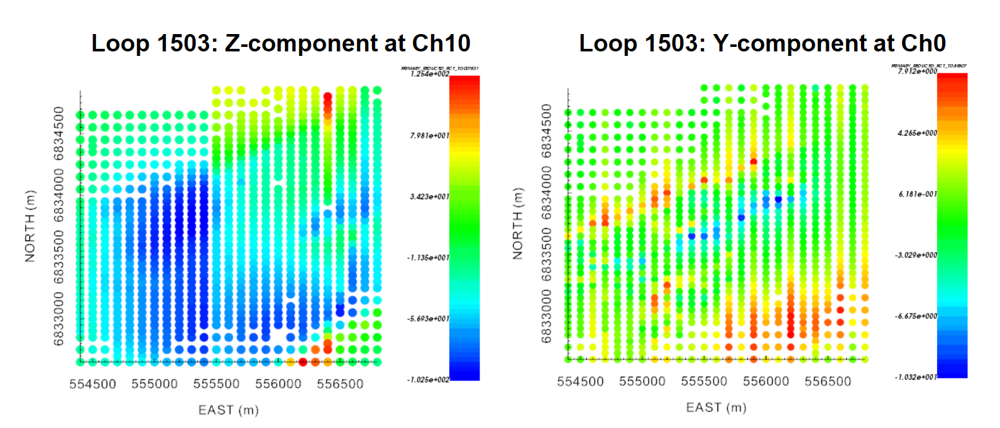

.. _comprehensive_workflow_utem_4:

Data Extraction and Type
========================

Here, we define the field data that will be inverted using UBC-GIF codes and extract it from each of our data objects.

Choosing Data Type for Inversion
--------------------------------

On the :ref:`understanding anomalies <comprehensive_workflow_utem_1_definition>`, we stated that UTEM field measurements could be defined as:

    - B-field measurements for a square-like waveform, or
    - dB/dt measurements for a well-regulated triangular waveform

We must now ask ourselves, **what representation of the fields should we invert?** The answer to this question depends on the numerical formulation used by the inversion code. We would like the following to be considered:

    - There doesn't seem to be a general consensus on which field representation should be inverted.
    - The difference between the true primary field and the numerical primary field computed by the code is significant. As a result, it is important to analytically remove the primary field from the data and invert the secondary field - not the total field. 
    - If you choose to invert B-field data, you should first transform the data into H-field values, then invert with a code that uses the H-field formulation (e.g. *tdoctree v1*). If you choose to invert dB/dt data, the inversion code should use an E-field formulation; as dB/dt can be computed naturally when the electric field is solved on the mesh (*tdoctree v2, tdrh v2*).
    - If there is a significant magnetostatic response in the data, you will need to solve a much more challenging static problem at *t0* if the H-field formulation (i.e. *tdoctree v1*) is used. For the E-field formulation (*tdoctree v2, tdrh v2*), the electric fields are zero. In our experience, the E-field formulation seems to model magnetic effects better than the H-field formulation.

Ultimately, we encourage the user to **invert dB/dt data with tdrh v2** at this time.

Converting Data to Inversion Type
---------------------------------

Here, we convert our data to its secondary field dB/dt representation. Any creation/manipulation of data columns can be done using:

    - the :ref:`column calculator <objectCalculator>`
    - :ref:`add constant column <objectAddConstantCol>`, which is good for storing the waveform period for each transmitter loop.

At this point, we assume the user has already completed the :ref:`Survey Geometry and Data Visualization <comprehensive_workflow_utem_3>` portion of the workflow. This means the user has computed and removed the primary field from total B-field data, and now has a secondary B-field column in each data object. To convert from secondary B-field to secondary dB/dt, we simply need to multiply by *4/T*, where *T* is the period of the waveform.

**For the tutorial data:**

The waveforms associated with the transmitter loops had the following periods:

    - Loop 1501: 0.2 s
    - Loop 1502: 0.2353 s
    - Loop 1503: 2 s

Since we initially loaded B-field data, we ultimately needed to convert to secondary dB/dt data.

.. _comprehensive_workflow_utem_4_time_channels:

Extracting Time Channels
------------------------

Not all of the data collected by UTEM systems is inverted. For example, field measurements at t < 0 s are meant to capture the steady-state B-field just before the corresponding step-excitation occurs. Here, we decide which time channels are sensitive to the target and of sufficient quality. We then extract these data from each of our data objects.

Things to consider
^^^^^^^^^^^^^^^^^^

**Early time channels:**

    - Data collected at the earliest time channels are the most likely to be noisy.
    - Furthermore, there can be a change in secondary field polarity which can be difficult to fit.
    - If the host is sufficiently conductive, the TEM response may be quite sensitive to the survey geometry and not as strongly sensitive to the target(s).

**Late time channels:**

    - In the absence of sufficiently conductive structures, the TEM response may have decayed almost completely by the latest time channel(s). In this case, the data might be noisy and/or not contain significant signal from the target.
    - For sufficiently conductive targets within a resistive host, the latest time channels provide data that are sensitive to the target and not the host; making them ideal for inversion.

Tutorial data
^^^^^^^^^^^^^

Upon examining the data for each loop, we choose to extract the following time channels.

+------------------+-----------------+--------------------+------------------+
| Loop #           | Waveform Period | Earliest           | Latest           |
+==================+=================+====================+==================+
| Loop 1501 (all)  | 0.2 s           | 0.0006124 s (Ch8)  | 0.089507 s (Ch0) |
+------------------+-----------------+--------------------+------------------+
| Loop 1502 (all)  | 0.2353 s        | 0.0007205 s (Ch8)  | 0.1053 s (Ch0)   |
+------------------+-----------------+--------------------+------------------+
| Loop 1503 (X, Y) | 2 s             | 0.0007655 s (Ch11) | 0.19597 s (Ch3)  |
+------------------+-----------------+--------------------+------------------+
| Loop 1503 (Z)    | 2 s             | 0.0061241 s (Ch8)  | 0.19597 s (Ch3)  |
+------------------+-----------------+--------------------+------------------+

**Loops 1501 and 1502:**

    - Significant anomalies were still observed at the latest time channel (Ch0) when plotting primary reduced data and the data still looked clean.
    - At Ch9 and earlier, the data weren't totally clean for all Cartesian components. Some components/time channels showed artifacts which correlated with survey lines. And since modeling earlier time channels requires finer discretization when creating the mesh, we chose to leave these data out for the purposes of the exercise.

**Loop 1503:**

    - For Ch0-Ch2, the data weren't clean for all Cartesian coordinates. Certain components/time channels showed artifacts that correlated with survey lines. As a result, we decided to omit these data for the exercise.
    - For the X and Y components, the data were clean up to Ch11. For the Z component however, the data were only clean up to Ch8. Once again, artifacts correlating with particular survey lines were present.

For loop 1503, we show examples of survey-line correlated artifacts at early times (Ch10) for z-component data and at late times (Ch0) for y-component data.

