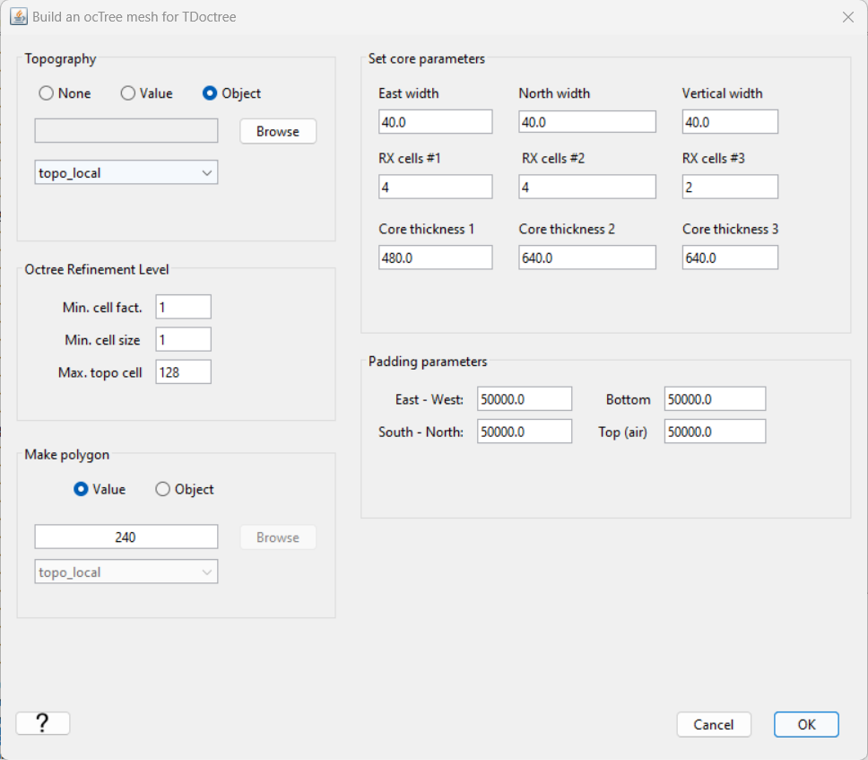

.. _comprehensive_workflow_utem_6:

Mesh Design
===========

Here we provide a basic approach for mesh design when inverting surface UTEM data. The field data provided was collected in a region with minimal topography. However, we will complete this step assuming we must account for significant topography.

Diffusion Distance
^^^^^^^^^^^^^^^^^^

Diffusion distance must always be considered when choosing a padding thickness and minimum cell size for the mesh.
The `diffusion distance <https://em.geosci.xyz/content/maxwell1_fundamentals/transient_planewaves_homogeneous/peakdistance.html>`__ at time *t* depends on the time channel and electrical resistivity/conductivity:

.. math::
	\delta \approx 1260 \sqrt{\frac{t}{\sigma}} = 1260 \sqrt{\rho t}

Ideally, the smallest cell size is less than 1/4 the smallest diffusion distance; which depends on the earliest time channel and largest conductivity.
And the thickness of the padding is 2-3 times the largest diffusion distance; which is obtained using the latest time channel and background conductivity.
Computing diffusion distances is easier when conductivities/resistivities can be obtained quantitatively from apparent resistivity maps and sounding curves.
If this information is unavailable, one may need to use other source of a-priori information; e.g. rock property measurements.

Meshing parameters based on diffusion distances work well when conductivities do not span too many orders of magnitude. **For the tutorial data,** an exact background conductivity was not provided. However the host rock is so resistive that its TEM response is negligible at the latest time channels. We also know that our targets are highly conductive plate-like structures (> 10 S/m). It is therefore unlikely we will be able to generate a mesh that 1) has small enough cells to model TEM responses from the plate targets accurately, and 2) has a total number of cells small enough for the inversion to be computationally feasible. Regardless, we gain valuable insight by performing and voxel-based inversion anyway. Our choice in meshing parameters is discussed in the *Create Mesh* subsection.

Data Object for Meshing
^^^^^^^^^^^^^^^^^^^^^^^

Mesh utilities within the GIFtools framework generate meshes based on survey geometry. The data object representing the survey geometry should contain 1) the geometries of all transmitter loops, and 2) receiver locations downsampled to a reasonable spacing. Presently, the data we intend to invert has been parsed into a multitude of data objects. Here, we explain how to create a data object for generating the mesh with GIFtools utilities.

**First step:** We begin by merging a selected set of data objects that collectively contain all transmitter loops and receiver locations. To do this, use:

	- :ref:`Merge TEM3Dsounding data <mergeParsedEM3Dsounding>`.

.. important:: This functionality will **only** work if all selected data objects have the exact same columns. **For the tutorial data,** the simplest option was to merge an unprocessed data object for loops 1501, 1502 and 1503; given the receiver locations are the same for all data objects.

**Second step:** To reduce computation time, we downsample the newly created data object based on a minimum desired station spacing.
The sampling rate in the along-line direction is generally much higher than is needed to characterize UTEM anomalies. Furthermore, 3D EM inversions are generally unable to recover geologically plausible models when the data spacing is less than 2-3 horizontal cell widths.
To create the downsampled data object: 

	- :ref:`Down-sample based on distance <objectDataDownsample>`. **For the tutorial data,** a minimum station spacing of 111 m was used.

Create Mesh
^^^^^^^^^^^

Here, we explain how to create an OcTree mesh based on surface UTEM survey geometry. We also explain the reasoning for the parameter values entered.
We can create OcTree meshes from UTEM surveys with the following utility:

	- :ref:`create OcTree mesh with TDoctree v2/TDRH v2 utilities <createTDoctreeMeshv2>`

Once you have created the object, complete the following steps:

	1) Set the data object corresponding to the survey
	2) Define the mesh using *Edit Options*
	3) Run the utility
	4) Load results

Parameters used to define the mesh for the **tutorial data** using TDoctree v2 / TDRH v2 mesh utility are shown below.

|

**Minimum cell size:** The minimum cell size is determined by the station spacing and/or the smallest diffusion distance. It is good to have a least 2.5-3 cells between each station. And since we downsampled to have a minimum station spacing of 111 m, a minimum cell size of 40 m was chosen. Note that we didn't consider minimum diffusion distance. In the *Diffusion Distance* subsection, we explained that tutorial data collected at this site posed a significant challenge, as the conductivities in the survey area span many orders of magnitude. We expect to gain useful insight by inverting the data on this mesh, but it will likely be very difficult to fit the observed anomalies from plate conductors accurately.  

**Max. topo cell:** Even if the topography is significant, we do not want to over-discretize in regions far away from the survey, as the fields there do not greatly impact the data. We chose to set this parameter as a larger number. If you want to more finely discretize the topography, set this to 8, 4, or even 2.

**Padding cell expansions:** The extent of the mesh depends on the largest skin depth. The mesh should extend 2-3 times the largest skin depths from the survey region in all directions. Because OcTree meshes pad out so effectively, setting this to be very large does not add many additional cells. Given the host rock is known to be fairly resistive, we chose to pad out 50,000 m. Given the latest time channel being inverted for the tutorial data is ~0.2 s, the padding based on diffusion distance should be reasonable so long as the host conductivity isn't significantly smaller than 0.0005 S/m.

**Core region discretization:** Discretization of the core region depends on skin depth and what we know about the scale of the structures we are trying to characterize. Here, the finest cell discretization was used up to a depth of 480 m. The cell dimensions were coarsened by a factor of 2 for the next 640 m, and again for the following 640 m. Assuming the background conductivity is ~0.0005 S/m, and given the earlier time channel being used is ~0.0006 s, the minimum diffusion distance for the background is ~1400 m. If we are worried about modeling the background response more accurately at early times, we may consider extending the region of finest cell discretization to a larger depth below surface; perhaps 0.5 - 1 times the background diffusion distance.

**Number of cells around Rx (and Tx):** sets the number of fine cells around nodes defining transmitters and receivers. Near the transmitters especially, it is important to have enough fine mesh cells; as the magnitude and direction of the primary field varies significantly about the transmitter. Near the receivers, we assume the fields are smoother and we simply need to ensure interpolation error is reasonable.

**Make polygon:** For UBC-GIF v2 codes, this parameter controls the horizontal extent of the core mesh region. In practice, this should be at least 0.5 times the smallest background diffusion distance. To keep the mesh size reasonable however, we chose 240 m.

