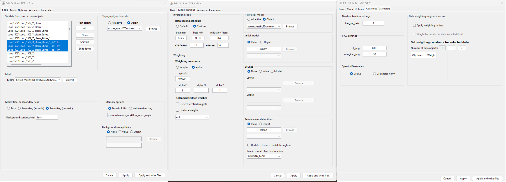

.. _comprehensive_workflow_utem_7:

Voxel Inversion Setup
=====================

Here, we set up and run a voxel UTEM inversion using the mesh created in :ref:`Mesh Design <comprehensive_workflow_utem_6>`.
We provide the steps for setting up and running an inversion with TDRH v2. We then discuss some important aspects of choosing inversion parameters.

.. important:: As was discussed on the :ref:`Mesh Design <comprehensive_workflow_utem_6>` page of the tutorial, the conductivities within the survey region for the **tutorial data** span many orders of magnitude. And it is unlikely we can generate a mesh that 1) has small enough cells to model TEM responses from plate targets accurately, and 2) has a total number of cells small enough for the inversion to be computationally feasible. Nonetheless, valuable insight is gained by performing the inversion.

Data Preparation
^^^^^^^^^^^^^^^^

For our final processing step, we spatially downsample every data object we want included in the inversion, with the same criteria used to generate our mesh. One again, we use

    - :ref:`Down-sample based on distance <objectDataDownsample>`.

Inversion with TDRH v2 allows joint inversion of multiple `TEM3Dsounding` objects. Therefore, the downsampled data objects DO NOT need to be merged prior to inversion.

**For the tutorial data,** a minimum station spacing of 111 m was used. We have 3-component data collected for 3 transmitter loops; 9 data objects total.

Create and Run Inversion
^^^^^^^^^^^^^^^^^^^^^^^^

We can now invert surface UTEM data using TDRH v2.

    - :ref:`Create TDRH v2 inversion object <createTEMInv>`
    - Use :ref:`edit options <invEditOptions_td_ver2>` to set the inversion parameters. *Note multiple data objects can be selected by holding Ctrl and selecting*.
    - Click *Apply and write files*
    - :ref:`Run the inversion <invRun>`

For the tutorial data, we chose to invert using TDRH v2, as this code defines the physics in a universally right-handed coordinate system and is capable of inverting secondary field data.

    Inversion parameters used for the inversion of tutorial data.

.. note:: The parameters chosen for inversion of the field dataset were experimentally derived. The numbers used here worked well for inverting this dataset but should not necessary be used as general default values!

Discussion of Parameters
^^^^^^^^^^^^^^^^^^^^^^^^

**Regarding Data Selection:**

We have 3-component data collected for 3 transmitter loops (9 data objects total), each of which was downsampled to a minimum station spacing of 111 m.

**Regarding field type:**

We are inverting secondary field data for measurements that were collected during the on-time. Those secondary field data were obtained by analytically removing the primary field. For the forward simulation to accurately output secondary field however, we must set the field option to *Secondary (numeric)*. By doing so, the code first solves for the total field (numerically), then subtracts a numerical primary field for the background conductivity provided. Only by doing this will the primary field signal be accurately removed from the total field solution. 

**Regarding beta cooling schedule:**

When setting the cooling schedule for the tutorial data set, the strategy was pretty straight-forward:

    - **beta max = 0.025**: The model recovered at the first iteration should clearly underfit the data. However if *beta max* is too large, you will have multiple iterations where the model doesn't budge because no emphasis is being put on fitting the data. We knew a good starting beta for the final inversion from cursory inversions of the data.
    - **beta min = 1e-10**: This can be set quite low when *nBeta* is used to set the maximum number of beta iterations.
    - **reduction factor = 0.4:** Generally we choose a value between 0.25 and 0.9. If the reduction factor is too large, the code will run for a long time since the reduction in beta at each iteration is small. If the reduction factor is too small, we may not obtain an accurate model update at each beta iteration or wind up in a local minimum. 
    - **chi factor = 1:** Here, we assume that appropriate uncertainties are set on the data. Thus, we assume the recovered model explains the data without over-fitting (fitting the noise) when the data misfit equals the number of data observations (chi factor = 1). In practice, you may choose a chi factor less than 1; which would allow you to get a better understanding of the convergence when uncertainties have been overestimated.
    - **nBeta = 10:** Here, we set a maximum number of beta iterations before the inversion terminates; provided target misfit or other stopping criteria are not met.

**Regarding the alpha parameters:**

As a default setting, we frequently let :math:`\alpha_x = \alpha_y = \alpha_z = 1` and we let :math:`\alpha_s = 1/dh^2` ; where :math:`dh` is the width of the smallest cells in the mesh. This effectively balances the emphasis on recovering a model that is similar to a reference model and recovering a model that has sufficient structure. If we have low confidence in our reference model, we may choose to decrease :math:`\alpha_s` relative to :math:`\alpha_x`, :math:`\alpha_y` and :math:`\alpha_z`.

For this exercise, we have been provided with zero a-prior information regarding the Earth's structure or its electrical conductivity. We have assumed a background conductivity of 0.0005 S/m is reasonable, but at no point have we validated this assumption. As a result, we have set :math:`\alpha_s = 10^{-6}` and let :math:`\alpha_x = \alpha_y = \alpha_z = 1`. This will recover a conductivity model which is primarily driven by the data, and is impacted minimally by the reference model.

**Regarding data weighting:**

Since we are selecting and inverting 9 `TEM3Dsounding` objects, our TDRH v2 inversion can be considered a joint inversion of sorts. For the tutorial inversion, each data object generally has the same number of data. The only exception is the vertical component data for loop 1503, in which slightly fewer time channels were extracted. At this point, we don't believe differences in the number of data for each object will result in certain data objects being overfit at the expense of others. This assumption may be confirmed or refuted upon analyzing the inversion results.

