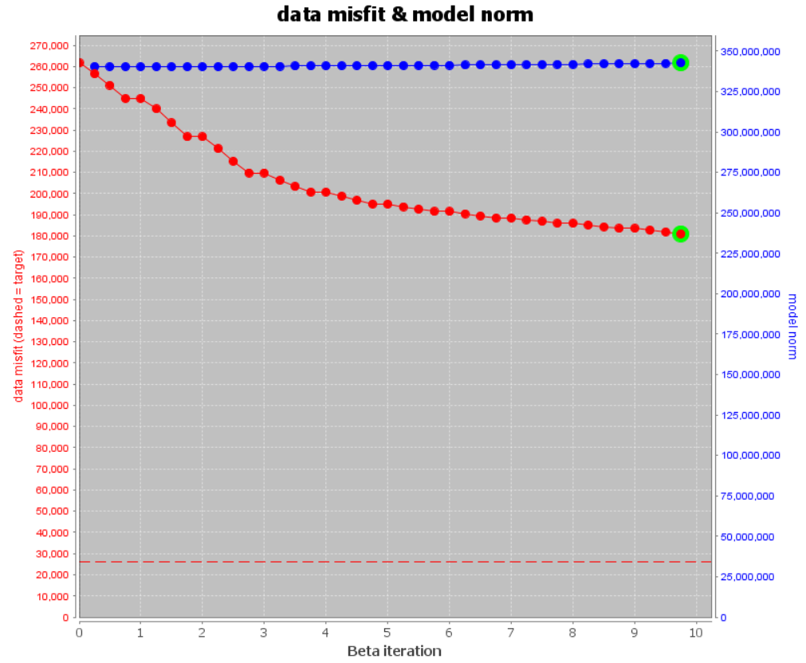
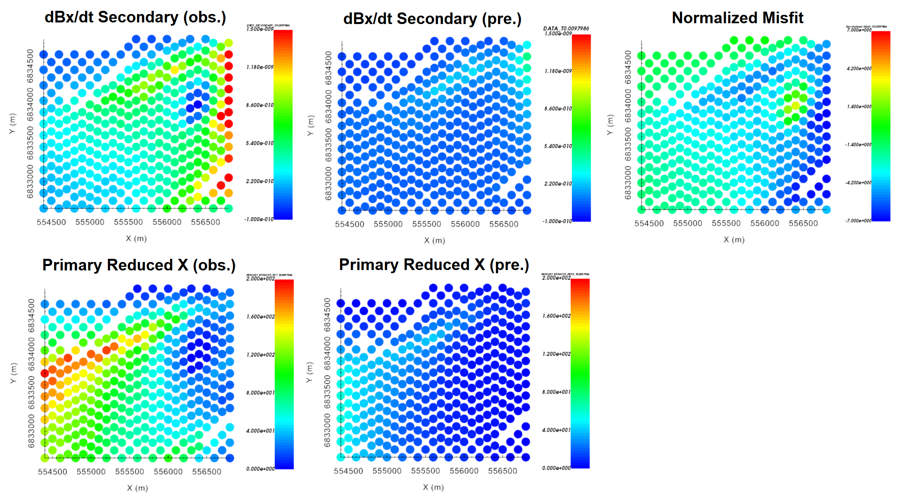
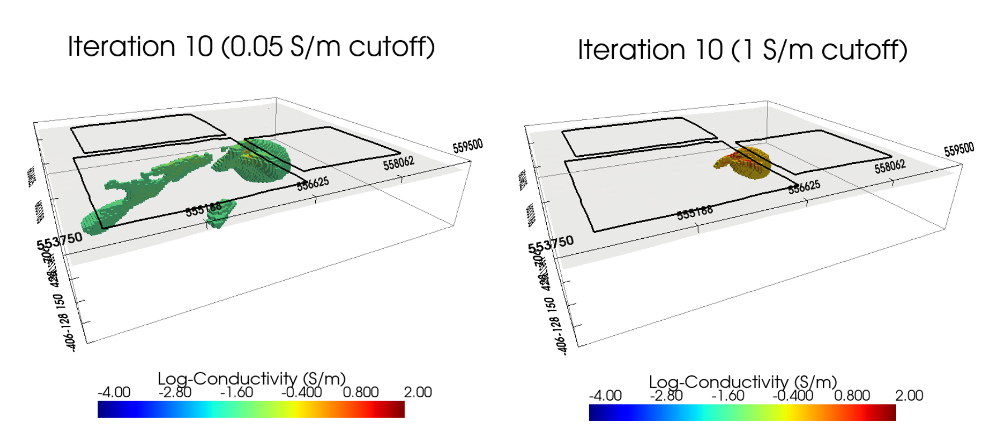
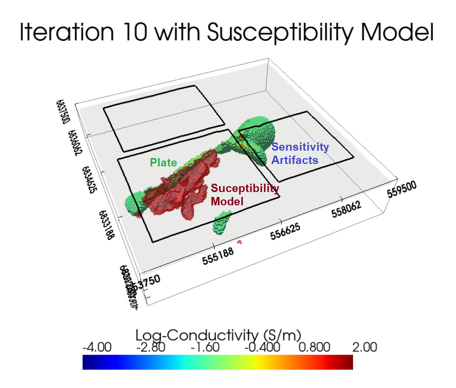

.. _comprehensive_workflow_utem_8:

Voxel Inversion Results
=======================

Here, we demonstrate a common practice approach for examining the output of the inversion code. This includes examining the convergence, the data misfit and the recovered model. Before looking at recovered models, the user is strongly urged to examine the convergence of the algorithm first (Tikhonov curve). By examining the convergence, we can:

    - determine if our data is in UBC-GIF data convention. The data misfit will be large and will not reduce at each iteration otherwise.
    - see if the inversion is able to reach target misfit.
    - infer whether the target misfit is reasonable; i.e. did we globally over or under-estimate the uncertainties on our data?

We then assess how well a given recovered model explains the data by looking at the predicted data, observed data and normalized data misfit maps. From this we can determine whether:

    - the predicted data fits the amplitude, shape and character of observed anomalies for each component and for each time channel,
    - the estimated uncertainties were reasonable for each component and for each time channels, and
    - the inversion must be re-run with a new set of uncertainties.

Only when the convergence and data misfit are acceptable can we infer geological structures from recovered models.

.. important:: As was discussed on the :ref:`Mesh Design <comprehensive_workflow_utem_6>` page of the tutorial, the conductivities within the survey region for the **tutorial data** span many orders of magnitude. And it is unlikely we can generate a mesh that 1) has small enough cells to model TEM responses from plate targets accurately, and 2) has a total number of cells small enough for the inversion to be computationally feasible. Nonetheless, valuable insight is gained by performing the inversion and discussing the results.

Convergence
^^^^^^^^^^^

Once the inversion has finished:

    - :ref:`View convergence <convergence_curve>`

The Tikhonov curve for our tutorial inversion is shown below. The inversion clearly does not reach target misfit after the total allowable number of beta iterations (10). For context, the data misfit is still roughly 7 times the target data misfit at the 10th iteration. The curve starts to flatten out around the 4th iteration. In most cases, we would assume the global level of uncertainty on the data may be too small when the curve flattens out before reaching target misfit. As we will see, this isn't the case for the tutorial inversion.

.. note:: There is a bug in the subroutine that computes and outputs the model norm when topography is included. This bug DOES NOT impact the recovered model and is currently being fixed.

Data Misfit
^^^^^^^^^^^

Here, we choose an iteration (or a small range of iterations) that we feel fits the data without over fitting. For UTEM inversion, many data objects may have been selected for inversion. If all iterations are loaded, you will be loading quite a lot of files. 

    - :ref:`Load inversion results for the iterations selected <invLoadResults>`

**For the tutorial data,** examine the observed and predicted data for iteration 10. If the observed and predicted UTEM anomalies match closely, our global level of uncertainty is too low. If not, the set of inversion inputs is not reasonable for solving the problem; whether it is meshing or improper representation of the survey geometry.

The predicted and observed data are secondary dB/dt data. To transform to primary reduced, we must

    - import the *4/T* and *Bpabs* columns from the observed data object using :ref:`import data columns from another TEM3Dsounding object <objectAddColumnsFromObj>`.
    - use the :ref:`column calculator <objectCalculator>` to

        - divide the predicted data column (*DATA*) by the *4/T* column; which converts from db/dt secondary to B secondary. Don't forget to create a new column for this!!!
        - divide the new column by the *Bpabs* column; which normalizes by the primary field
        - then multiply by 100 if you want to represent as a percent.

Below, we plot the observed data, predicted data and normalized misfit for X-component data for loop 1501 (to the East of the receivers) for CH 4. We also plot the primary reduced data computed from the observed and predicted TEM responses. The plots for this particular subset of the data are fairly representative of what was observed for other loops, directional components and time channels. It is strikingly clear that our predicted data underfits the anomalies in the observed data; both in the secondary dB/dt and primary reduced representations. As expected, the normalized misfits are quite large in magnitude and show coherent features.

**For the tutorial data,** a satisfactory data misfit was not achieved because the set of inversion inputs was not reasonable for solving the forward problem. More specifically, the mesh generated for the inversion does not have small enough cells to model TEM responses from plate conductors accurately. And as a result, the Tikhonov curve has asymptoted towards a value much higher than the target data misfit.

    X-component data for loop 1503 at CH 4.

Recovered Model
^^^^^^^^^^^^^^^

.. important:: If poor convergence and data misfits are observed, the recovered model cannot be used to characterize the target(s) and the inversion **must** be re-run with more suitable inputs. For the tutorial inversion however, we show the recovered conductivity model at the final iteration and discuss some of the current challenges related to voxel UTEM inversion.

The recovered conductivity model at iteration 10, plotted with a 0.05 S/m and a 1 S/m cutoff, is shown below. A near-vertical, WSW to ENE oriented plate-like conductor is being recovered within loop 1503; as expected from our :ref:`preliminary data interpretation <comprehensive_workflow_utem_3_interp>`. And a small isolated conductor is recovered in the Southeast corner of loop 1503. Given that our predicted data drastically underestimates the amplitude of the observed anomalies, the conductivities of these features are certainly much smaller than the true conductivities.

The plate-conductor is not the most conductive feature recovered by the inversion. Instead, the largest conductor is found in the region proximal to all three transmitter loops. Large-loop TEM inversion has a tendency to fit the data by placing conductive materials the regions of highest sensitivity; e.g. near transmitter loops. Without applying any sort of sensitivity weighting to counteract the sensitivity to survey geometry, the inversion will continue to place more and more conductive material within this region at every beta iteration.

    Recovered conductivity model at iteration 10, plotted using a 0.05 S/m cutoff (left) and a 1 S/m cutoff (right).

:ref:`In another comprehensive workflow <comprehensive_workflow_magnetics_index>`, total magnetic intensity data were inverted to recover a magnetic susceptibility model at this site. Here, we plot the recovered conductivity model at iteration 10 (0.05 S/m cutoff) and the final susceptibility model (0.1 SI cutoff). It is clear that the plate-conductor lies on the boundary of the susceptible unit; which happens to be consistent with the known geology.

    Recovered conductivity model at iteration 10 (0.05 S/m cutoff) and final magnetic susceptibility model (0.1 SI cutoff).

