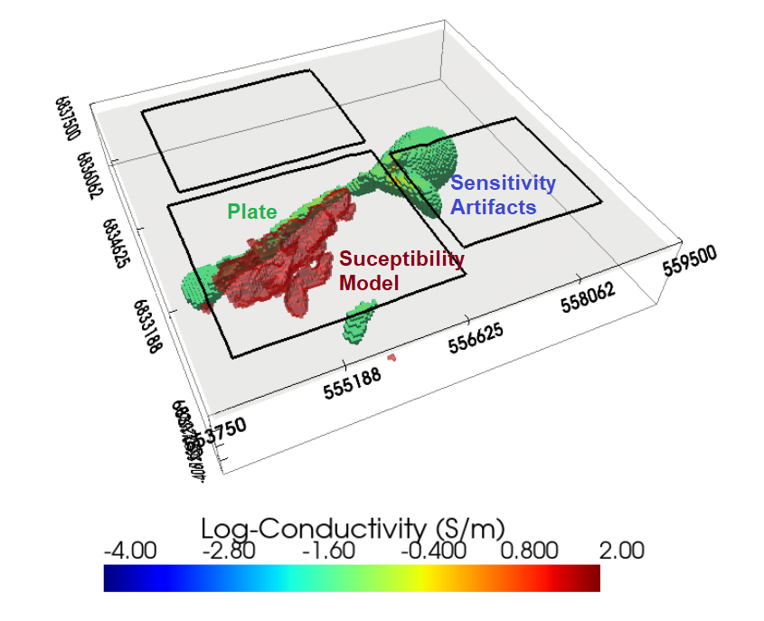

.. _comprehensive_workflow_utem_index:

Comprehensive Workflows: Surface UTEM
=====================================

**Author: Devin C. Cowan**

**Published: June, 2023**

Here, we present a general workflow for loading, interpreting and inverting surface "University of Toronto ElecroMagnetometer" (UTEM) data. We begin with UTEM data in AMIRA TEM files. Our goal is to invert the data to recover a 3D conductivity model. You may work with the tutorial dataset provided or your own data:

    - `Download the tutorial data <https://github.com/ubcgif/GIFtoolsCookbook/raw/master/assets/comprehensive_tutorial_utem.zip>`_

The data used for this tutorial were collected at a Nickel-Copper-Sulphide property in the Nunavik region of Northern Quebec. We would like to thank our program sponsors for providing the local survey data used to create this comprehensive workflow. **Please note** this UTEM dataset presents unique challenges, as we are attempting to recover a highly conductive plate-like target. This particular class of problem is an ongoing research topic. We have chosen to discuss the challenges of recovering highly conductive plate-like targets from surface UTEM data using voxel-based inversion codes.

    Recovered conductivity model (0.05 S/m cutoff) showing sensitivity-based artifacts near transmitter loops, and a red volume representing the final magnetic susceptibility model (0.1 SI cutoff).

**Tutorial Sections**

.. toctree::
    :maxdepth: 1

    - Understanding surface UTEM anomalies <1_basic_anomalies>
    - Loading UTEM data and proper units <2_load_data>
    - Defining survey geometry and plotting data <3_survey_geometry>
    - Data extraction and type <4_data_preparation>
    - Assigning uncertainties <5_uncertainties>
    - Mesh design <6_mesh_design>
    - Voxel inversion setup <7_voxel_inversion_setup>
    - Voxel inversion results and discussion <8_voxel_inversion_results>

 
