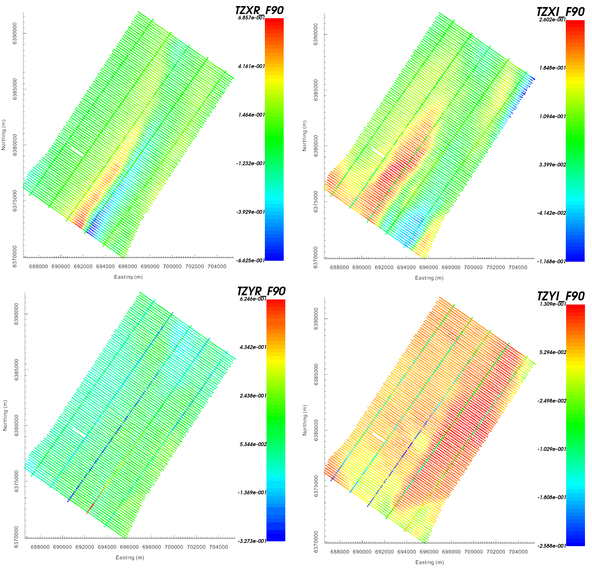
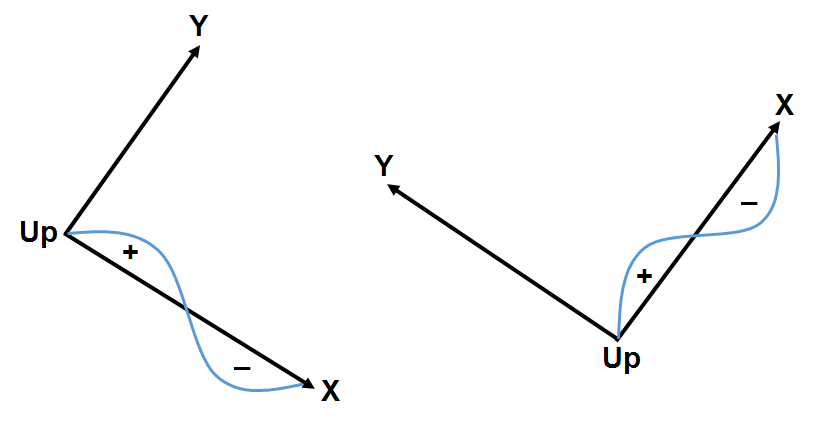
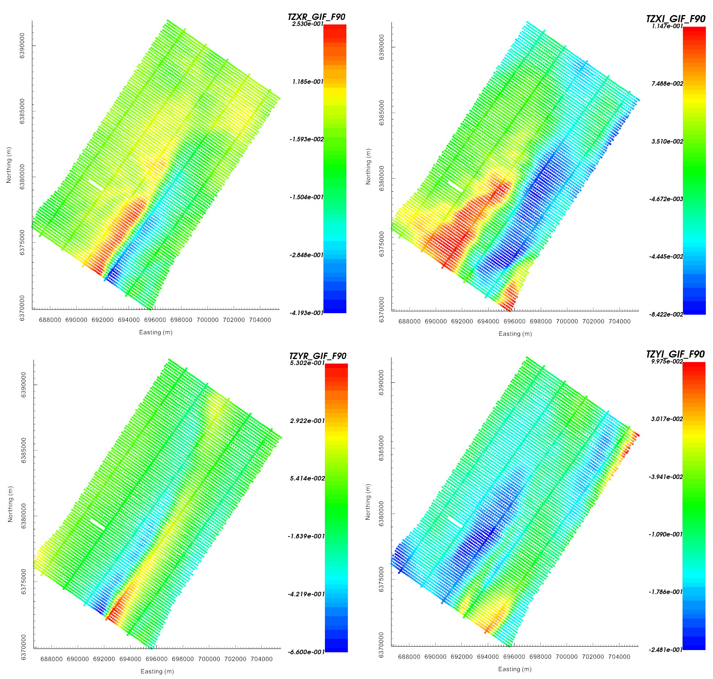
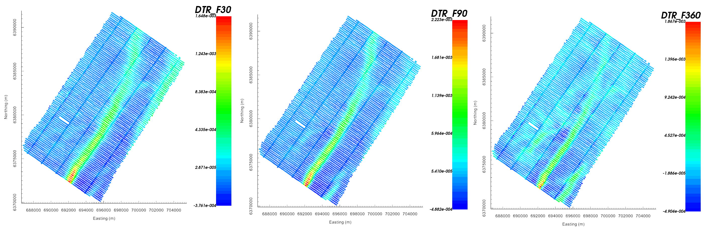

.. _comprehensive_workflow_ztem_2:

.. note:: The data used for this tutorial were collected at Dufferin Lake as part of a uranium exploration project. The data are public domain. They were downloaded from the `Saskatchewan Mineral Assessment Database <https://www.saskatchewan.ca/business/agriculture-natural-resources-and-industry/mineral-exploration-and-mining/saskatchewan-geological-survey/saskatchewan-mineral-assessment-database-smad>`__ . The original data have been down-sampled to make the size of data files more manageable.

Loading and Transforming Field Data into GIF Convention
=======================================================

The first step in any project is to load field collected data and visualize it. ZTEM datasets are challenging to work with for several reasons. First, ZTEM data are computed by applying a non-trivial operation to the components of the measured magnetic fields. Second, the ZTEM data values are frequently represented in a survey-dependent coordinate system.

Here, we will assume that you have some XYZ formatted ZTEM data. The goal is to transform these data into UBC-GIF convention so that we can work entirely within the GIFtools framework. Using contractor information and GIFtools, we will show how this is possible.

.. important:: Requires GIFtools v3.2 or later.

Starting Your Project
---------------------

    - Open GIFtools
    - :ref:`Set the working directory <projSetWorkDir>`

Import Files
------------

.. note:: If you do not have Geosoft XYZ formatted data from which to work with, you may `download tutorial data <https://github.com/ubcgif/GIFtoolsCookbook/raw/master/assets/comprehensive_tutorial_ztem.zip>`_ . It is from this dataset that we will demonstrate the workflow.

Here, we import the ZTEM data and topography.

    - :ref:`Import topography data (XYZ format) <importTopo>`. The data file is named *ZTEMtopo.xyz* and is in the *assets* folder.

    - :ref:`Import ZTEM data from Geosoft XYZ <importXYZemData>`. The data file is named *ZTEMdata_XYZ.dat* and is in the *assets* folder. If you are using the tutorial data:

        - We are loading data at 6 frequencies: 30, 45, 90, 180, 360 Hz and 720 Hz.
        - There are 4 data groups (TZXR, TZXI, TZYR, TZYI)
        - Make sure you load the *bearing* column as well!

    - Once loaded, make sure to :ref:`set IO headers <objectSetioHeaders>` for all ZTEM data.

    - **Pro tip:** To avoid confusion between location and data coordinate systems, use the :ref:`set data headers <objectDataHeaders>` tool to define location columns as *Easting, Northing* and *Elevation*.

Determining Data Convention
---------------------------

Now that we have loaded the XYZ data file and set the IO headers, we can take a first look at our data. By looking at the raw data and using any contractor information we can determine:

    1) the coordinate system in which our data are being represented
    2) the transformation required to go from the raw data coordinate system to UBC-GIF
    3) whether the data are represented using a :math:`+i\omega t` or :math:`-i\omega t` Fourier convention

Some things to consider when examining your dataset may include:

    - Any information about data convention provided by the contractor. This is the most important.
    - If the data values collected along different flight line directions do not match up at the same locations.
    - If the shape of the Tzx anomaly over a known conductor or resistor lines up with the flight direction. Recall the :ref:`anomaly over a compact conductor <comprehensive_workflow_ztem_1_conductor>` .
    - Whether the real and quadrature components are the same sign (+iwt) or opposing sign (-iwt) at the lowest frequency. **Use this only when necessary!!!** It is best to determine the Fourier convention directly from the contractor.

For the tutorial data, the real and imaginary components of the tipper data are plotted below. We see that data collected Southwest to Northeast and data collected Northeast to Southwest are very different at similar locations. This indicates the data coordinates are dependent on flight direction. According to the contractor, the imaginary component of the tutorial data are represented using a :math:`-i\omega t` Fourier convention. And for this particular dataset, we see that the real and imaginary components of the Tipper data have opposing sign. Note that at 90 Hz (seen below), induction is significant and the sign of the quadrature components has changed!!!

    Raw ZTEM data (TZXR, TZXI, TZYR and TZYI) at 90 Hz. Figure shows that data collected along different flight lines are not collected in the same coordinate system.

Below, we see the convention for data collection provided by the contractor. The plot defines Z as +ve upwards. The plot also indicates that the cross-line direction is 90 degrees counter clockwise from the along-line direction.

Flying Northwest to Southeast (bearing = 125 degrees), our Re[Tzx] anomaly would be positive to the Northwest of a conductor and negative to the Southeast. Flying Southwest to Northeast (bearing = 35 degrees), our Re[Tzx] anomaly would be positive to the Southwest and negative to the Northeast.  

    Cross-over polarization for data flown along bearing 125 degrees (left) and along 35 degrees (right).

Transformation to UBC GIF Coordinates
-------------------------------------

According to the contractor information, we must apply the following transformations to the ZTEM data provided:

    - Data collected along Northwest to Southeast must be rotated counter clockwise by 125 degrees. And data collected along Southwest to Northeast must be rotated counter clockwise by 35 degrees.
    - We must transform the cross-line direction to being 90 degrees clockwise from the along-line direction instead of 90 degrees counter clockwise.
    - We must transform from z +ve upward to z +ve downward.
    - The Fourier convention for the data is :math:`-i\omega t` (which is consistent with UBC-GIF format). If this were not the case, you would need to multiply the imaginary component of the Tipper data by -1 after the spatial transform.

To apply this transformation, we use the following utility:

    - :ref:`ZTEM data transformation <objectDataManipulationZTEM_transform>`. The XYZ file has a column which provides the along-line direction for each datum.
    - Don't forget to :ref:`set IO headers <objectSetioHeaders>` such that the data are defined in the UBC-GIF convention.

Tipper data after applying the transformation is shown below. Data are now in the UBC-GIF convention, where X = Northing, Y = Easting and Z is positive downward. The position of the data however, are still in standard UTM. The data map indicates a possible conductive feature that trends from the Southwest to the Northeast.

    ZTEM data (TZXR, TZXI, TZYR and TZYI) at 90 Hz represented in UBC-GIF coordinates. Figure shows that all data are in the same coordinate system.

.. _comprehensive_workflow_ztem_2_dt:

Interpretation using total divergence
-------------------------------------

We can compute the total divergence parameter for the data at each frequency in order to locate obvious conductive and resistive structures. To do this, we must make sure that we have first :ref:`set IO headers <objectSetioHeaders>` to data columns in the UBC-GIF convention. To compute this quantity for the real and imaginary components:

    - :ref:`Compute total divergence (DT) columns <objectDataManipulationZTEM_total_divergence>`

The total divergence parameter computed for real data at 30 Hz, 90 Hz and 360 Hz is shown below. The total divergence parameter map indicates the existence of conductive structures within a more resistive background. The most prominent conductive feature strikes along a bearing of roughly 35 degrees from the North. This conductive feature is observed across all frequencies.

    Total divergence parameter for the real component at 30 Hz (left), 90 Hz (middle) and 360 Hz (right).

.. note:: If structures were much more resistive than the background, they would be identified as large negative anomalies in the total divergence parameter map.

