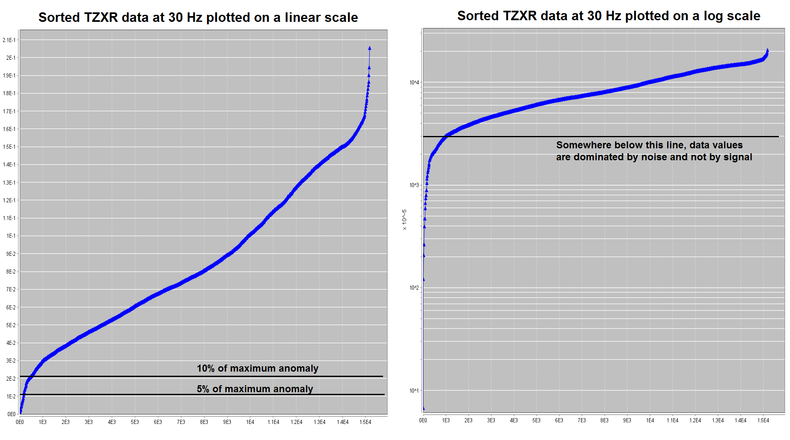

.. _comprehensive_workflow_ztem_3:

Assigning Uncertainties
=======================

Here, we provide a basic approach for assigning uncertainties to ZTEM data. The role of uncertainties in geophysical inversion is presented in the :ref:`fundamentals of inversion <Fundamentals_Uncertainties>`. When assigning uncertainties, we want to ensure we fit the anomaly and not the background. We also want to ensure we fit each component and frequency equally.

Percent Versus Floor Uncertainty
--------------------------------

For each frequency (roughly 30 Hz to 720 Hz), and for each component (TZXR, TZXI, TZYR, TZYI), ZTEM data values span roughly the same range. Because of this:

    - ZTEM anomalies observed at higher frequencies have roughly the same magnitude as ZTEM anomalies observed at low frequencies.
    - TZXR, TZXI, TZYR and TZYI anomalies have similar magnitudes.

Therefore the uncertainties applied to ZTEM data should generally be dominated by a *floor value*; as opposed to a percent which scales data values at different orders of magnitude.

There is another problem which occurs if the uncertainties are dominated by a percent. Since the background response for ZTEM data is theoretically zero, larger uncertainties are applied to ZTEM anomalies if a percent is used. This results in an inversion which attempts to over-fit the background at the expense of under-fitting the anomalies.

When the inversion is complete, we will be able to assess whether the estimated uncertainties on our data were correct. If not, the inversion will need to be re-run with a new set of uncertainties.

General Approach
----------------

There are a few options for choosing the floor uncertainty values for each component at each frequency:

    1) The user may take some fractional percents of the largest anomalous value and use that as the floor.
    2) The user may sort the data by absolute value, and choose a threshold at which the data values contain an insignificant amount of signal and are dominated by noise.

    Option 1 for choosing uncertainties (left). Option 2 for choosing uncertainties (right).

To keep our synthetic example simple, we chose to add uncertainties of 0.02 to all data. This was roughly 5-10 % the maximum anomaly amplitude for most components and frequencies. Despite being a quick way to assign uncertainties, we may end up over-fitting certain frequencies and/or components at the expense of others. To apply uncertainties:

    - Use the :ref:`GUI for applying frequency-dependent uncertainties <objectAssignUncertGUI>`.

