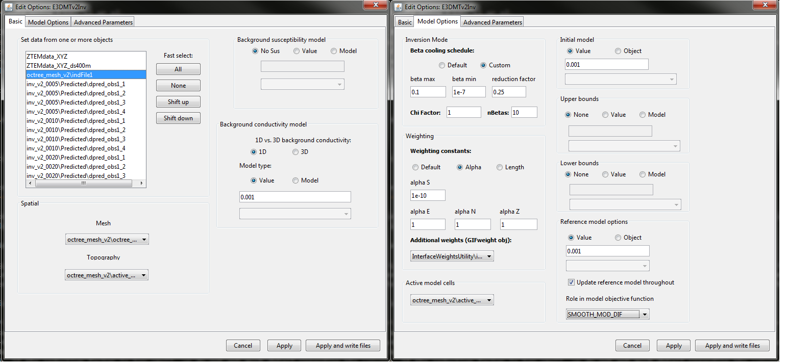

.. _comprehensive_workflow_ztem_6:

ZTEM Inversion
==============

Here, we provide the steps for setting up and running an inversion with E3DMT or E3DMT v2. We then discuss some important aspects of choosing inversion parameters.

Reducing Artifacts through Interface Weighting
----------------------------------------------

When inverting ZTEM data, the E3DMT codes have a tendency to place conductive structures near receiver locations due to the sensitivity of the data to those locations. Here, we generate interface weights to counteract this problem. By forcing lateral smoothness within the top few layers of cells, we can limit the artifacts and force the inversion to place conductive structures at the appropriate depths.

    - :ref:`Create and interface weights utility <createinterfWeights>`
    - Use :ref:`edit options <utilEditOptions>` and set the following parameters:

        - set the OcTree mesh
        - set as *log model*
        - set topography as the active cells model
        - set number of layers and corresponding weights (choose something exponentially decreasing. We chose 20, 10, and 5)
        - Face value = 0.001
        - Face tolerance = 0.001

    - :ref:`Run the utility <utilRun>`
    - :ref:`Load results <utilLoadResults>`

Create and Run Inversion
------------------------

We can now invert ZTEM data using E3DMT v1 or v2. 

    - :ref:`Create E3DMT v1 or v2 inversion object <createMTZTEMInv>`
    - Use edit options for :ref:`v1 <invEditOptions_e3dmt_ver1>` or :ref:`v2 <invEditOptions_e3dmt_ver2>` to set the inversion parameters
    - Click *Apply and write files*
    - :ref:`Run the inversion <invRun>`

For the tutorial data, **we chose to invert using E3DMT v2**, as we were able to define the receiver loops. Things are effectively the same for E3DMT v1. The parameters used are shown below. **Note that we chose the data object that has shifted locations relative to discretized topography.**

    Parameters used to invert the field dataset using E3DMT v2.

Discussion of Parameters
------------------------

.. note:: The parameters chosen for inversion of the field dataset were experimentally derived. The numbers used here worked well for inverting this dataset but should not necessary be used as general default values!

**Regarding beta cooling schedule:**

For synthetic modeling, we know the uncertainties on our data. With real data, we cannot be 100% sure that we have correctly estimated the uncertainties. In the case that we have globally under-estimated our uncertainties, we sometime set the *chi factor* to be less than 1. That way, we get to see more of the Tikhonov curve.

When setting the cooling schedule for the tutorial data set, the strategy was pretty straight-forward:

    - **beta max = 0.1**. The model recovered at the first iteration should clearly underfit the data. However if *beta max* is too large, you will have multiple iterations where the model doesn't budge because no emphasis is being put on fitting the data. We knew a good starting beta for the final inversion from cursory inversions of the data.
    - **beta min = 1e-7**. This can be set quite low. But it is good for the inversion to terminate within a reasonable number of beta iterations if target misfit is not reached.
    - **reduction factor = 0.25:** Generally we choose a value between 0.1 and 0.9. If the reduction factor is too large, the code will run for a long time since the reduction in beta at each iteration is small. If the reduction factor is too small, we do not get much detail regarding the convergence of the inversion.
    - **chi factor = 1** Here, we assume that appropriate uncertainties are set on the data. Thus, we assume the recovered model explains the data without over-fitting (fitting the noise) when the data misfit equals the number of data observations (chi factor = 1). In practice, you may choose a chi factor less than 1. This will allow you to get a better understanding of the convergence, especially if you have over-estimated the uncertainties.

**Regarding the alpha parameters:**

As a default setting, we frequently let :math:`\alpha_x = \alpha_y = \alpha_z = 1` and we let :math:`alpha_s = 1/dh^2` ; where :math:`dh` is the width of the smallest cells in the mesh. This effectively balances the emphasis on recovering a model that is similar to a reference model and recovering a model that has sufficient structure. If we have high confidence in our reference model, we may choose to increase :math:`\alpha_s` relative to :math:`\alpha_x`, :math:`\alpha_y` and :math:`\alpha_z`. If we have low confidence in our reference model, we may choose to decrease :math:`\alpha_s` relative to :math:`\alpha_x`, :math:`\alpha_y` and :math:`\alpha_z`

For this exercise, we have been provided with zero prior information regarding the Earth's structure or its electrical conductivity. We have assumed the background conductivity is 0.001 S/m but at no point have we validated this assumption. As a result, we have set :math:`\alpha_s = 10^{-10}` and let :math:`\alpha_x = \alpha_y = \alpha_z = 1`. This will recover a conductivity model which is primarily driven by the data, and is impacted minimally by the reference model.

**Regarding the background, starting and reference models**

For the background, starting and reference models, we chose 0.001 S/m. This value was suggested by a 2D ZTEM study that came with the original dataset. Before you choose these values for your project, there are some things you should consider.

If you choose a background conductivity that is lower than the true conductivity:

    - The overall range of conductivities in the recovered model may be lower than the true range of conductivities.
    - Your inversion will be more sensitive to structures at depth. Recovered structures may be lower conductivity and placed at larger depths.

If you choose a background conductivity that is higher than the true conductivity:

    - The overall range of conductivities in the recovered model may be higher than the true range of conductivities.
    - Your inversion will note be as sensitive to structures at depth. Recovered conductors may be highly conductive and placed at shallower depths.

