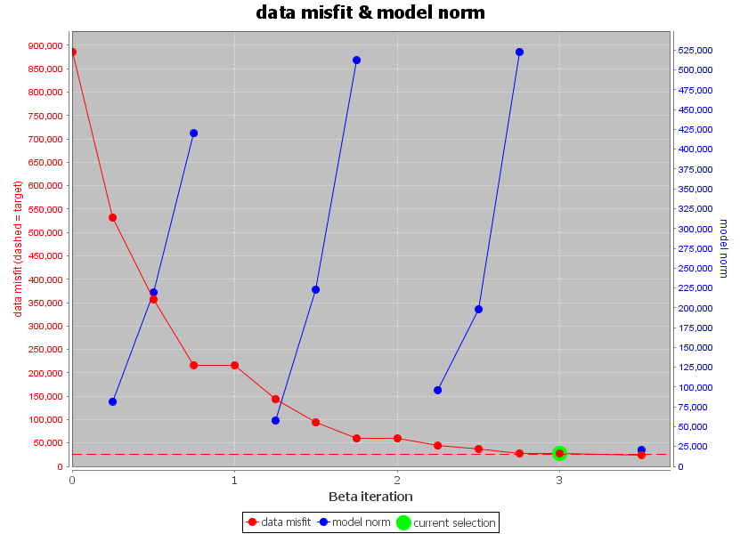
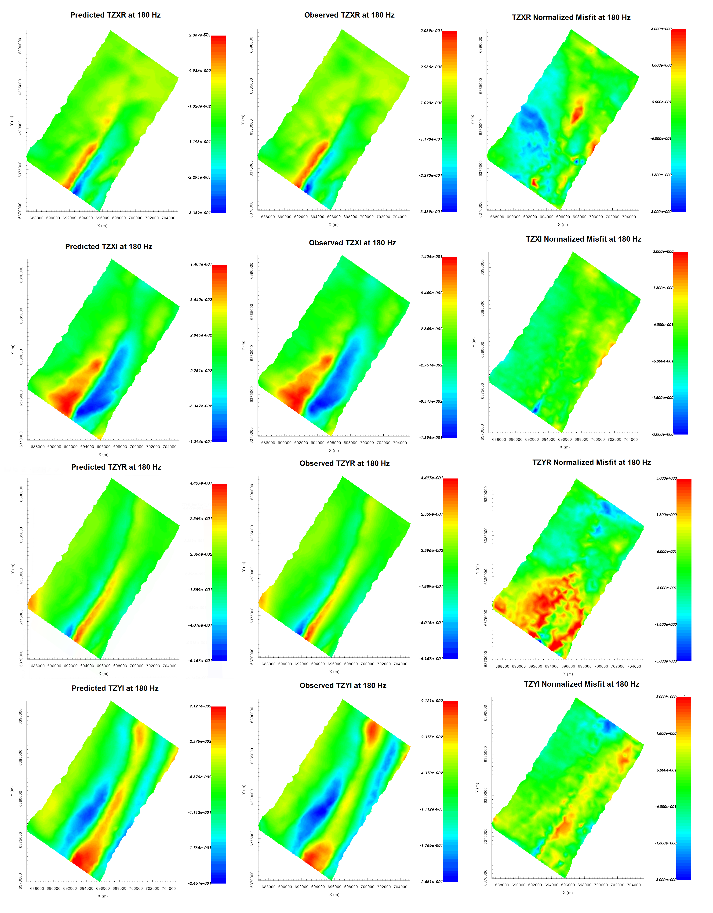
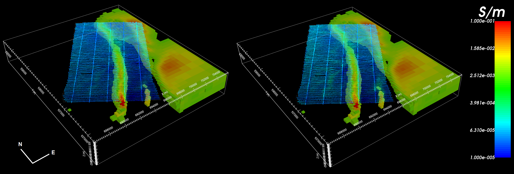

.. _comprehensive_workflow_ztem_7:

Inversion Results
=================

Here, we demonstrate a common practice for examining the output of the inversion code. This includes examining the convergence, the data misfit and the recovered model. Before looking at recovered models, the user is **strongly** urged to examine the convergence of the algorithm first (Tikhonov curve). By examining the convergence, we can:

	- determine if our data is in UBC-GIF data convention. The data misfit will be large and will not reduces at each iteration otherwise.
	- see if the inversion is able to reach target misfit
	- infer whether the target misfit is reasonable; i.e. did we globally over or under-estimate the uncertainties on our data

We then assess how well a given recovered model explains the data by looking at the predicted data, observed data and normalized data misfit maps. From this we can determine whether:

	- the predicted data fits the amplitude, shape and character of observed anomalies for each component and for each frequency
	- the estimated uncertainties were reasonable for each component and for each frequency.
	- the inversion must be re-run with a new set of uncertainties

Only when the convergence and data misfit are acceptable can we infer geological structures from recovered models.

Convergence
^^^^^^^^^^^

Once the inversion has finished:

	- :ref:`View convergence <convergence_curve>`

The Tikhonov curve for our example inversion is shown below. According to the figure:

	- the inversion reaches target misfit (chi-factor = 1 in this case) after 4 iterations. Thus the algorithm is converging over the course of the beta cooling schedule.
	- the inversion reaches a chi-factor of 1 (data misfit equals number of data) somewhere between the 3rd or 4th iteration. Assuming the estimate of our uncertainties is correct, the optimum recovered model should correspond to a chi-factor of 1.
	- the Tikhonov curve starts to flatten out at the 4th iteration, indicating the point on the Tikhonov curve after which recovered models start to over-fit the data. You may choose to verify this by setting the chi factor to something like 0.5 and re-running the inversion.

Data Misfit
^^^^^^^^^^^

Now that we have selected an iteration (or range of iterations) that we feel explains the data without overfitting:

    - :ref:`Load inversion results for these iterations <invLoadResults>`

According the Tikhonov curve, the recovered model at iteration 4 has a good change of explaining the data without fitting the noise. To be sure however, we must examine the observed data, predicted data and data misfit for the corresponding model. Here are some good questions to ask during this step:

	- Are the prominent anomaly features identified in the observed data also found in the predicted data? Is this true for all components and for all frequencies?
	- Are there obvious coherent features in your normalized misfit map? If so, this indicates you are over-fitting certain regions at the expense of others and that you must assign new uncertainties and re-run the inversion.
	- Are the ranges of normalized misfits for each component and for each frequency generally the same? If not, the uncertainties are not balanced between components and/or frequencies. In this case, new uncertainties should be applied and the inversion should be re-run.

For our example inversion, here are some things we noticed:

	- The general shape and amplitude of the main geophysical signatures are well reproduced by the predicted data at all frequencies and for all components.
	- The range of normalized misfits are generally consistent over all frequencies and over all components. This indicates that our basic estimate of the data uncertainties was a good first estimate.
	- The TZXI component has noticeably smaller normalized misfits than the other components, indicating the inversion fits these data better than it does the other components.
	- TZYI shows higher normalized misfits and more coherent features at low frequencies.
	- Individual misfit maps shown coherent features, but these features are not consistent over all frequencies.
	

For our example, better results could be obtained by decreasing the floor uncertainty on TZXI by some factor and re-running the inversion to ensure we recover a model which fits the data evenly. This change will force the inversion to fit the TZXI component as well as it does the TZXR, TZYR and TZYI components. We may also adjust the floor uncertainty for individual components and frequencies which we feel are over/under fit.

    Predicted data, observed data and normalized misfit for all data components at 180 Hz. For each component, predicted and observe data are plotted on the same scale. All normalized misfit maps are plotted on a range from -3 to 3.

Recovered Model
^^^^^^^^^^^^^^^

The conductivity model recovered at the 4th iteration is shown below. A cutoff of 0.003 S/m was applied. The model was also sliced horizontally at an elevation of 253 m. To show how well structures in the recovered model match data signatures, we plotted the total divergence parameter at 45 Hz and at 180 Hz.

The inversion recovers the large conductive feature that strikes along a bearing of 35 degrees. The conductivity along the recovered feature corresponds well to amplitude of the ZTEM response. A secondary conductive feature is also recovered at the Southernmost tip of the survey area. Along the Eastern end of the of the survey area, ZTEM data and the total divergence parameter indicated the possible presence of another conductor. Although the inversion placed conductive structures in this area, the feature is poorly constrained by the data. 

    Recovered model and total divergence parameter at 45 Hz (left) and at 180 Hz (right).

