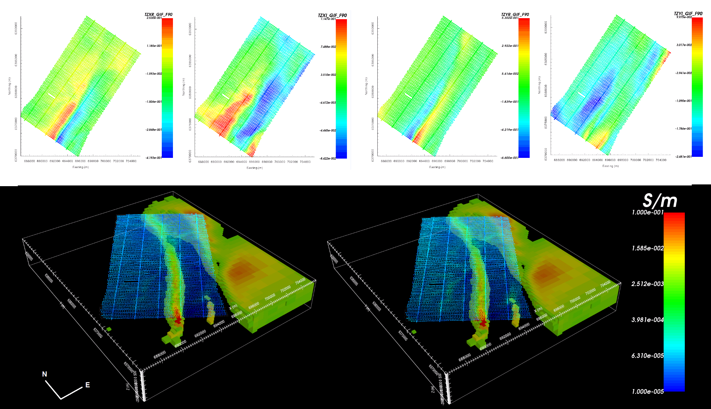

.. _comprehensive_workflow_ztem_index:

Comprehensive Workflows: ZTEM
=============================

**Author: Devin C. Cowan**

**Published: March, 2020**

Here, we present a general workflow for loading, interpreting and inverting Z-axis Tipper electromagnetic (ZTEM) data. We begin with ZTEM data in xyz data format. Our goal is to invert the data to recover a 3D conductivity model. You may work with the tutorial dataset provided or your own data:

    - `Download the tutorial data <https://github.com/ubcgif/GIFtoolsCookbook/raw/master/assets/comprehensive_tutorial_ztem.zip>`_

The data used for this tutorial were collected at Dufferin Lake as part of a uranium exploration project. The data are public domain. They were downloaded from the `Saskatchewan Mineral Assessment Database <https://www.saskatchewan.ca/business/agriculture-natural-resources-and-industry/mineral-exploration-and-mining/saskatchewan-geological-survey/saskatchewan-mineral-assessment-database-smad>`__ . The original data have been down-sampled to make the size of data files more manageable.

**Tutorial Sections**

.. toctree::
    :maxdepth: 1

    - Understanding ZTEM anomalies <1_basic_anomalies>
    - Loading geophysical data and transforming from along-line cross-line convention to GIF convention <2_load_data>
    - Standard assignment of uncertainties to ZTEM data <3_uncertainties>
    - Preparing data for inversion within the GIFtools framework <4_data_preparation>
    - Mesh design <5_mesh_design>
    - Setting appropriate parameters and running the inversion <6_inversion>
    - Examining convergence, data misfit and the recovered model <7_results>

 