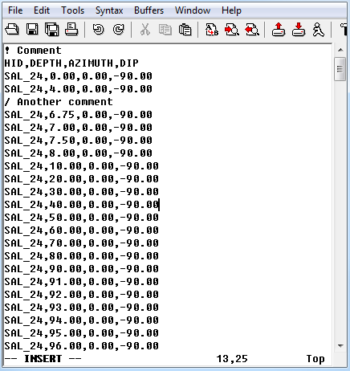

.. _CSVfile:

CSV file format
===============

The CSV file should have an *uncommented* header line and be comma delimited. Comments are given throughout the file by: ``/`` , ``!`` , or ``%``. There are no specific keywords that are assumed to be comment lines.
 
Below is a sample CSV file with the header [HID,DEPTH,AZIMUTH,DIP]:

