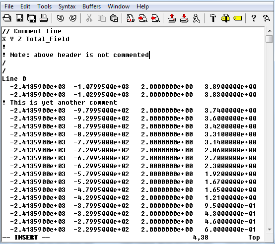

.. _XYZfile:

XYZ file format
===============

GIFtools assumes all XYZ files are in a specific format. The file should have an *uncommented* header line and be white-spaced delimited (tabs/space mixture is ok). Comments are given throughout the file by: ``/`` , ``!`` , or ``%``. There are seven specific keywords that should *not* be in the header:

    - Line
    - Test
    - Trend
    - Tie
    - Base
    - Special
    - Random
 
Below is a sample XYZ file with the header [X Y Z Total_Field]:

