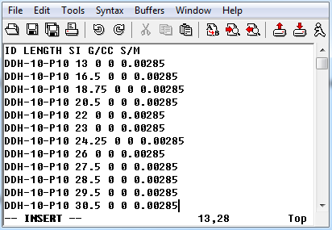
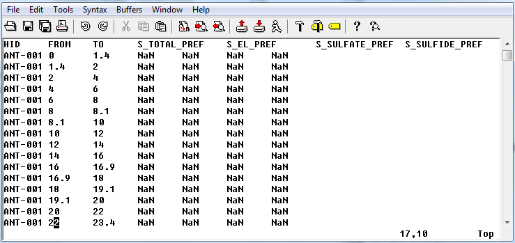

.. _bhPropfile:

Borehole property file format
=============================

GIFtools assumes that the borehole property file is in either the :ref:`XYZ <XYZfile>` or :ref:`CSV <CSVfile>` file format. This file requires either the length downhole for point measurements *or* two columns defining the start/end to the observation section. The file may contain multiple properties that would be :ref:`set in the input/output header <objectSetioHeaders>` later in GIFtools. It is possible to import an integer field that describes geology or characters (e.g., "PK" or "Pyroclastic Kimberlite" if a CSV file). The file *must* have the at least the following information (but not necessarily these specific names or order):

#. Hole_ID: If the hole ID names require a space, then a CSV file should be used. These identifications can be numeric or characters (with no quotes), but should be consistent with the :ref:`collar <bhCollarfile>` and :ref:`survey <bhSurveyfile>` files.

#. Length: Length of observation down the borehole **OR**

#. Depth_From: Start of the observation section (if length not given)

#. Depth_To: End of the observation section (if length not given)

Examples
--------

Example 1: Length 
^^^^^^^^^^^^^^^^^
Below is a sample borehole property file (XYZ format) where "ID" is the Hole_ID three properties can be imported (SI, G/CC, and S/M):

Example 1: Depth section 
^^^^^^^^^^^^^^^^^^^^^^^^

Below is a sample borehole property file (XYZ format) where "HID" is the Hole_ID and "FROM" is the Depth_From, "TO" is the Depth_to (note NaN are the values of no data):

