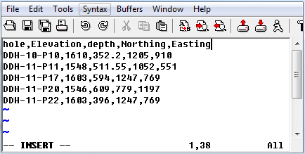

.. _bhCollarfile:

Borehole collar file format
===========================

GIFtools assumes that the borehole collar file is in either the :ref:`XYZ <XYZfile>` or :ref:`CSV <CSVfile>` file format. The file *must* have the at least the following information (but not necessarily these specific names or order):

#. Hole_ID: If the hole ID names require a space, then a CSV file should be used. These identifications can be numeric or characters (with no quotes), but should be consistent with the :ref:`survey <bhSurveyfile>` and :ref:`property <bhPropfile>` files.

#. Easting: East coordinate in metres (may be local coordinate system)

#. Northing: North coordinate in metres (may be local coordinate system)

#. Elevation: Elevation in metres (z+ up) of the collar

#. Length: Length of the borehole in metres

Example
-------

Below is a sample collar file (CSV format) where "hole" is the Hole_ID and "depth" is the Length:

