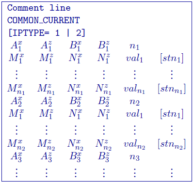
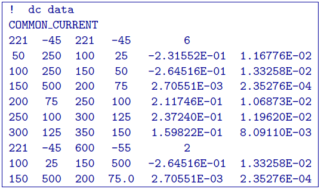
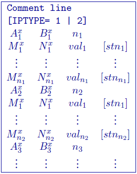
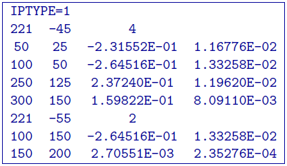
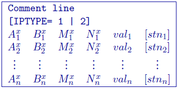
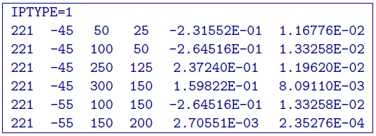

.. _dcip2dObsfile:

DC/IP 2D Observations file
==========================

This file contains the observed measurements and the associated electrode locations. Both potential data and apparent chargeability data are stored in the same format. This will be the format of all the data files that are output from DCIPF2D, and are input to DCINV2D and IPINV2D.

It is assumed that the survey is carried out either along a line in the :math:`x-`\ direction perpendicular to geologic strike or along a borehole. In the presence of topography, it is assumed that all current and potential electrodes are located along the line and are placed on the topography at each :math:`x` location. In other words, the programs in the DCIP2D package will automatically place the electrodes on the surface according to the topography and the :math:`x` location given in the  observations file. Electrodes will be at :math:`z=0` if topography is not given (e.g., set to null). The :math:`z` coordinates should be provided in the observations file when the data are located down a borehole.

The observations file can have three different formats: the :ref:`general2DFormat`, :ref:`surface2DFormat`, :ref:`simple2DFormat` format. Only a single format is allowed in a data file. **The general format is the only format that will allow the use of borehole locations**. The type of format chosen to store the data does not make any difference to the DCIP2D program library or GIFtools and is determined only by the user's preference. At the beginning of execution, the programs will determine the format and the output files will be written in the same format. Standard deviations are optional in each format. The calculation of the standard deviation within is given below in the detailed summaries of components. All standard deviations must either be given or not given to be calculated.

.. _general2DFormat:

General format
--------------

The DCIP2D can handle arbitrary electrode configurations, and a mixture of different configurations can be present in the data file. This is accomplished by specifying the locations of four electrodes for each datum. Whenever the two current electrodes, or two potential electrodes, are given the identical location, that particular pair is considered to be a single pole with the negative electrode being at infinity. The format consists of a line with the current electrode location and number of potential electrode locations associated with it. Each location has :math:`x` and :math:`z` coordinates. An example of the format file structure is as follows:

- Comment Line: Any comments can go here. This line is ignored by dcinv2d

- COMMON_CURRENT: This flag is given prior to to let the code know that it is a general format file

- IPTYPE: Only used for IP inversion and not required if only using DC inversion.
    - IPTYPE = 1: Flag for ``apparent chargeability`` IP data
    - IPTYPE = 2: Flag for ``secondary potentials`` IP data

- A\ :math:`^x_i`: i\ :math:`^{th}` horizontal position along line of current electrode A

- A\ :math:`^z_i`: i\ :math:`^{th}` elevation of current electrode A

- B\ :math:`^x_i`: i\ :math:`^{th}` horizontal position along line of current electrode B

- B\ :math:`^z_i`: i\ :math:`^{th}` elevation of current electrode B

- M\ :math:`^x_j`: j\ :math:`^{th}` horizontal position along line of potential electrode M associated with the i\ :math:`^{th}` current pair

- M\ :math:`^z_j`: j\ :math:`^{th}` elevation of potential electrode M associated with the i\ :math:`^{th}` current pair

- N\ :math:`^x_j`: j\ :math:`^{th}` horizontal position along line of potential electrode N associated with the i\ :math:`^{th}` current pair

- N\ :math:`^z_j`: j\ :math:`^{th}` elevation of potential electrode N associated with the i\ :math:`^{th}` current pair

- val\ :math:`_j`: j\ :math:`^{th}` observed datum related to the j\ :math:`^{th}` potential pair and i\ :math:`^{th}` current pair. The potential measurements must be measured value in Volts, or a dimensionless real number (not percentage) for apparent chargeability (*potential is always normalized to unit current amplitude*). There are four types of IP data generally in use; two gathered in the time domain and two gathered in the frequency domain. For small chargeabilities, as is nearly always the case for earth materials, all data types can be used as input for inversion, and resulting models will have chargeabilities in the same units.

- stn\ :math:`_j`: j\ :math:`^{th}` standard deviation associated with the j\ :math:`^{th}` datum. This is a positive, absolute value (i.e., not a percentage).

Example of general format
^^^^^^^^^^^^^^^^^^^^^^^^^

The following is an example of DC data (e.g., no IPTYPE):

In the above example, there are two current electrode locations, the first with six potential electrodes and the second with two potential electrode data. The line ``IPTYPE=2`` would be added if this file were IP data of second potentials.

.. _surface2DFormat:

Surface format
--------------

The surface format is similar to the general format with difference that the elevation data is not given. Instead, the program places the electrodes on top of the discretized topographic surface. Accordingly, this format **cannot be used with borehole data** and if no topography is given, assumes the data are on top of the mesh at an elevation of 0. Whenever the two current electrodes, or two potential electrodes, are given the identical location, that particular pair is considered to be a single pole with the negative electrode being at infinity. The format consists of a line with the current electrode location and number of potential electrode locations associated with it. An example of the format file structure is as follows:

The following are detailed summaries of components of the surface-format
observations file:

- Comment Line: Any comments can go here. This line is ignored by dcinv2d

- IPTYPE: Only used for IP inversion and not required if only using DC inversion.
    - IPTYPE = 1: Flag for ``apparent chargeability`` IP data
    - IPTYPE = 2: Flag for ``secondary potentials`` IP dataa

- A\ :math:`^x_i`: i\ :math:`^{th}` horizontal position along line of current electrode A

- B\ :math:`^x_i`: i\ :math:`^{th}` horizontal position along line of current electrode B

- M\ :math:`^x_j`: j\ :math:`^{th}` horizontal position along line of potential electrode M associated with the i\ :math:`^{th}` current pair

- N\ :math:`^x_j`: j\ :math:`^{th}` horizontal position along line of potential electrode N associated with the i\ :math:`^{th}` current pair

- val\ :math:`_j`: j\ :math:`^{th}` observed datum related to the j\ :math:`^{th}` potential electrode pair and i\ :math:`{^th}` current electrode pair. The potential measurements must be measured value in Volts, or a dimensionless real number (not percentage) for apparent chargeability (*potential is always normalized to unit current amplitude*). There    are four types of IP data generally in use; two gathered in the time domain and two gathered in the frequency domain. For small chargeabilities, as is nearly always the case for earth materials, all data types can be used as input for inversion, and resulting models will have chargeabilities in the same units.

- stn\ :math:`_j`: j\ :math:`^{th}` standard deviation associated with the j\ :math:`^{th}` datum. This is a positive, absolute value (not a percentage) in units of the data.

Example of surface format
^^^^^^^^^^^^^^^^^^^^^^^^^

The following is an example of IP data in units of apparent
chargeability:

In the above example, there are two current electrode locations, the first with four potential electrodes and the second with two potential electrode data. The line ``IPTYPE=1`` would be absent if this file were DC data.

.. _simple2DFormat:

Simple format
-------------

The simple format is the most straightforward, but also most restrictive of the three formats. The elevations are not given similar to the surface format with difference that the elevation data is not given. Instead, the program places the electrodes on top of the discretized topographic surface. Accordingly, this format **cannot be used with borehole data** and if no topography is given, assumes the data are on top of the mesh at an elevation of 0. Whenever the two current electrodes, or two potential electrodes, are given the identical location, that particular pair is considered to be a single pole with the negative electrode being at infinity. The format consists of a line with the current electrode pair location and potential electrode location pair. An example of the format file structure is as follows:

The following are detailed summaries of components of the simple-format
observations file:

- Comment Line: Any comments can go here. This line is ignored by

- IPTYPE: Only used for IP inversion and not required if only using DC inversion.
    - IPTYPE = 1: Flag for ``apparent chargeability`` IP data
    - IPTYPE = 2: Flag for ``secondary potentials`` IP data

- A\ :math:`^x_i`: i\ :math:`^{th}` horizontal position along line of current electrode A

- B\ :math:`^x_i`: i\ :math:`^{th}` horizontal position along line of current electrode B

- M\ :math:`^x_i`: i\ :math:`^{th}` horizontal position along line of potential electrode M

- N\ :math:`^x_i`: i\ :math:`^{th}` horizontal position along line of potential electrode N

- val\ :math:`_j`: i\ :math:`^{th}` observed datum. The potential measurements must be measured value in Volts, or a dimensionless real number (not percentage) for apparent chargeability (*potential is always normalized to unit current amplitude*). There are four types of IP data generally in use; two gathered in the time domain and two gathered in the frequency domain. For small chargeabilities, as is nearly always the case for earth materials, all data types can be used as input for inversion, and resulting models will have chargeabilities in the same units.

- stn\ :math:`_j`: i\ :math:`^{th}` standard deviation associated with the i\ :math:`^{th}` datum. This is a positive, absolute value (i.e., not a percentage) in units of the data.

Example of simple format
^^^^^^^^^^^^^^^^^^^^^^^^

The following is an example of the simple format. The data are the same as given in the surface format example; IP data in units of apparent chargeability:

