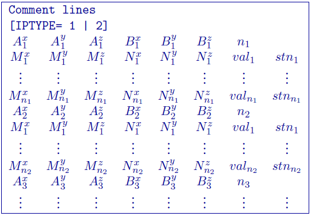
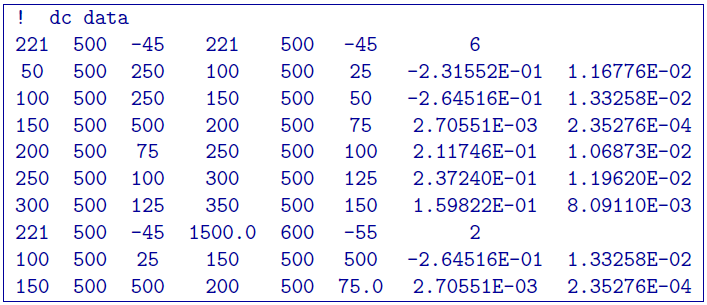
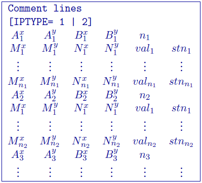
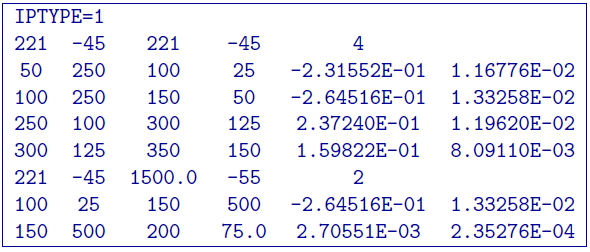

.. _dcip3dfile:

DC/IP 3D Observations file
==========================

This file contains the observed measurements and the associated electrode locations. Both potential data and apparent chargeability data are stored in the same format. This will be the format of all the data files that are output from and to DCIP3D. For convenience, there are two slightly different file formats: the :ref:`general3DFormat` and :ref:`surface3DFormat` formats. The two data formats cannot be mixed in one file. Both formats are consistent the two-dimensional version of the code () except for the addition of a :math:`y` location. Any comments for either format are given in the beginning and denoted by ``!`` prior to the comment.

**NOTE**: The output of the forward modelling programs ``DCIP3DF`` ``DCIPoctreeFwd`` does not quite have the correct format to be considered an observation file since the final column which is supposed to contain standard deviations for the error is instead replaced with computed apparent conductivities/chargeabilities.

.. _general3DFormat:

General format
--------------

A mixture of different configurationsat any electrode location and configuration can be present in the data file. This is accomplished by specifying the locations of four electrodes for each datum. Whenever the two current electrodes, or two potential electrodes, are given the identical location, that particular pair is considered to be a single pole with the negative electrode being at infinity. It should be noted that if this format is used and topography is desired, then **the topography format used must be** :ref:`topoDiscretefile`. The format consists of a line with the current electrode location and number of potential electrode locations associated with it. An example of the format file structure is below.

The following are detailed summaries of components of the standard-format observations file:

- IPTYPE: Only used for IP inversion and not required if only using DC inversion.
    - IPTYPE = 1: Flag for ``apparent chargeability`` IP data
    - IPTYPE = 2: Flag for ``secondary potentials`` IP data

- A\ :math:`^x_i`: i\ :math:`^{th}` easting position (:math:`x`) of current electrode A

- A\ :math:`^y_i`: i\ :math:`^{th}` northing position (:math:`y`) of current electrode A

- A\ :math:`^z_i`: i\ :math:`^{th}` vertical position (:math:`z`) of current electrode A

- B\ :math:`^x_i`: i\ :math:`^{th}` easting position (:math:`x`) current electrode B

- B\ :math:`^y_i`: i\ :math:`^{th}` northing position (:math:`y`) of current electrode B

- B\ :math:`^z_i`: i\ :math:`^{th}` vertical position (:math:`z`) of current electrode B

- M\ :math:`^x_j`: j\ :math:`^{th}` easting position (:math:`x`) of potential electrode M associated with the i\ :math:`^{th}` current pair

- M\ :math:`^y_j`: j\ :math:`^{th}` northing position (:math:`y`) of potential electrode M associated with the i\ :math:`^{th}` current pair

- M\ :math:`^z_j`: j\ :math:`^{th}` vertical position (:math:`z`) of potential electrode M associated with the i\ :math:`^{th}` current pair

- N\ :math:`^x_j`: j\ :math:`^{th}` easting position (:math:`x`) of potential electrode N associated with the i\ :math:`^{th}` current pair

- N\ :math:`^y_j`: j\ :math:`^{th}` northing position (:math:`y`) of potential electrode N associated with the i\ :math:`^{th}` current pair

- N\ :math:`^z_j`: j\ :math:`^{th}` vertical position (:math:`z`) of potential electrode N associated with the i\ :math:`^{th}` current pair

- val\ :math:`_j`: j\ :math:`^{th}` observed datum related to the j\ :math:`^{th}` potential electrode pair and i\ :math:`{^th}` current electrode pair. The potential measurements must be measured value in Volts, or a dimensionless real number (not percentage) for apparent chargeability  (*potential is always normalized to unit current amplitude*). There are four types of IP data generally in use; two gathered in the time domain and two gathered in the frequency domain. For small chargeabilities, as is nearly always the case for earth materials, all data types can be used as input for inversion, and resulting models will have chargeabilities in the same units.

- stn\ :math:`_j`: j\ :math:`^{th}` j\ :math:`^{th}` standard deviation associated with the j\ :math:`^{th}` datum. This is a positive, absolute value (i.e., not a percentage).

Example of general format
^^^^^^^^^^^^^^^^^^^^^^^^^

The following is an example of DC data (e.g., no IPTYPE):

In the above example, there are two current electrode locations, the first with six potential electrodes and the second with two potential electrode data. The line ``IPTYPE=2`` would be added if this file were IP data of second potentials.

.. _surface3DFormat:

Surface format
--------------

The surface format is similar to the general format with difference that the elevation data is not given. Instead, the program places the electrodes on top of the discretized topographic surface. Accordingly, this format **cannot be used with borehole data** and if no topography is given, assumes the data are on top of the mesh. Whenever the two current electrodes, or two potential electrodes, are given the identical location, that particular pair is considered to be a single pole with the negative electrode being at infinity. The format consists of a line with the current electrode location and number of potential electrode locations associated with it. This format can be used with any topography type. An example of the format file structure is as follows:

The following are detailed summaries of components of the surface-format observations file:

- IPTYPE: Only used for IP inversion and not required if only using DC inversion.
    - IPTYPE = 1: Flag for ``apparent chargeability`` IP data
    - IPTYPE = 2: Flag for ``secondary potentials`` IP data

- A\ :math:`^x_i`: i\ :math:`^{th}` easting position (:math:`x`) of current electrode A

- A\ :math:`^y_i`: i\ :math:`^{th}` northing position (:math:`y`) of current electrode A

- B\ :math:`^x_i`: i\ :math:`^{th}` easting position (:math:`x`) current electrode B

- B\ :math:`^y_i`: i\ :math:`^{th}` northing position (:math:`y`) of current electrode B

- M\ :math:`^x_j`: j\ :math:`^{th}` easting position (:math:`x`) of potential electrode M associated with the i\ :math:`^{th}` current pair

- M\ :math:`^y_j`: j\ :math:`^{th}` northing position (:math:`y`) of potential electrode M associated with the i\ :math:`^{th}` current pair

- N\ :math:`^x_j`: j\ :math:`^{th}` easting position (:math:`x`) of potential electrode N associated with the i\ :math:`^{th}` current pair

- N\ :math:`^y_j`: j\ :math:`^{th}` northing position (:math:`y`) of potential electrode N associated with the i\ :math:`^{th}` current pair

- val\ :math:`_j`: j\ :math:`^{th}` observed datum related to the j\ :math:`^{th}` potential electrode pair and i\ :math:`{^th}` current electrode pair. The potential measurements must be measured value in Volts, or a dimensionless real number (not percentage) for apparent chargeability  (*potential is always normalized to unit current amplitude*). There are four types of IP data generally in use; two gathered in the time domain and two gathered in the frequency domain. For small chargeabilities, as is nearly always the case for earth materials, all data types can be used as input for inversion, and resulting models will have chargeabilities in the same units.

- stn\ :math:`_j`: j\ :math:`^{th}` j\ :math:`^{th}` standard deviation associated with the j\ :math:`^{th}` datum. This is a positive, absolute value (i.e., not a percentage).

Example of surface format
^^^^^^^^^^^^^^^^^^^^^^^^^

The following is an example of IP data in units of apparent chargeability:

In the above example, there are two current electrode locations, the first with four potential electrodes and the second with two potential electrode data. The line ``IPTYPE=1`` would be absent if this file were DC data.
