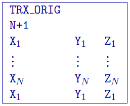
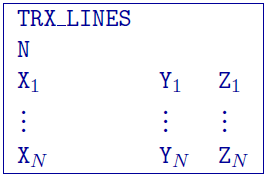
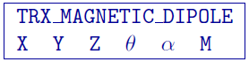
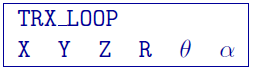

.. _emTransmitters:

EM transmitter formats
======================

This "block" format will be used for describing EM transmitters within :ref:`FEM <femfile>` and :ref:`TEM <temfile>` data files. The types of EM transmitters available are:

- Large-loop,
- Line-current,
- Dipole, and 
- Loop

Large-loop transmitter
----------------------

A large-loop transmitter, also known as the "original" distributed current source-closed loops or grounded wires. Below is an example of the closed loop. The block is started by the flag ``TRX_ORIG``:

The parameters given are:
- :math:`N`: Number of unique locations defining the transmitter (+1 added for the closed loop)
- :math:`X_i`: Easting (m) of \\(i^{th}//) transmitter location
- :math:`Y_i`: Northing (m) of \\(i^{th}\\) transmitter location
- :math:`Z_i`: Elevation (m) of \\(i^{th}\\) transmitter location

**NOTES**: The last value is a repeat of the first value to "close" the loop. The source is described by the number of nodes (must have at least 4) where 4 denote a groundwire and > 4 is a closed loop. The current in the transmitter is assumed to be 1 Ampere.

Line-current transmitter
------------------------

A line transmitter is an analytical general closed loop of line currents. It is designed to handle arbitrary complex transmitters with user defined number of nodes. The format for this source type is same as above; the difference is in how the transmitter currents are handled. The block is started by the flag ``TRX_LINES``:

The parameters given are:

- ``N``: Number of unique locations defining the transmitter
- :math:`X_i`: Easting (m) of \\(i^{th}\\) transmitter location
- :math:`Y_i`: Northing (m) of \\(i^{th}\\) transmitter location
- :math:`Z_i`: Elevation (m) of \\(i^{th}\\) transmitter location

Dipole transmitter
------------------

There are two different types of dipole transmitters: magnetic and electric. The flags for each of these are respectively ``TRX_MAGNETIC_DIPOLE`` and ``TRX_ELECTRIC_DIPOLE``. Below is an example of an magnetic dipole:

The parameters given are:

- :math:`X`: Easting (m) location of the transmitter
- :math:`Y`: Northing (m) location of the transmitter
- :math:`Z`: Elevation (m) location of the transmitter
- :math:`\theta`: vertical angle in degrees from z+ up. 
- :math:`\alpha`: angle in degrees from y+ north.
- :math:`M`: Moment of the dipole in SI units (could be one if the data are normalized)

**NOTE**: A vertical dipole (z+ up) is defined by \\( \\theta = \\alpha = 0\\). 

Loop transmitter
----------------

A transmitter defined by an analytical circular loop. This type of transmitter is a good approximation for airborne systems (VTEM, HeliGEOTEM, AeroTEM, etc.). The flag is ``TRX_LOOP`` and the block is defined as:

The parameters given are:

- :math:`X`: Easting (m) location of the transmitter
- :math:`Y`: Northing (m) location of the transmitter
- :math:`Z`: Elevation (m) location of the transmitter
- :math:`R`: Radius (m) of the loop
- :math:`\theta`: vertical angle in degrees from z+ up. 
- :math:`\alpha`: angle in degrees from y+ north.

**NOTE**: A loop parallel to the xy plane is \\( \\theta = \\alpha = 0\\).

