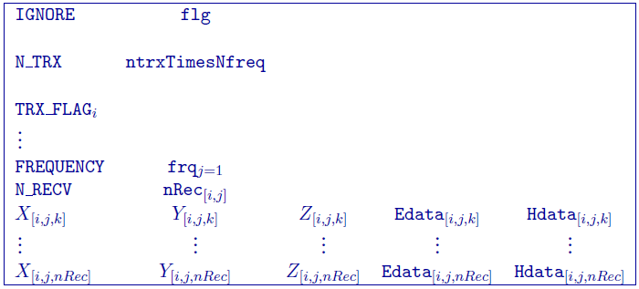
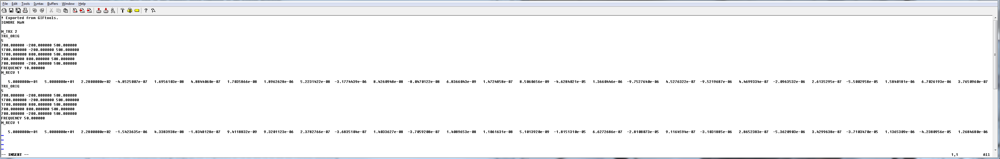
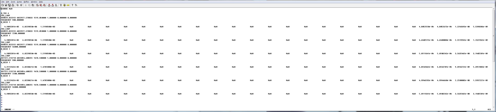

.. _femfile:

FEM data: GIF file
==================

This file is used to specify the transmitters and associated data for a Frequency-domain ElectroMagnetic (FEM) survey. The file is broken down based on the transmitters and requires all data types be present (although they may be filled with an ignore value; see below). The convention is z+down and x+ East and y+ North. Comment lines begin with ``!``. The data line contains 27 columns (x,y,z,E data and H data with uncertainties), but may be filled with ignore flags to denote using only certain data types. Below is the general format:

Parameter definitions:

- ``flg``: Any string/value that does not contain actual data. By default, GIFtools will export ``NaN`` as the ignore value. The flag ``IGNORE`` preceeds this input.

- ``ntrxTimesNfreq``: Number of transmitters multiplied by the number of frequencies. The flag ``N_TRX`` preceeds this input.
  
- ``TRX_FLAG``: The \\(i^{th}\\) transmitter. This line contains the specific transmitter flag and block defining the transmitter. See :ref:`GIF EM transmitters <emTransmitters>` for specifications on formatting different transmitters.

- ``frq``: The  frequency of the following receivers for the given transmitter. The flag ``FREQUENCY`` preceeds this input.

- ``nRec``: Number of receivers associated with the frequency given above for the given (\\(i^{th}\\)) transmitter. The flag ``N_RECV`` preceeds this input.

- :math:`X_{[i,j,k]}`: Easting (m) of the \\(k^{th}\\) receiver at the  \\(j^{th}\\) frequency for the \\(i^{th}\\) transmitter.

- :math:`Y_{[i,j,k]}`: Northing (m) of the \\(k^{th}\\) receiver at the  \\(j^{th}\\) frequency for the \\(i^{th}\\) transmitter.

- :math:`Z_{[i,j,k]}`: Elevation (m) of the \\(k^{th}\\) receiver at the  \\(j^{th}\\) frequency for the \\(i^{th}\\) transmitter.

- ``Edata``: 12 columns containing electric-field data and their uncertainties of the \\(k^{th}\\) receiver at the  \\(j^{th}\\) frequency for the \\(i^{th}\\) transmitter (in order):

  - :math:`Ex^r`: Real part of the electric-field component in the Easting direction.

  - :math:`Ex^r_{stn}`: Standard deviation of the real part of the electric-field component in the Easting direction. This must be a positive, non-zero number.

  - :math:`Ex^i`: Imaginary part of the electric-field component in the Easting direction.

  - :math:`Ex^i_{stn}`: Standard deviation of the imaginary part of the electric-field component in the Easting direction. This must be a positive, non-zero number.

  - :math:`Ey^r`: Real part of the electric-field component in the Northing direction.

  - :math:`Ey^r_{stn}`: Standard deviation of the real part of the electric-field component in the Northing direction. This must be a positive, non-zero number.

  - :math:`Ey^i`: Imaginary part of the electric-field component in the Northing direction.

  - :math:`Ey^i_{stn}`: Standard deviation of the imaginary part of the electric-field component in the Northing direction. This must be a positive, non-zero number.

  - :math:`Ez^r`: Real part of the vertical electric-field component.

  - :math:`Ez^r_{stn}`: Standard deviation of the real part of the vertical electric-field component. This must be a positive, non-zero number.

  - :math:`Ez^i`: Imaginary part of the vertical electric-field component.

  - :math:`Ez^i_{stn}`: Standard deviation of the imaginary part of the vertical electric-field component. This must be a positive, non-zero number.

- ``Hdata``: 12 columns containing magnetic-field data and their uncertainties of the \\(k^{th}\\) receiver at the  \\(j^{th}\\) frequency for the \\(i^{th}\\) transmitter (in order):

  - :math:`Hx^r`: Real part of the magnetic-field component in the Easting direction.

  - :math:`Hx^r_{stn}`: Standard deviation of the real part of the magnetic-field component in the Easting direction. This must be a positive, non-zero number.

  - :math:`Hx^i`: Imaginary part of the magnetic-field component in the Easting direction.

  - :math:`Hx^i_{stn}`: Standard deviation of the imaginary part of the magnetic-field component in the Easting direction. This must be a positive, non-zero number.

  - :math:`Hy^r`: Real part of the magnetic-field component in the Northing direction.

  - :math:`Hy^r_{stn}`: Standard deviation of the real part of the magnetic-field component in the Northing direction. This must be a positive, non-zero number.

  - :math:`Hy^i`: Imaginary part of the magnetic-field component in the Northing direction.

  - :math:`Hy^i_{stn}`: Standard deviation of the imaginary part of the magnetic-field component in the Northing direction. This must be a positive, non-zero number.

  - :math:`Hz^r`: Real part of the vertical magnetic-field component.

  - :math:`Hz^r_{stn}`: Standard deviation of the real part of the vertical magnetic-field component. This must be a positive, non-zero number.

  - :math:`Hz^i`: Imaginary part of the vertical magnetic-field component.

  - :math:`Hz^i_{stn}`: Standard deviation of the imaginary part of the vertical magnetic-field component. This must be a positive, non-zero number.

**NOTE**: Each ``FREQUENCY`` flag must be preceded by the transmitter definition, *regardless of whether it is the same as the previous transmitter*. See the DIGHEM example below. 

Examples
--------

The following are two examples of data files.

**Example 1**: One transmitter (large loop) at two frequencies of 10 Hz and 50 Hz and one receiver location:

**Example 2**: Co-planar DIGHEM data example. Two transmitters (two loops) at the frequencies of 900, 7200, and 56000 Hz with with only Hz real and imaginary (and standard deviations) given:

