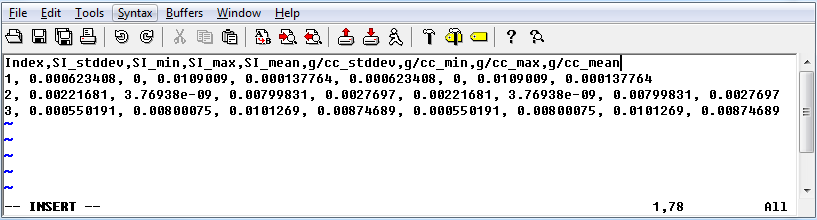

.. _geoDeffile:

Geology definition file format
==============================

A geology definition file is in either the :ref:`XYZ <XYZfile>` or :ref:`CSV <CSVfile>` file format. This file describes a :ref:`geology model <modelfile>` defining its property or properties. GIFtools will assign air values to the integer 0, but air is not required to be given during import. It *must* have a column of integers corresponding to the geology model. Other information that *may* be included are:

#. Property: A value (e.g., 0.001 S/m) for the \\( i^{th} \\) unit

#. Upper bound: Generic upper bound for the \\( i^{th} \\) unit

#. Lower bound: Generic lower bound for the \\( i^{th} \\) unit

#. Ws: Smallest model component of the model objective function for generating weights. A "default" value is 1, with anything greater than 1 placing *more* emphasis on the property value and anything less than 1 placing *less* empthasis on the given property. 

Example
-------

Below is a sample geology definition file for two physical properties, density and magnetic susceptibility (also contains optional upper and lower bounds and a standard deviation column):

