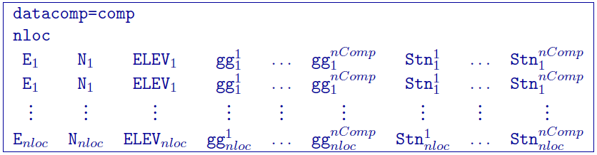

.. _ggfile:

Gravity gradiometry observations: GIF file
==========================================

This file is used to specify the observation locations and observed gravity gradiometry anomalies with estimated standard deviation. The output of the forward modelling program ``ggfor3d`` has the same structure except that the column of standard deviations for the error is omitted. This data file is quite similar to the :ref:`gravity data <gravfile>` style except with a component header. Lines starting with ! are comments. The following is the GIF-formatted file structure of a gravity observations file:

Parameter definitions:

-  comp: Two-letter flag(s) for the data types: `xx, xy, xz, yy, yz, zz`. This is proceeded by the flag ``datacomp=``. Multiple components can be separated by anything, but must only take up one character (e.g., a comma or a space).

-  nloc: Number of locations.

-  E, N, ELEV: Easting, northing, and elevation of the observation, measured in meters.

-  gg :math:`^{nComp}_i`: Anomalous (//(j^{th}//) component of the gravity gradient at the //(i^{th}//) location measured in Eotvos.

-  Stn :math:`^{nComp}_i`: Standard deviation of the (//(j^{th}//) component of the gravity gradient at the //(i^{th}//) location. It must be positive and non-zero.

**NOTE:** The program package assumes a density contrast distribution in g/cm :math:`^3` with mesh cells in meters. Therefore, it is crucial that the data be prepared in ``Eotvos``.

Example 1 
---------

Below is an example of observations of the vertical gradient only (`Gzz`):

Example 2 
---------

Below is an example of the gravity gradient observations with all six components:

