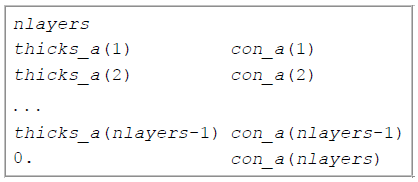

.. _mesh1Dfile:

1D Mesh file
============

This is the file used to define a finite difference mesh for 1D modeling and
inversion. In the file, the vertical column representing the earth is divided into layers. By
convention, the z-axis is positive down.

An example of the file structure is as follows:

- Number of segments used to define the vertical partitioning

- Column 1: From there, each line defines the layer thickness.

- Column 2 [OPTIONAL]: Model value corresponding to the :math:`i^{th}` layer

