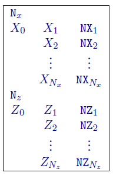
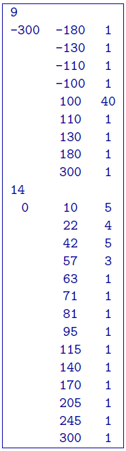

.. _mesh2Dfile:

2D Mesh file
============

This is the file used to define a finite difference mesh for 2D modelling and inversion. In the file, the x-z plane is divided into a rectangular grid. By convention, the z-axis is positive down. The mesh can be designed by considering it as consisting of a core portion representing the region of interest and a padding zone which ensures that the boundary conditions in the finite difference modelling are handled correctly. In the core portion, the horizontal mesh is mainly controlled by the experiment grid on which to collect the data, so the mesh partition in this region is usually uniform given that the data are collected at constant intervals and the cell width is an integer fraction of the station spacing (or dipole length of the array).

An example of the file structure is as follows:

- Number of segments used to define the horizontal partitioning

- Boundary of the segment in :math:`x-`\ coordinates. The first line has the edged of the mesh (west-most coordinate) and the next boundary. From there, each line is the boundary for the previous line.

- Number of cells within the segment. The cell size is determined by (:math:`[X_i - X_{i-1}] / NX_i`)

- Number of segments used to define the vertical partitioning.

- Boundary of the segment in :math:`z-`\ coordinates. These coordinates are in depth (z+ down). The first line has the top of the mesh (west-most coordinate) and the next boundary. From there, each line is the boundary for the previous line. NOTE: When topography is given, the top of the mesh (Z:math:`_0`) is set to the in the file. Therefore, it is encouraged to set Z\ :math:`_0 = 0` in all cases for user readability of the thicknesses of cells in the first segment.
  
- Number of cells within the segment. The cell size is determined by (:math:`[Z_i - Z_{i-1}] / NZ_i`)

Example
-------

The following is an example of a 2D mesh:

In the above example, the mesh is :math:`(48 \times 27)` covering from :math:`x = [-100,100]` and :math:`z=[0,300]` . There are 9 segments in the file defining the horizontal partitioning which goes from :math:`x=-300` to :math:`x=300`. The region :math:`x=[-100,100]` has been divided into 40 equal length cells. Four padding cells of increasing width extend the mesh out to :math:`x=[-300,300]`. In depth, there are 14 segments over the depth range :math:`z=[0,300]`. Note that the bottom depth is considerably larger than the depth of investigation of the survey. This procedure is carried out automatically in all-default mode. If default meshing is chosen, the horizontal cell size is set to :math:`1/3` the average electrode spacing. The vertical discretization is set to accommodate 1:2 vertical to horizontal ratio and the padding is increased by 1.5 times.

DC/IP Notes on the 2D mesh
--------------------------

Generally, at least three cells are recommended between adjacent stations (i.e., per dipole length). In the presence of topography, one might use a finer partitioning in sections where the topographic relief changes rapidly. This helps to better approximate the topographic surface using the finite difference mesh. In the presence of surface topography, the top of the finite difference mesh corresponds to the highest point on the surface. Since the current sources are all on the surface of the earth, the vertical mesh has thicknesses which generally increase with depth. The cell thickness should be small near the surface and increase slowly in the upper region that is within the array's depth of investigation. Finer partitioning can be used at a depth where there is rapid change in the conductivity for forward modelling or where one might expect anomalous structures in the inversion. The maximum depth for the mesh should be considerably larger than the depth of investigation provided by the survey. The thickness of the cells, especially near the surface, should be determined in reference to the horizontal partitioning so that the cells do not have an extremely large aspect ratio (width divided by thickness). Cells with extreme aspect ratio tend to degrade the quality of the forward solution and they can also cause undesirable abrupt changes in the inversion results. It is good practice to keep the aspect ratio of cells less than 5. Once the core mesh is designed, a set of padding cells is required to extend the mesh horizontally. Three to five cells whose width progressively increases by a factor of two to three provide sufficient extension so that the boundary conditions are adequately handled. 

It is good practice to generate the mesh and perform a forward modelling using a uniform conductivity model, called the half-space test. The test for a properly designed mesh is performed by calculating the apparent conductivities from the uniform conductivity model. The mesh is considered adequate if the modelled responses do not deviate from the true conductivity by more than a few percent. Otherwise, the mesh should be modified and the test performed again. This test is valid when there is no topography. However, a mesh designed properly for a model with topography should pass the half-space test when the mesh is used alone without topography.

