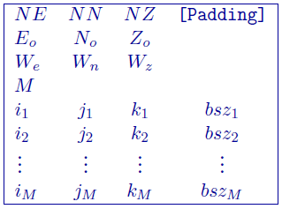

.. _meshOctreefile:

OcTree mesh file
================

The ocTree mesh defines the model region, but the underlying mesh is defined as a regular 3D orthogonal grid (referred to as the "core" grid) where the number of cells in each dimension are :math:`2^{m1} \times 2^{m2} \times 2^{m3}`,with grid size \\( h \\). This underlying mesh is the finest possible, so that larger cells have lengths which increase by powers of 2 multiplied by \\( h \\). The file has the following structure:

- :math:`NE`: Number of core cells in the East direction.

- :math:`NN`: Number of core cells in the North direction

- :math:`NZ`: Number of core cells in the vertical direction

- :math:`[Padding]`: Optional input of 6 integers giving the padding in terms of the number of ``core`` cells. The integers in order are: east, west, south, north, bottom, and top. This input is used for viewing the ocTree mesh.
 
-  :math:`E_o, N_o, Z_o`: Coordinates, in meters, of the southwest top corner, specified in (Easting, Northing, Elevation). The elevation can be relative to a reference elevation other than the sea level, but it needs to be consistent with the elevation used to specify the locations, observations, and topography files.

-  :math:`W_e, W_n, W_z`: Widths of the core cells in the Easting, Northing, and Vertical directions.

- :math:`M`: Number of cells in ocTree mesh

- :math:`i_n`: :math:`n^{th}` cell location in the grid (easting)

- :math:`j_n`: :math:`n^{th}` cell location in the grid (northing)

- :math:`k_n`: :math:`n^{th}` cell location in the grid (vertical; positive down)

- :math:`bsz_n`: Number of core cells grouped in each direction to create the cell (e.g., 2 would be 8 core cells: 2 x 2 x 2). The cell size ([e,n,z]) is given by \\( [bsz_n * W_e, bsz_n * W_n, bsz_n * W_z] \\).

Example
-------

This example shows a mesh that has a core of \\( 1024 \\times 1024 \\times 1024 \\) cells at 10-m width in each direction. The mesh has the optional padding cells given to define the core of the mesh for viewing. There are 3,719,976 total cells with the first eight being  \\( 128 \\times 128 \\times 128 \\) core cells in size. The first \\( [i,j,k] \\) line is located at top, south-west corner of the mesh.

