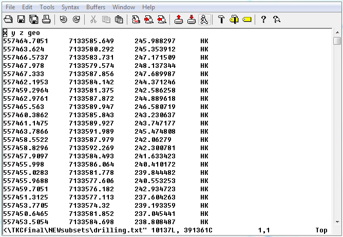

.. _miscPropfile:

Miscellaneous property file format
==================================

A miscellaneous property file is in either the :ref:`XYZ <XYZfile>` or :ref:`CSV <CSVfile>` file format. This file simply requires the spatial coordinates and then can contain any information (numeric or character). The file *must* have the the following information (but not necessarily these specific names or order):

#. Easting: The easting coordinate (can be local) in metres

#. Northing: The northing coordinate (can be local) in metres

#. Elevation: The elevation in metres

Examples
--------

Below is a sample property file (XYZ format) giving the drill outline of a kimberlite:

