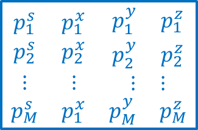

.. _modelNormfile:

Model Norm file
===============

This file contains the four exponent values within the model used to control
the sparsity applied on the model and its gradients [ps px py pz]. The
following is the file structure of the model file

Each \\(p_{i,j,k}\\) is the norm value in the \\([i,j,k]^{th}\\) model cell
\\(s\\) denotes the l_p-norm on the model, \\(x\\) denotes the l_p-norm on the
model gradients along the x-axis (Easting), \\(y\\) denotes the \\(l_p\\)-norm
on the model gradients along the y-axis (Northing), \\(z\\) denotes the l_p-
norm on the model gradients along the z-axis (Vertical). Values must be on
the interval \\(0 \\leq p \\leq 2\\). Indices \\([i, j, k]=[1, 1, 1]\\) is
defined as the cell at the top, south-west corner of the model. The total
number of lines in this file should equal \\(NN \\times NE \\times NZ\\),
where \\(NN\\) is the number of cells in the north direction, \\(NE\\) is the
number of cells in the east direction, and \\(NZ\\) is the number of cells in
the vertical direction. The model ordering is performed first in the
z-direction (top-to-bottom), then in the easting, and finally in the northing.

