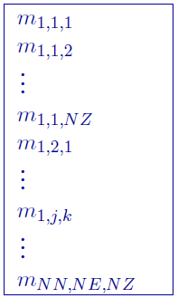

.. _modelfile:

3D Model file
=============

This file contains the cell property values of the model and is the most common of the model files. Inversion models (forward, initial, reference, recovered, and most lower and upper bound) are in this format. The following is the file structure of the model file

Each \\(m_{i,j,k}\\) is the property in the \\([i,j,k]^{th}\\) model cell. \\([i, j, k]=[1, 1, 1]\\) is defined as the cell at the top, south-west corner of the model. The total number of lines in this file should equal \\(NN \\times NE \\times NZ\\), where \\(NN\\) is the number of cells in the north direction, \\(NE\\) is the number of cells in the east direction, and \\(NZ\\) is the number of cells in the vertical direction. The model ordering is performed first in the z-direction (top-to-bottom), then in the easting, and finally in the northing.

**Active Cells Model**: Active cell models are in the same format, but only have values of -1, 0, or 1.

**Geology Model**: Geology models are the in the same format, but only contain integer values corresponding to their :ref:`definitions <geodeffile>`.

.. note:: Only the cells completely below the (interpolated) topographic surface are kept within an inversion. The cells above or at the topographic surface are removed from the model, although these must still be included in the as if they are a part of the model. For input model files these cells can be assigned any value. The recovered model produced by inversion program also includes the cells that are excluded from the model, but these cells will have unrealistic values and be set (e.g., -100, 1e-8, etc). 

