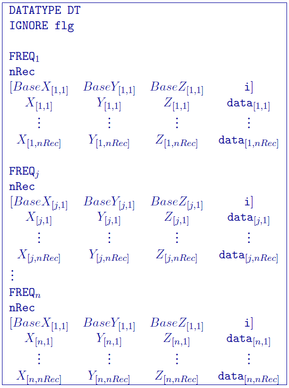
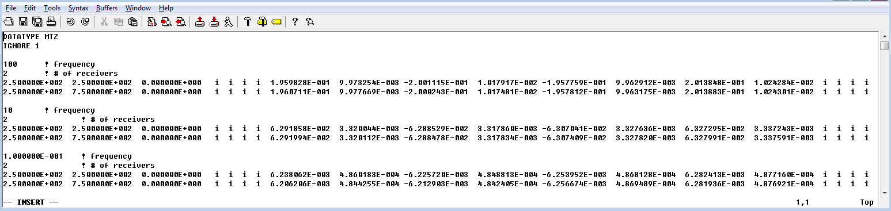
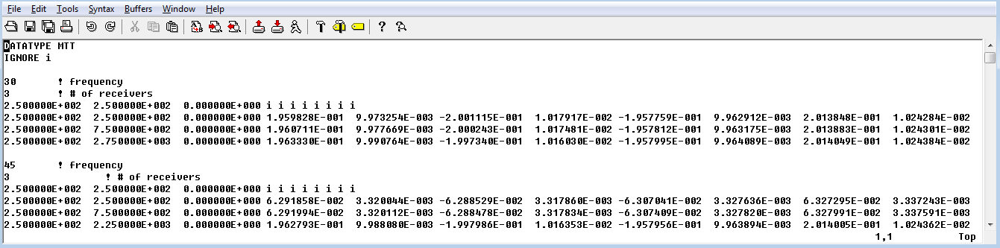
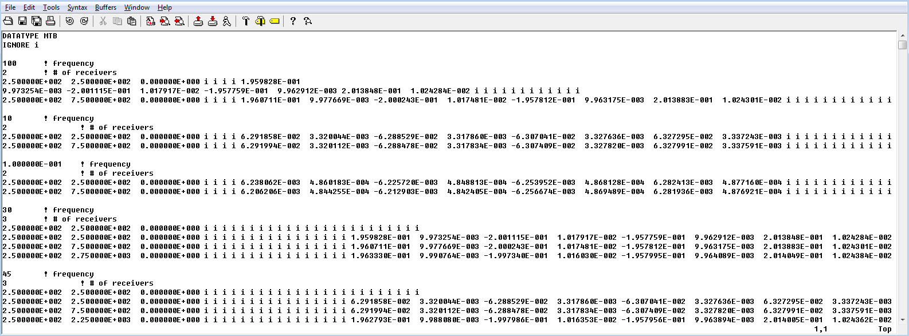

.. _mtz3dfile:

MT / ZTEM data: MTZ3D GIF file
==============================

This file is the structure for MT and/or ZTEM data associated with the inversion program ``MTZ3D``. The type of data is set by a data flag. Data that should be ignored are denoted by an *i*. The general format is:

Parameter definitions:

- ``DT``: The data type flag. The flag ``DATATYPE`` preceeds this input. The options for the data flag are:
    - ``MTZ``: MT data; impedance data with both imaginary and real parts.
    - ``MTR``: MT data; apparent resitivities and phases
    - ``MTT``: ZTEM data; real and imaginary tipper functions is absolute ratio. Hx and Hy are constant at the reference (base) station location. This is the most typical flag for ZTEM data.
    - ``MTB``: Both MT and ZTEM data; ZTEM data is denoted by providing a reference (base) station after the frequency declaration.

- ``flg``: Any value that does not contain actual data. By default, GIFtools will export ``NaN`` as the ignore value. The flag ``IGNORE`` preceeds this input.

- ``FREQ``: The frequency for the data type.

- ``nRec``: Number of receivers associated with the given frequency.

- [:math:`BaseX_{[j,k]} ...`]: This line is only present for ZTEM data. The line consists of the (X,Y,Z) for the base station followed by "i" (usually 8 columns) for the number of data columns given on the next line.

- [:math:`X_{[j,k]} ...`]: Easting (m) of the \\(k^{th}\\) receiver for the \\(j^{th}\\) data type.

- [:math:`Y_{[j,k]} ...`]: Northing (m) of the \\(k^{th}\\) receiver for the \\(j^{th}\\) data type.

- [:math:`Z_{[j,k]} ...`]: Elevation (m) of the \\(k^{th}\\) receiver for the \\(j^{th}\\) data type.
  
- ``data``: Columns of data / uncertainty pairs depending upon the data type:

    - **Impedence MT data:** The 16 data columns are in MT coordinates (X+ north, Y+ East, Z+ down) and consist of the following in order:
  
        - :math:`ZXX^r`: Real part of the ZXX component
     
        - :math:`ZXX^r_{stn}`: Standard deviation of the real part of the ZXX component       
 
        - :math:`ZXX^i`: Imaginary part of the ZXX component
       
        - :math:`ZXX^i_{stn}`: Standard deviation of the imaginary part of the ZXX component       
 
        - :math:`ZXY^r`: Real part of the ZXY component
      
        - :math:`ZXY^r_{stn}`: Standard deviation of the real part of the ZXY component       
  
        - :math:`ZXY^i`: Imaginary part of the ZXY component
      
        - :math:`ZXY^i_{stn}`: Standard deviation of the imaginary part of the ZXY component  
 
        - :math:`ZYX^r`: Real part of the ZYX component
      
        - :math:`ZYX^r_{stn}`: Standard deviation of the real part of the ZYX component       
  
        - :math:`ZYX^i`: Imaginary part of the ZYX component
      
        - :math:`ZYX^i_{stn}`: Standard deviation of the imaginary part of the ZYX component  
 
        - :math:`ZYY^r`: Real part of the ZYY component
      
        - :math:`ZYY^r_{stn}`: Standard deviation of the real part of the ZYY component       
 
        - :math:`ZYY^i`: Imaginary part of the ZYY component
       
        - :math:`ZYY^i_{stn}`: Standard deviation of the imaginary part of the ZYY component

    - **Apparent resistivity / phase MT data:** The 16 data columns consist of the following in order (phase in degrees and apparent resistivity in Ohm-m):
  
        - :math:`ZXX^r`: ZXX component of apparent resistivity
     
        - :math:`ZXX^r_{stn}`: Standard deviation of the ZXX component of apparent resistivity

        - :math:`ZXX^p`: ZXX component of phase

        - :math:`ZXX^p_{stn}`: Standard deviation of the ZXX component of phase

        - :math:`ZXY^r`: ZXY component of apparent resistivity
     
        - :math:`ZXY^r_{stn}`: Standard deviation of the ZXY component of apparent resistivity

        - :math:`ZXY^p`: ZXY component of phase
     
        - :math:`ZXY^p_{stn}`: Standard deviation of the ZXY component of phase

        - :math:`ZYX^r`: ZYX component of apparent resistivity
     
        - :math:`ZYX^r_{stn}`: Standard deviation of the ZYX component of apparent resistivity   

        - :math:`ZYX^p`: ZYX component of phase
     
        - :math:`ZYX^p_{stn}`: Standard deviation of the ZYX component of phase

        - :math:`ZYY^r`: ZYY component of apparent resistivity
     
        - :math:`ZYY^r_{stn}`: Standard deviation of the ZYY component of apparent resistivity

        - :math:`ZYY^p`: ZYY component of phase
     
        - :math:`ZYY^p_{stn}`: Standard deviation of the ZYY component of phase

    - **ZTEM data:** The 8 data columns are in MT coordinates (X+ north, Y+ East, Z+ down) and consist of the following in order:
   
         - :math:`ZXY^r`: Real part of the ZXY component
     
         - :math:`ZXY^r_{stn}`: Standard deviation of the real part of the ZXY component       

         - :math:`ZXY^i`: Imaginary part of the ZXY component
     
         - :math:`ZXY^i_{stn}`: Standard deviation of the imaginary part of the ZXY component  
   
         - :math:`ZYX^r`: Real part of the ZYX component
     
         - :math:`ZYX^r_{stn}`: Standard deviation of the real part of the ZYX component       

         - :math:`ZYX^i`: Imaginary part of the ZYX component
     
         - :math:`ZYX^i_{stn}`: Standard deviation of the imaginary part of the ZYX component  
    

**NOTE**: When using the ``MTB`` flag for both data, the locations will include *both* MT and then ZTEM data *and must be in impedances*. Therefore, MT data would follow with 8 columns of the ignore flag and ZTEM data would have 16 columns of ignore flag prior to data (see example 3 below).

Examples
--------

The following are two examples of data files.

**Example 1**: Off-diagonal (ZXY and ZYX) impedance MT data at 3 frequencies (100, 10, and 1 Hz) with 2 observations each for brevity:

**Example 2**: ZTEM data at 2 frequencies (30 and 45 Hz) with 3 observations each with a single base station:

**Example 3**: MT and ZTEM data (combining example 1 and example 2). Note that the MT data comes first and then the ZTEM data:

