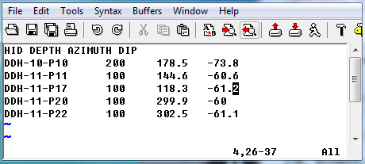

.. _bhSurveyfile:

Borehole survey file format
===========================

GIFtools assumes that the borehole survey file is in either the :ref:`XYZ <XYZfile>` or :ref:`CSV <CSVfile>` file format. If the file is not given during the borehole data import, than GIFtools assumes the boreholes are vertical. The file *must* have the at least the following information (but not necessarily these specific names or order):

#. Hole_ID: If the hole ID names require a space, then a CSV file should be used. These identifications can be numeric or characters (with no quotes), but should be consistent with the :ref:`collar <bhCollarfile>` and :ref:`property <bhPropfile>` files.

#. Length: Length of observation down the borehole

#. Azimuth: Azimuth of the borehole trace at the downhole length in degrees. 90\\(^o\\) is North. 

#. Dip: Dip of the borehole trace at the downhole length in degrees. Dip is from horizontal: -90\\(^o\\) is vertical and 0\\(^o\\) is a horizontal trace.

Example
-------

Below is a sample survey file (XYZ format) where "HID" is the Hole_ID and "DEPTH" is the Length:

