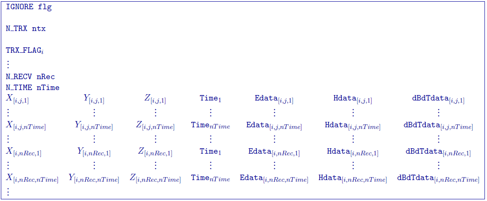
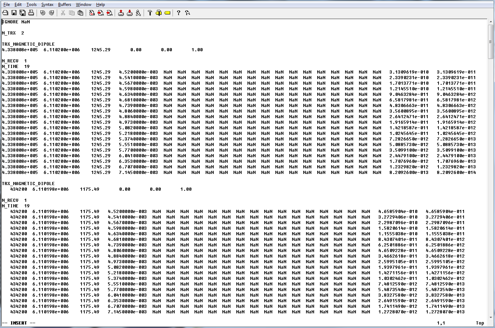
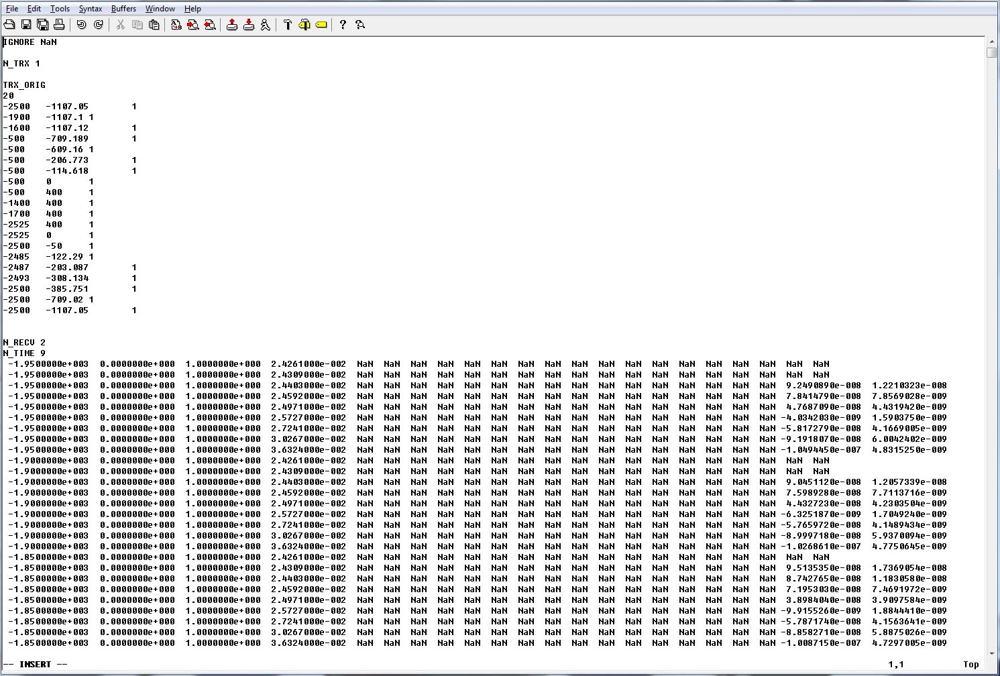

.. _temfile:

TEM data: GIF file
==================

This file is used to specify the transmitters and associated data for a Time-domain ElectroMagnetic (TEM) survey. The file is broken down based on the transmitters and requires all data types be present (although they may be filled with an ignore value; see below). The convention is z+down and x+ East and y+ North. Comment lines begin with ``!``. The data line contains 27 columns (x, y, z, E, H, and dB/dt data with uncertainties), but may be filled with ignore flags to denote using only certain data types. Below is the general format:

Parameter definitions:

- ``flg``: Any string/value that does not contain actual data. By default, GIFtools will export ``NaN`` as the ignore value. The flag ``IGNORE`` preceeds this input.

- ``ntx``: Number of transmitters. The flag ``N_TRX`` preceeds this input.
  
- ``TRX_FLAG``: The \\(i^{th}\\) transmitter. This line contains the specific transmitter flag and block defining the transmitter. See :ref:`GIF EM transmitters <emTransmitters>` for specifications on formatting different transmitters.

- ``nRec``: Number of receivers for the \\(i^{th}\\) transmitter. The flag ``N_RECV`` preceeds this input.

- ``nTime``: The number of time channels for the \\(j^{th}\\) receiver associated with the \\({i^{th}\\) transmitter. The flag ``N_TIMES`` preceeds this input.

- :math:`X_{[i,j,k]}`: Easting (m) of the \\(j^{th}\\) receiver at the \\(k^{th}\\) time for the \\(i^{th}\\) transmitter.

- :math:`Y_{[i,j,k]}`: Northing (m) of the \\(j^{th}\\) receiver at the \\(k^{th}\\) time for the \\(i^{th}\\) transmitter.

- :math:`Z_{[i,j,k]}`: Elevation (m) of the \\(j^{th}\\) receiver at the \\(k^{th}\\) time for the \\(i^{th}\\) transmitter.

- :math:`Time`: Time (sec) of the observation.

- ``Edata``: 6 columns containing electric-field data aligning with the cartesian coordinate system and their uncertainties \\(j^{th}\\) receiver at the \\(k^{th}\\) time for the \\(i^{th}\\) transmitter (in order):

  - :math:`Ex`: Electric-field component in the Easting direction.

  - :math:`Ex_{stn}`: Standard deviation of the electric-field component in the Easting direction. This must be a positive, non-zero number.

  - :math:`Ey`: Electric-field component in the Northing direction.

  - :math:`Ey_{stn}`: Standard deviation of the electric-field component in the Northing direction. This must be a positive, non-zero number.

  - :math:`Ez`: Vertical component of the electric-field.

  - :math:`Ez_{stn}`: Standard deviation of the vertical component of the electric-field. This must be a positive, non-zero number.

- ``Hdata``: 6 columns containing magnetic-field data aligning with the cartesian coordinate system and their uncertainties \\(j^{th}\\) receiver at the \\(k^{th}\\) time for the \\(i^{th}\\) transmitter (in order):

  - :math:`Hx`: Magnetic-field component in the Easting direction.

  - :math:`Hx_{stn}`: Standard deviation of the magnetic-field component in the Easting direction. This must be a positive, non-zero number.

  - :math:`Hy`: Magnetic-field component in the Northing direction.

  - :math:`Hy_{stn}`: Standard deviation of the magnetic-field component in the Northing direction. This must be a positive, non-zero number.

  - :math:`Hz`: Vertical component of the magnetic-field.

  - :math:`Hz{stn}`: Standard deviation of the vertical component of the magnetic-field. This must be a positive, non-zero number.

- ``dBdTdata``: 6 columns containing :math:`\partial B / \partial t` data aligning with the cartesian coordinate system and their uncertainties \\(j^{th}\\) receiver at the \\(k^{th}\\) time for the \\(i^{th}\\) transmitter (in order):

  - :math:`\partial B / \partial t_x`: Derivative the B-field in the Easting direction.

  - :math:`\partial B / \partial t_x^{stn}`: Standard deviation of the derivative the B-field in the Easting direction. This must be a positive, non-zero number.

  - :math:`\partial B / \partial t_y`: Derivative the B-field in the Northing direction.

  - :math:`\partial B / \partial t_y^{stn}`: Standard deviation of the derivative the B-field in the Northing direction. This must be a positive, non-zero number.

  - :math:`\partial B / \partial t_z`: Vertical component of the derivative the B-field.

  - :math:`\partial B / \partial t_z^{stn}`: Standard deviation of the vertical component of the derivative the B-field. This must be a positive, non-zero number.

Examples
--------

**Example 1**: The following is an example with 2 vertical magnetic dipole transmitters, each with 1 receiver recording at 19 time channels. Only the :math:`\partial B / \partial t_z` data and its uncertainty are given:

**Example 2:**: The second example is from a UTEM survey. The large loop is given by 20 locations, has 2 receivers recording at 9 time channels. Only the :math:`\partial B / \partial t_z` data and its uncertainty are given and some early times are not recorded and thus would be ignored:

