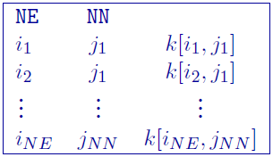
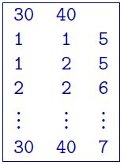

.. _topoDiscretefile:

GIF discrete topography file
============================

This file is used specifically with DCIP3D to define the surface topography within a mesh by the integer values of the number of cells from the top of the mesh to the discretized topographic surface. This format is compatible with any type of DC/IP :ref:`3D data set <dcip3dfile>`. This file is usually created with the ``make_wdat`` executable found in the DC/IP 3D inversion package **and is required for borehole 3D DC/IP data**. The format is:

Parameter definitions:

- NN: Number of cells in the north (\\(NN\\) from the mesh)

- NE: Number of cells in the north (\\(NE\\) from the mesh)

- :math:`i_n`: :math:`n^{th}` cell in the easting direction, starting with the west-most cells = 1

- :math:`j_m`: :math:`m^{th}` cell in the northing direction, starting with the south-most cells = 1

- :math:`k[i_n,j_m]`: Number of cells from top of the mesh to the topography

The lines in this file can be in any order as long as the total number is equal to \\(NE \\times NN \\). There are no comments allowed in this file. The value of \\(k[i,j]\\) indicates the number of cells above the earth's surface. If the topography reached the top row of cells in the vertical direction, then \\(k[i,j] = 0\\). If all values of \\(k\\) are zero, the topography would be at the very top of the mesh (i.e., the situation where no topography is given).

Example:
--------

The following is an example of a discrete topography file:

In this example the topography at \\((1,2)\\) is *higher* than at \\( (2,2) \\) by one cell thickness. The mesh consists of 30 cells in the easting, 40 cells in the northing, and at least 7 cells in the vertical direction. If the topography is above the mesh, then \\(k=0\\).

