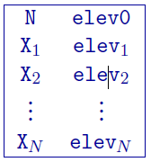
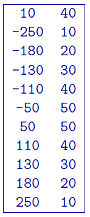

.. _topoGIF2Dfile:

2D GIF topography file
======================

This file is used to define the surface topography of a 2D mesh/model by the elevation at different locations along the line, primarily for DCIP2D. It should be noted that, in the 2D case, the mesh file is linked to the topography. The specification of the top elevation, elev0, sets the top of the mesh. In other words, elev0 in the topography is the top of the mesh and where \\( z=0 \\). This point is assumed to be the highest point on the topographic surface. Locations above elev0 on the surface are set to elev0. The elevation is positive up file and thus it can be given in relative values. For DCIP2D, the topography file must cover the core portion of the mesh where electrodes are placed. The coverage should ideally extend to both ends of the mesh, otherwise the remaining portion towards the ends will be assumed to have the same surface elevation in each direction as given at the end points within the file. The topographic surface is discretized onto the mesh using the elevations at the horizontal nodes that are obtained by linear interpolation from this file. The 2D topography file has the following general structure:

Parameter definitions:

- N: Number of points defining the topographic profile.

- elev0: The elevation of the top of the 2D mesh. See above for details.

- X\ :math:`_i`: :math:`i^{th}` horizontal location.

- elev\ :math:`_i`: Elevation (metres) at  X\ :math:`_i`

Example:
--------

The following is an example of a 2D topography file. There are 10 locations that vary in elevation from 10 to 50 m. The two locations above 40 m (elev0) will be represented as 40 m of elevation within DCIP2D. The top of the mesh will also be placed at 40 m.

