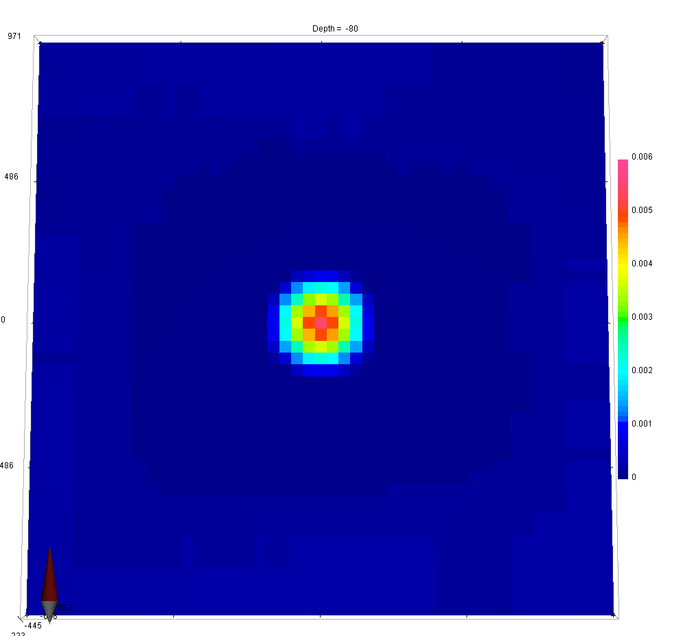
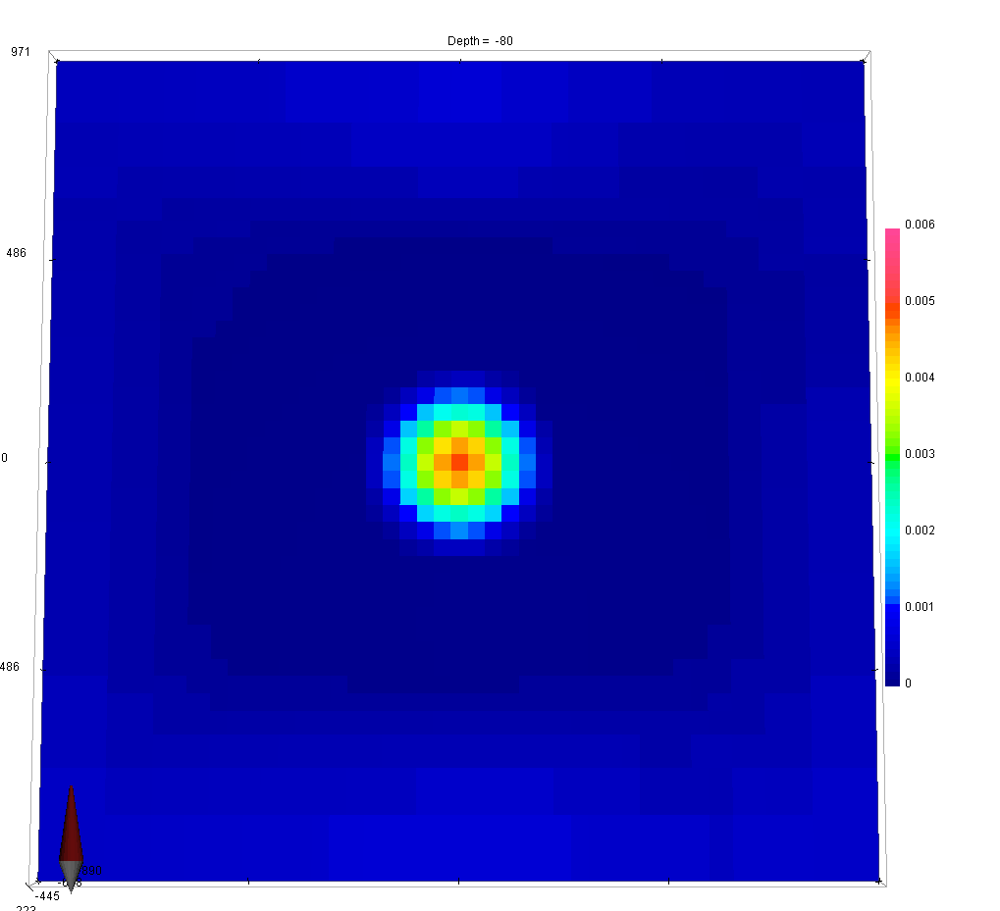
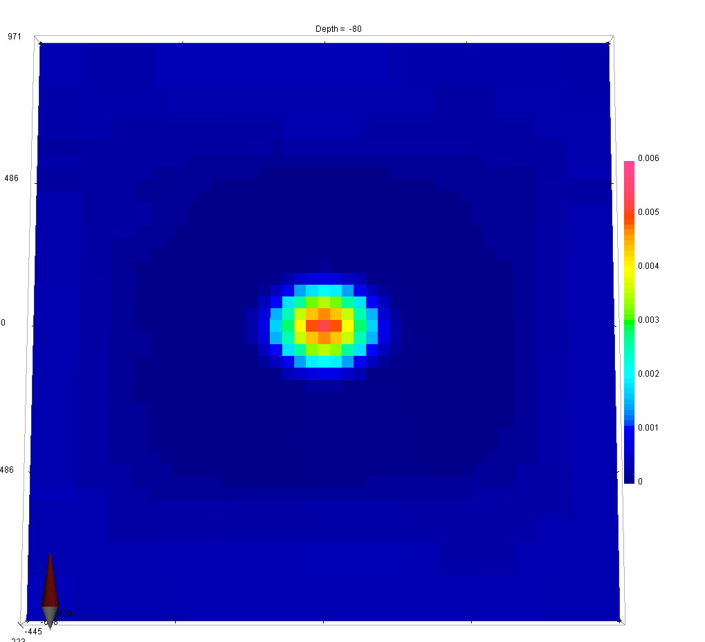
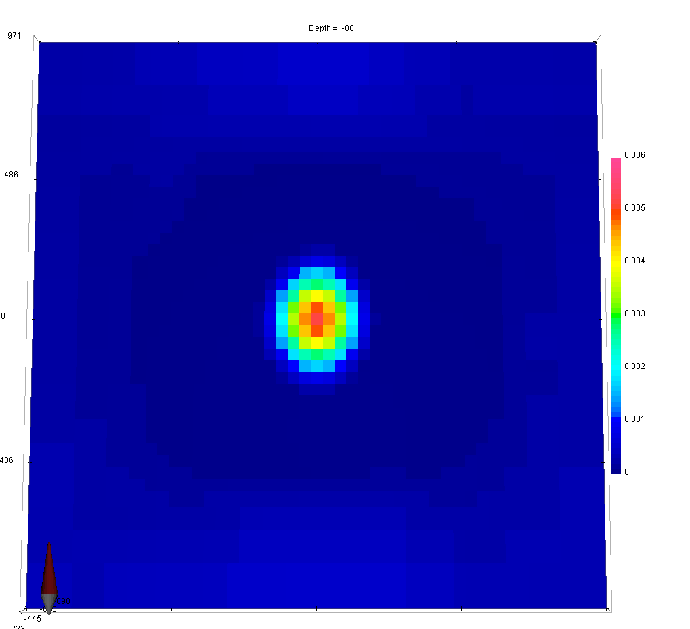
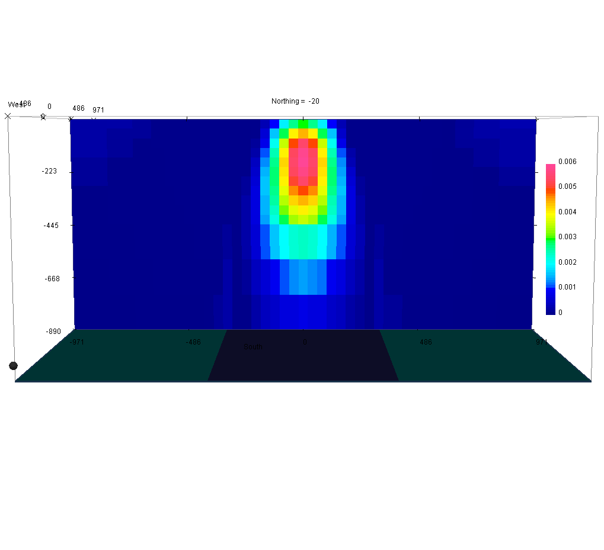

.. _Fundamentals_alphas:

The Alphas Parameters
=====================

.. .. math::
..     \phi_m(\mathbf{m}) = \phi_{small}(\mathbf{m}) + \phi_{smooth}(\mathbf{m})
..     :label: Regularizer2

.. With:

.. .. math::
..     \phi_{small}(\mathbf{m}) = \color{blue}{\alpha_s} ||\mathbf{W}_s\;\mathbf{R}_(\mathbf{m}-\mathbf{m}_0)||^p
..     :label: Smallness2

.. And:

The model objective function consists of four main components; one that
defines how the model can vary from the reference model, and one for each of
the allowed gradients in the x, y and z directions. Each of these four
components has a coefficient, denoted by α, that controls their relative
importance in the regularization :math:`\phi_m (\mathbf{m})`.

.. math::
    \phi_m(\mathbf{m}) = &\color{blue}{\alpha_s} ||\mathbf{W}_s\;\mathbf{R}_s(\mathbf{m}-\mathbf{m}_{ref})||_2^2 +\\
    &\color{blue}{\alpha_x} ||\mathbf{W}_x\;\mathbf{R}_x \; \mathbf{G}_x(\mathbf{m}-\mathbf{m}_{ref})||_2^2 +\\
    &\color{blue}{\alpha_y} ||\mathbf{W}_y\;\mathbf{R}_y \; \mathbf{G}_y(\mathbf{m}-\mathbf{m}_{ref})||_2^2 +\\
    &\color{blue}{\alpha_z} ||\mathbf{W}_z\;\mathbf{R}_z \; \mathbf{G}_z(\mathbf{m}-\mathbf{m}_{ref})||_2^2
    :label: Regularizer_alpha

In this example, we demonstrate the effect that each α value has on the solution.

.. raw:: html
    :file: ./raw/AtoZ_InvFun_az.html

As a general rule of thumb, larger :math:`\alpha_x`, :math:`\alpha_y` and
:math:`\alpha_z` results in an increased smoothing in the corresponding
direction, while reducing :math:`\alpha_s` results in an overall smoother
model.

.. tip:: In order to get equal contribution from all four components making up
         :math:`\phi_m(\mathbf{m})`, set :math:`\alpha_s=\frac{1}{h^2}`, where *h*
         represent the cell size dimension in the core region. If the mesh cells are
         not cubic, α values should be adjusted accordingly (smaller *h* =>
         reduced α)

It is sometimes useful to think of the α values in terms of *length scales*:

.. math::
    L_x = \sqrt{\frac{\alpha_x}{\alpha_s}}, \quad L_y = \sqrt{\frac{\alpha_y}{\alpha_s}}, \quad L_z = \sqrt{\frac{\alpha_z}{\alpha_s}}

These length scales can be adjusted to reflect a priori information about the
general trend expected from the geology.

.. important:: In most inversion codes, the default α values are: :math:`\left[ \alpha_s=1e-4, \alpha_x=\alpha_y=\alpha_z=1 \right]`.

.. In real-world scenarios, choosing the correct α values can be problematic. To
.. resolve this, α can be transformed into a Length scale, because the allowed
.. deviation and allowed gradient are spatially related. The equation that
.. governs the relationship is:
.. Here, the length scales Lx, Ly and Lz are in units equal to those of the cell
.. sizes (usually metres). As a rule of thumb, the length scales should be larger
.. than the cell size. A length scale of four or five times the cell size is a
.. good starting point.

.. This is just a dirty trick to force the figures to be updated for the html

