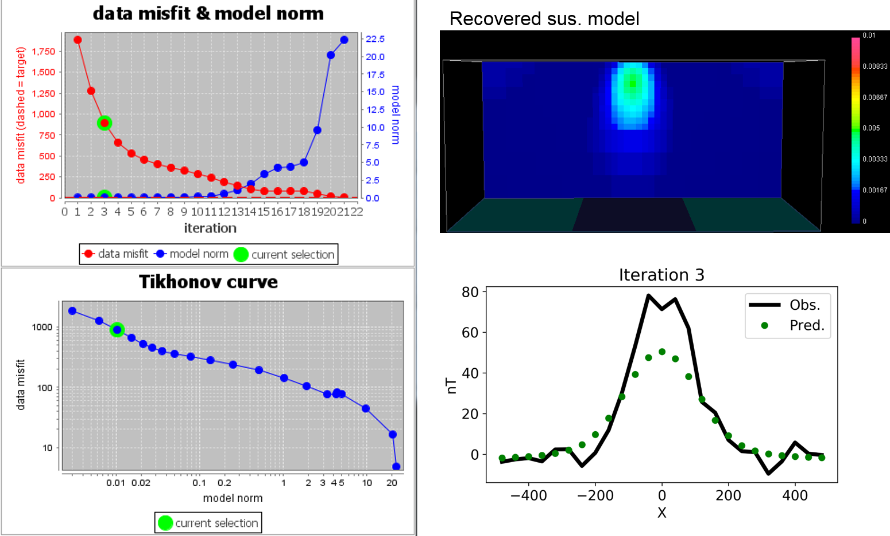
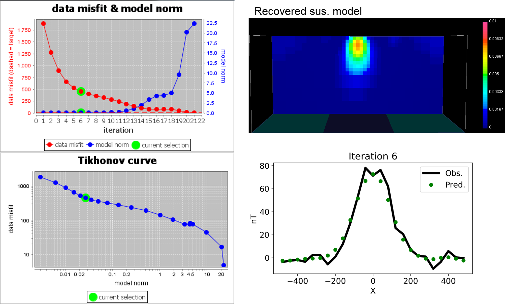
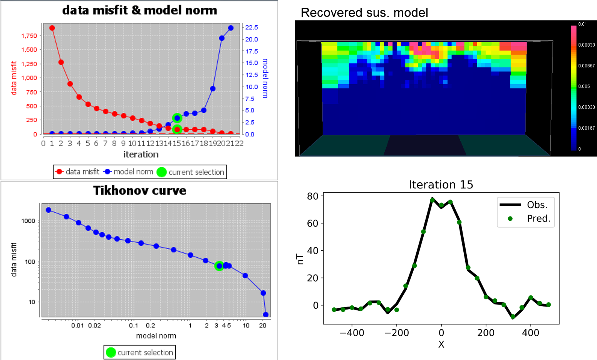

.. _Fundamentals_Beta:

The Beta Parameter (Trade-Off)
==============================

In :eq:`ObjFun2`, :math:`\beta` is a trade-off parameter that controls the
relative importance of the model smoothness through the model objective
function and data misfit function. :math:`\beta` is scaled to the total number
of input data, and is usually automatically recovered through an optimisation
routine that ensures the target misfit is reached. In the UBC codes, there are
four ways of specifing how :math:`\beta` should be chosen.

.. math::
    \phi(\mathbf{m}) = \phi_d(\mathbf{m}) + \color{blue}{\beta} \phi_m(\mathbf{m})
    :label: ObjFun2

To illustrate how :math:`\beta` impacts on data misfit and recovered model of
the inversion, we  introduce below magnetic inversion example. Here we start
magnetic inversion with large :math:`\beta`, and cool down. Both recovered
model and data fit are presented for corresponding beta.

.. raw:: html
    :file: ./raw/AtoZ_InvFun_Lcurve.html

Errors on Data
--------------

Before the inversion can proceed, each datum should have an estimate of
uncertainty. Otherwise the inversion will not know how well that datum should
be reproduced. Errors on data (i.e. data reliability) can be thought of in
three ways:

- Are errors constant for all data? (for example ±4 nT for magnetic data)
- Are errors a percentage of data? (Perhaps data are known to be within 5% of their value)
- Or should a combination be used? (for example 2% + 3 nT)

Choices made about the reliability (error) of the data can be significant. If a datum
has a measured value of 10, and it is considered to have an error of 10%, then
the inversion process must find a model that is capable of reproducing that
datum as any value between 9 and 11.

If statistics about errors on the data can be reliably estimated, then the
*Chi-factor* method of choosing  is appropriate. However, what should be done if
there is only a poor estimate for the reliability of data? The GCV or L-Curve
methods may be useful in this situation. All three methods are expanded upon
next.

.. _Fundamentals_Beta_Discrepancy:

Chi-factor
----------

Use of Chi-factor to determine the value of  which yields the optimal model is
based upon the assumption that noise and error on the data are random, and
that they behave according to a Gaussian distribution. If this is the case,
then the misfit function (explained in the "Optimization" chapter) will have
an expected value of N, the number of data. This allows use to tell the
inversion to try a range of values, then chose the model that results from the
inversion which used a  value yielding a data misfit equal to N.

In fact, it is more useful to be able to control how close predicted data must
match the measured data. So, instead of using a target misfit of N, we can use
a target misfit of Chi-factor x N, in which Chi-factor is a user-specified
parameter.

This allows the user to make adjustments so that misfit is consistent with
prior knowledge of supplied errors. If data are noisy, or they do not adhere
reliably to the normal assumptions (random, Gaussian, and zero mean), then
target misfit may have to be larger than N, so Chi-factor would be specified
as more than 1. If data are quite clean then it may be acceptable to set Chi-
factor < 1.

GCV
---

The GCV (Generalized Cross Validation) approach to choosing  when datum errors
are poorly known is attractive because it is a rigorous idea that considers
each data point, and the ability of all the other data points to find a model
that reproduces that one data point. The idea is used in many aspects of
applied mathematics, including inversion. It is however very intensive of
computing time - perhaps four or more times the computing time required when
using Chi-factor to determine :math:`\beta`.

Here is the idea underlying the GCV approach. For a range of :math:`\beta`,
perform a set of inversions to find a model that is least affected by any
single data point. The procedure is as follows:

- Choose one value for :math:`\beta`, then perform one inversion for each data point with that one data point omitted.
- Compute a misfit value for each inversion.
- Calculate the cumulative misfit (called a cross validation, or CV ) for all these inversions at the single chosen. It is a summation over all data points except the current one.
- Start again using then next :math:`\beta`.
- When all are done, generate a graph of CV versus :math:`\beta`.
- Choose the :math:`\beta` with the smallest value of cumulative misfit, CV.

The term Generalized Cross Validation ( GCV ) refers to a numerically
efficient method of computing the CV required by this method. Effectively, the
minimum GCV yields the model that is least affected by any single data point.
The only assumptions about noise on data are (i) that each datum has the same
level of noise, (ii) noise is Gaussian and independent, and (iii) the standard
deviation of noise on each datum is unknown.

L-Curve
-------

To select :math:`\beta` using the L-curve approach, a series of solutions for
a range of :math:`\beta` values must be generated. The resulting set of
:math:`\phi_d(\mathbf{m})` and :math:`\phi_m(\mathbf{m})` values are then
plotted to create a Tikhonov curve. Using log-log axis, this plot is sometimes
called an L-curve. In the absence of reliable information on data errors, an
optimal choice formay be made by picking the value that generates the
:math:`\phi_d(\mathbf{m})` and :math:`\phi_m(\mathbf{m})` pair at the point of
maximum curvature on this curve. The model corresponding to this particular
solution then becomes the inversion result.

There is no “proof” that this approach works all the time. However it is
usually sensible for the following arguments:

- Small :math:`\phi_m(\mathbf{m})` is desirable since kernels are generally smooth (low frequency) and we usually have relatively few of them. In other words, if :math:`\phi_m(\mathbf{m})` were large, the model would have more structure (larger high frequency components), yet it is usually noise which tends to have high frequencies. Therefore, if model norms are large, we have probably fitted noise rather than data.
- Small :math:`\phi_m(\mathbf{m})` may be desirable, but the minimum misfit must be avoided since that would imply some structure was reproducing noise.
- The compromise is to take the values of :math:`\phi_d(\mathbf{m})` and  :math:`\phi_m(\mathbf{m})` at the “elbow” in the L-curve.

