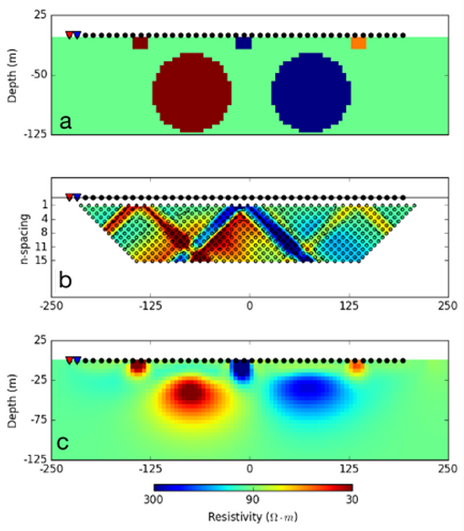

.. _Fundamentals_concept:

Geophysical Inversion Basics
============================

**What is geophyiscal inversion?**

Geophysical inversion is a tool which we can use to recover the subsurface distribution of a physical property from field-collected data. Each type of geophysical data may be inverted using one or more inversion algorithms.

**What does geophysical inversion recover?**

Geophysical inversion recovers a physical property model which:

	- fits the data (field observations), and
	- is geologically reasonable (contains plausible structures)

Geophysical inversion does not recover the exact distribution of a physical
property; i.e. the *true model*. There may be a number of physical property
models which satisfy the aforementioned requirements. Therefore, it is up to
the user to set appropriate starting parameters for the inversion.

    Inversion of 2D DC resistivity data.

**Example:**

The benefits of geophysical inversion are illustrated in the figure on the
right.

- In **(a)**, we see several conductors and resistors buried below the Earth;
  i.e. the *true model*.

- In **(b)**, we see the apparent resistivity data collected
  by a 2D DC resistivity survey plotted in pseudo-section.

- In **(c)**, we see the
  physical property model recovered through inversion. If the geology is
  complex, the pseudo-section data can be very difficult to interpret. In this
  case, the inversion results are much easier to interpret.

**When is inversion able to recover a subsurface structure?**

Inversion is successful in recovering geological structures when:

	- There is a sufficient physical property contrast between the target structure and the surrounding geology
	- The data are sensitive to the target structure; i.e. the geophysical response from that structure is observed in the data
	- Parameters relevant to the inversion are set appropriately

