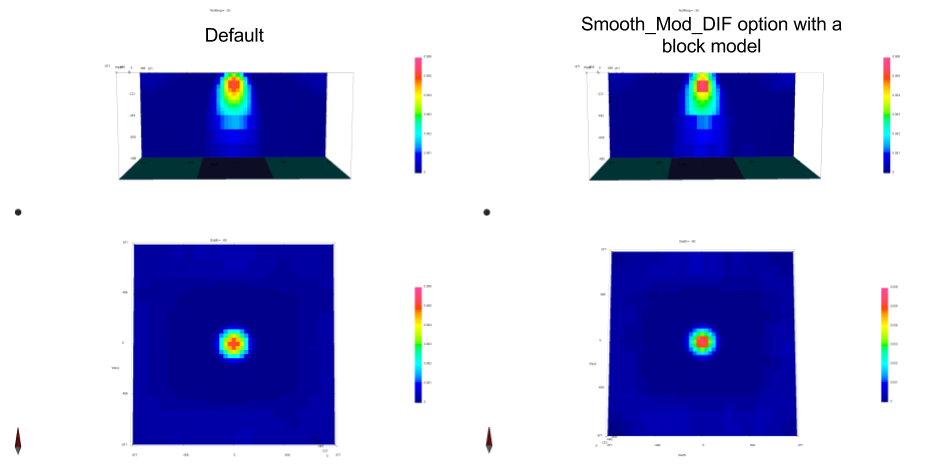

.. _Fundamentals_SmoothInDiff:

The SMOOTH_MOD_DIF or SMOOTH_MOD options
========================================

.. math::
    \phi_m(\mathbf{m}) = &{\alpha_s} ||\mathbf{W_s}\;\mathbf{R}_s(\mathbf{m}-\mathbf{m}_{ref})||_2^2 +\\
    &{\alpha_x} ||\mathbf{W_x}\;\mathbf{R}_x \; \mathbf{G}_x(\mathbf{m}-\mathbf{\color{blue}m}_{\color{blue}ref})||_2^2 +\\
    &{\alpha_y} ||\mathbf{W_y}\;\mathbf{R}_y \; \mathbf{G}_y(\mathbf{m}-\mathbf{\color{blue}m}_{\color{blue}ref})||_2^2 +\\
    &{\alpha_z} ||\mathbf{W_z}\;\mathbf{R}_z \; \mathbf{G}_z(\mathbf{m}-\mathbf{\color{blue}m}_{\color{blue}ref})||_2^2
    :label: Regularizer_smooth_mod

Introduced in v6 of the gravity and magnetics codes, this toggle controls
whether the reference model is used in the gradient terms of the model
objective function.

If the reference model is used in the gradient terms
(SMOOTH_MOD_DIF), then sharp boundaries that are present in the reference
model will be preserved. If not used (SMOOTH_MOD), the difference to the
gradient model will still be minimised, but the boundary is allowed to have a
smooth transition.

