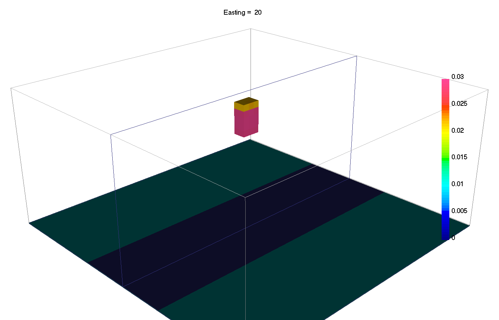

.. _Fundamentals_Norms:

Sparse and Blocky Norms
=======================

Introduced in v6 of the gravity and magnetics codes, it is now possible to
change the norms in the different part of the regularization independently.
In general terms, a small :math:`l_p`-norm applied on the model yields *sparse* solutions, while small
:math:`l_p`-norm on the gradients yield *blocky* solutions.

.. math::
    \phi_m(\mathbf{m}) = &{\alpha_s} ||\mathbf{W_s}\;\mathbf{\color{blue}R}_s(\mathbf{m}-\mathbf{m}_{ref})||_2^2 +\\
    &{\alpha_x} ||\mathbf{W_x}\;\mathbf{\color{blue}R}_x \; \mathbf{G}_x(\mathbf{m}-\mathbf{m}_{ref})||_2^2 +\\
    &{\alpha_y} ||\mathbf{W_y}\;\mathbf{\color{blue}R}_y \; \mathbf{G}_y(\mathbf{m}-\mathbf{m}_{ref})||_2^2 +\\
    &{\alpha_z} ||\mathbf{W_z}\;\mathbf{\color{blue}R}_z \; \mathbf{G}_z(\mathbf{m}-\mathbf{m}_{ref})||_2^2
    :label: Regularizer_norm

.. raw:: html
    :file: ./raw/AtoZ_InvFun_Lp.html

Most codes thus far have involved the :math:`l_2`-norm which favors values
that are small. Different norms tend to favor
models with fewer non-zero model parameters, potentially resulting in simpler,
more compact solutions. In discrete form, the general :math:`l_p`-norm is written as:

.. math::
	\| \mathbf{x}(\mathbf{m}) \|^p_p =& \sum_{i=1}^{nC} {|x_i|}^p \\

which we approximate with a Scaled-IRLS methods as

.. math::
	\sum_{i=1}^{nC}  r_i \; x_i^2

where

.. math::
	{r}_i  =  {\epsilon_p}^{(1-p/2)}{\Big[ {({x_i}^{(k-1)})}^{2} + \epsilon_p^2 \Big]}^{(p/2 - 1)}

such :math:`k` denotes the iteration number and :math:`p` and :math:`\epsilon`
are sparsity and threshold parameters respectively. A total of 6 variables can
be manually adjusted by the user (:math:`p_s\;, p_x\;, p_y\;, p_z\;,
\epsilon_s, \epsilon_{xyz}`).  The choice of :math:`p` and :math:`\epsilon`
values is made based upon prior knowledge.

.. For example, it makes sense to look for simple smooth models when
.. there is no knowledge about subsurface structures. In contrast, the L0 or L1
.. norm has some different characteristics: it makes blocky models, and outliers
.. are less influential.

.. In the smallness term of the regularization, the difference between the recovered
.. model and the reference model is calculated at each iteration. The metric that
.. is used can be defined as the sum of the difference (L1), or the sum of the
.. squares of the difference (L2), or some other exponent of the difference. The
.. user-definable exponent is referred to as Lp. For values between 0 and 2, a
.. high value results in smoothly varying models and a low value allows for
.. sparse models.

.. Similarly, the exponents relating to the gradients in x, y and z are definable
.. through the Lq parameter. For values between 0 and 2, a high value enforces
.. smooth gradients and a low value allows discontinuous gradients, resulting in
.. blocky models.

