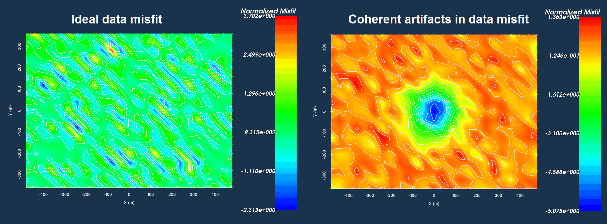
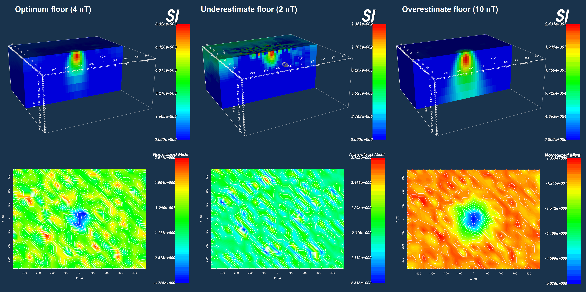

.. _Fundamentals_Uncertainties:

Data Misfit and Uncertainties
=============================

Here, we discuss the importance of assigning appropriate uncertainties, the importance of analyzing the data misfit, and present some best-practices. In the :ref:`objective function<Fundamentals_ObjectiveFunction>`, we use a :ref:`data misfit<Fundamentals_ObjectiveFunction_dmis>` term to ensure the inversion recovers a model which can fit the set of field observations. The data misfit can be expressed as a finite sum:

.. math::
	\phi_d (\mathbf{m}) = \sum_{i=1}^N \phi_{d,i}^2 = \sum_{i=1}^N \Bigg ( \frac{\mathbf{F[m]}_i - d_i}{\varepsilon_i} \Bigg )^2
	:label: eq1

where

	- :math:`N` is the total number of observations
	- :math:`\phi_{d,i}` is the data misfit for each datum
	- :math:`d_i` is the observed datum :math:`i`
	- :math:`\mathbf{F[m]}_i` is the predicted datum for model :math:`\mathbf{m}`
	- :math:`\varepsilon_i` is the uncertainty on datum :math:`i`

If we assume that the noise on each datum is independent and Gaussian, then the uncertainties :math:`\varepsilon_i` can be thought of as estimations of the standard deviation of the noise on each datum. Under this assumption, two things should occur if the recovered model fits the data properly:

	1) The data misfit :math:`\phi_d \approx N`, indicating the inversion has fit the signal without fitting the noise.
	2) The individual data misfits when plotted, are incoherent; that is, the recovered model does not fit the data well in some areas and poorly in others.

Eq. :eq:`eq1` is commonly represented as the L2-norm of a weighted residual between the observed data vector (:math:`d_{obs}`) and the predicted data for a given conductivity model :math:`\boldsymbol{\sigma}`, i.e.:

.. math::
    \phi_d (\mathbf{m}) = \big \| \mathbf{W_d} \big ( \mathbf{d_{obs}} - \mathbb{F}[\boldsymbol{\sigma}] \big ) \big \|^2
    :label: eq2

where :math:`W_d` is a diagonal matrix containing the reciprocals of the uncertainties :math:`\boldsymbol{\varepsilon}` for each measured data point, i.e.:

.. math::
    \mathbf{W_d} = \textrm{diag} \big [ \boldsymbol{\varepsilon}^{-1} \big ] 

    Data misfits indicating all area of the survey region fit equally (left). Data misfits indicating the central area of the survey region is fit poorly compared to the rest of the survey region (right).

Why use Uncertainties
---------------------

Uncertainties are used to weight the difference between observed and predicted data in the data misfit function. This is done for two reasons:

	1) If the observed data span several orders of magnitude, we want to make sure that the inversion doesn't focus on fitting the large values at the expense of the small values.
	2) If the noise on our data are independent and Gaussian, then the data misfit provide a stopping criteria for the inversion. See :ref:`trade-off parameter<Fundamentals_beta>`.

In general, the uncertainty on each datum :math:`d_i` can be split into two contributions:

.. math::
	\varepsilon_i = \varepsilon_{floor} + C_\% |d_i |

where :math:`\varepsilon_{floor}` is the "floor value" and :math:`0 < C_\% < 1` is a fractional percent. Using a percent uncertainty ensures that data spanning multiple orders of magnitude are all weighted so that they contribute towards the data misfit equally. That is, we do not fit large data values at the expense of smaller values. The floor represents the smallest possible uncertainty that we may have on the data. The floor also helps to stabilize the inversion; i.e. ensure that there are no uncertainties such that :math:`\varepsilon_i \ll |\mathbf{F[m]}_i - d_i |`.

Importance of Choosing Appropriate Uncertainties
------------------------------------------------

In the figure below, we see the results of three inversions to recover a susceptible block where different sets of uncertainties were applied. The observed data were generated by adding Gaussian noise with a standard deviation of 4 nT to forward modeled data. Thus in this case, we need only apply a floor uncertainty to the data.

On the left, the floor value for all data points is set to equal the standard deviation of the noise that was added. By applying the correct uncertainties, we are able to recover a reasonable model which fits the data to an appropriate degree. In the middle, the data uncertainties are underestimated. As a result, the inversion must put non-geological structures in the recovered model to fit the data. On the right, the data uncertainties are overestimated. The inversion recovers a plausible model, however, there is a large artifact in the corresponding data misfit. The large misfits clustered over the susceptible block indicate that the recovered model does fit the data sufficiently there.

    Appropriate floor (left). Underestimation of floor (middle). Overestimation of floor (right)

.. important:: After running an inversion, it is always good to plot the data misfit in order to determine if the assigned level of uncertainty is correct.

Choosing a Floor Value
----------------------

For successful inversion results, an appropriate floor value must be chosen for the data uncertainties. The optimum floor uncertainty is one that accurately approximates the standard deviation of the smallest errors on the data. If the floor is too large, then the minimum level of noise on the data is overestimated and the inversion will not fit small data values to the same degree as larger data values; e.g. it will not fit the signal associated with small data values. If the floor is too small, then the minimum level of noise on the data is underestimated and the inversion may fit small data values to a much higher degree than larger data values; e.g. it will fit noise associated with small data values.

Basic Strategies for Picking a Floor
^^^^^^^^^^^^^^^^^^^^^^^^^^^^^^^^^^^^

**Floor from Background Response:**

Far away from any significant geophysical anomalies, the observed response (background response) for a set of locally clustered measurements should be approximately equal. By examining the standard deviation of the collection of background data values, we may obtain a plausible estimate for the floor uncertainty. This approach works better when applied to repeat measurements at the same location.

**Floor from Sorted Data:**

Another technique for obtaining a floor uncertainty is to sort all data values from smallest in magnitude to largest. In examining the curve, we choose the point below which we believe the observed data are attributed solely to the noise and not the signal. This technique is easier when the absolute data values approach zero sharply.

**Distinct Floor at Separate Times/Frequencies:**

The noise floor for data at different time channels/frequencies may not be the same. The reasons for this are not discussed here. As a result, the user may want to specify a unique floor uncertainty for each time/frequency using any of the two aforementioned approaches.

Choosing a Percent
------------------

The percent uncertainty is especially important when data values span multiple orders of magnitude; thus for potential fields problems, the inclusion of a percent error may not always be necessary.

