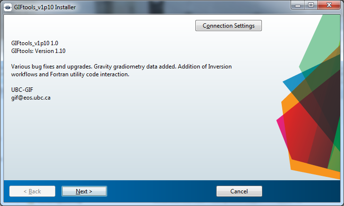
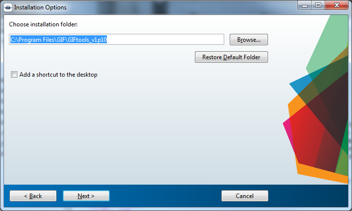
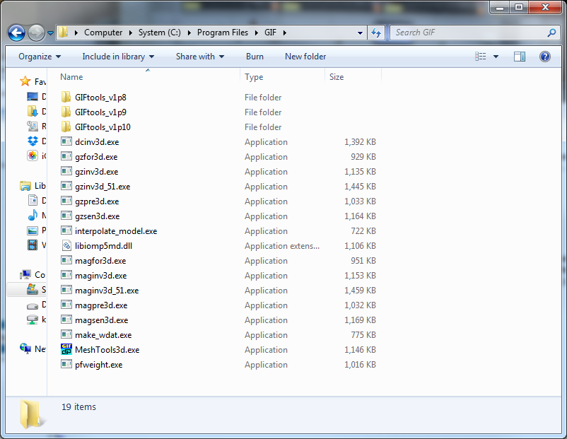
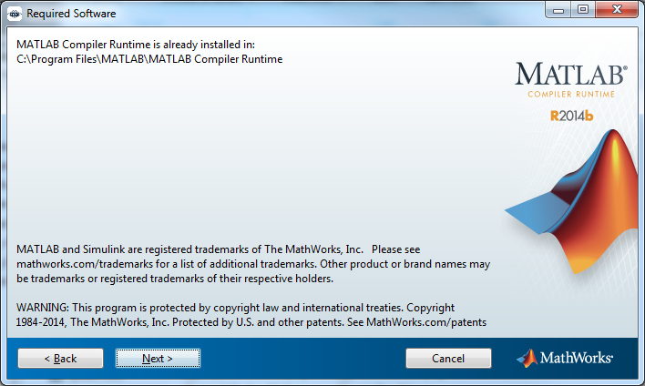
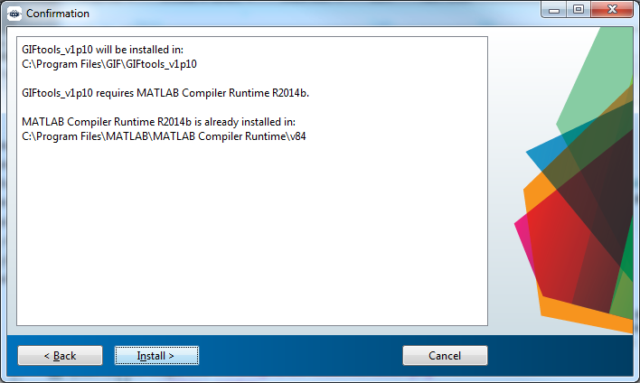
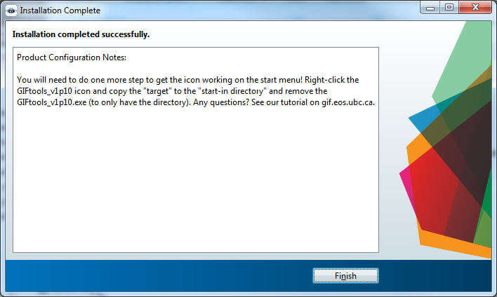
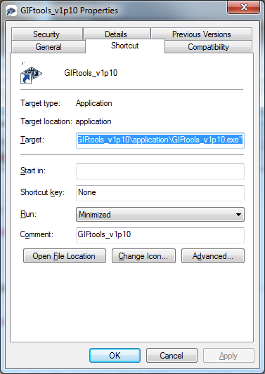
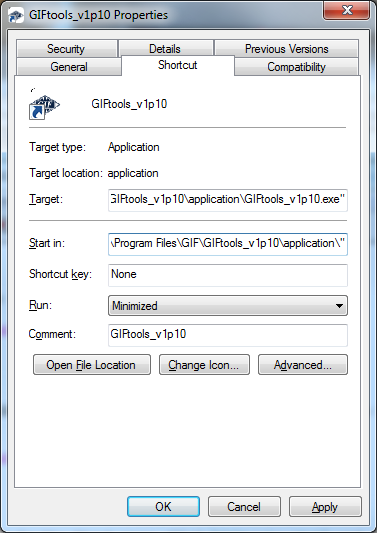
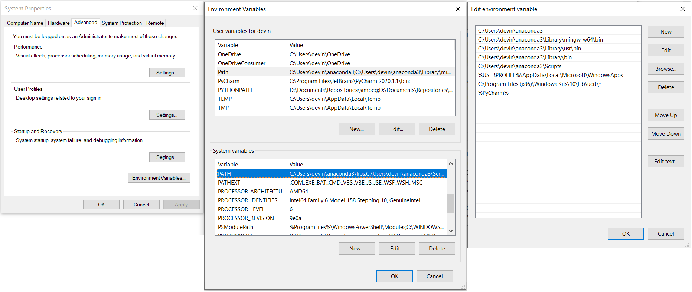

.. _installation:

.. warning:: The GIFtools cookbook provides supporting documentation for **proprietary software** developed by the UBC Geophysical Inversion Facility. Currently, GIFtools software is **only accessible** by the consortium of companies which funded the GIFtools project. Plans to commercialize this software is underway.

Installation
============

To install GIFtools, you will need to go the the website and download the
latest `installation executable <https://gif.eos.ubc.ca/GIFtools/downloads>`_
(Log-in required). To obtained a login, please `contact us
<http://gif.eos.ubc.ca/contact>`_

- :ref:`System Requirement <systemRequirements>`

Installation notes
------------------

The two available executables are either ``GIFtools_vXpX_install`` or
``GIFtools_vXpX_offlineInstall``. The only difference is that the off-line
install is much bigger to ensure that the Matlab run-time environment that is
needed is accessible if not already installed. The former installation
executable will use the internet to call Matlab to check on the environment
and download if necessary. Either way, **you will need administrator
privileges**. Once downloaded here are the 7 steps to follow:

1. Double click on executable, which will lead you to this screen (you can trust us...):

If you use a proxy server *and* you are using the `GIFtools_vXpX_install.exe`, you will need to click on the **Connection Settings** button and put the server name and port along with a user ID and password to access the internet.

2. Click **Next** and choose the installation directory for GIFtools. This does *not* necessarily need to be in ``C:\Program Files\GIF``! If you have created another folder somewhere on your computer, you may install GIFtools there (e.g., ``D:\GIFtools\``)

**NOTE 1**:  If you have previous versions of GIFtools on your computer, you can put the latest version in the parent directory (e.g., ``C:\Program Files\GIF``). This directory will also be where you should place all of your executables (i.e. inversion executables, MeshTools3D, etc.) that GIFtools would require. Here is an example:

**NOTE 2**: If you chose the ``Add a shortcut to the desktop`` option, you will need to perform step 7 on that shortcut too!

4. Click **Next**: One of two things will now happen, either (1) you will have to install the run-time compiler or (2) the compiler will already be installed. If (1), follow the on-screen instructions (most likely just keep clicking next) and this will lead you to step 5. If (2) this window will show up:

5. You are ready for install! Click **Install >**. It will take a minute or two.

6. If everything worked out, you will get to the screen below giving you step 7's instructions. Click **Finish** and **read below to finish the install** so the link is not broken.

7. Fix the *Start-in*  directory link for GIFtools. Go to the Start menu and find `GIFtools_vXpX` and **right-click** and select **properties**:

Note that the *Start in:* field is blank. **Copy and paste** the *Target:*  field to the *Start in:* field. Then **remove GIFtools_vXpX.exe from the Start in** field so that only the directory is present:

Click **Apply** and then **OK**. GIFtools is now installed and can be started from the Start menu

.. tip:: *Why did we have to do step 7?* Windows makes a copy in the registry and starts GIFtools there. The visualization package (VTK) that is used requires static Java libraries and therefore GIFtools needs to be started where those dynamic libraries are located.

.. tip:: *Manual shortcuts to desktop do not require step 7!* If you have gone into GIFtools ``application`` directory, right-clicked and chose ``Create shortcut``, then the the shortcut (by default it will ask you if you want to put it on the desktop) will already have the *Start in:* field adjusted.

.. _systemRequirements:

GIFtools system requirements
----------------------------

Below are the system requirements for GIFtools.

Operating System
^^^^^^^^^^^^^^^^

-  Microsoft Windows 7

-  Microsoft Windows 8

-  Microsoft Windows 10

-  Linux (by request)

-  Mac (by request)

CPU type
^^^^^^^^

-  64-bit (Designed on Intel Core i7)

Disk size
^^^^^^^^^

- Requires 275 MB of disk space (not including GIF Fortran executables)

Network
^^^^^^^

-  Deployment via ``GIFtools_vXpX_install`` requires internet

-  Deployment via ``GIFtools_vXpX_Offlineinstall``

-  There is no license server for GIFtools

-  Tutorial links within GIFtools calls user-default internet browser

Memory
^^^^^^

-  2 GB (4+ GB recommended)

Display resolution
^^^^^^^^^^^^^^^^^^

-  1920 x 1080 with TrueColor

Point device
^^^^^^^^^^^^

-  MS-Mouse compliant

.NET framework
^^^^^^^^^^^^^^

-  Minimum .NET framework version 4.5.1

Visual C++ 2013 x64
^^^^^^^^^^^^^^^^^^^

- `Download <https://support.microsoft.com/en-us/help/3179560/update-for-visual-c-2013-and-visual-c-redistributable-package>`__

Browser
^^^^^^^

-  Calls user-selected default browser for tutorial links

.. _PythonInstaller:

Installing Fortran Modeling/Inversion Codes
-------------------------------------------

Forward modeling, inversion and other specialized functionality is carried out using a set of external
executables written in Fortran. For each modeling code (Mag3D, DCIPoctree, E3DMT, etc...), there is a separate
coding package. **Individual licenses must be purchased to use each Fortran coding package in addition to the
GIFtools license**. If the user is licensed to use particular Fortran coding package, the installation steps
are as follows:

- Acquire the .zip file containing the Fortran coding package. Note that Consortium sponsors have specialized access and may login and download Fortran packages from the `UBC-GIF website <https://gif.eos.ubc.ca/about>`__ .

- Unzip the file and place the contents into a desired folder.

- Add the folder to your computer's *path variables*. That is, go to your computer's settings to 'edit system environment variables', and add the folder to the one called 'PATH'. If this step is not completed, your computer will not find the necessary executables when running the Fortran code from the GUI.

Python Installation (Optional)
------------------------------

Starting from version 2.25, GIFtools has the option to run some
functionalities from the open-source community; namely batch 2D DC/IP inversions. In order to get access to
these codes, users must install Python. This is
done through the Anaconda project

Part 1
^^^^^^

**If you do not already have Python 3.5 or greater already installed**, please follow these steps to get setup:

- Download the latest `Miniconda <https://docs.conda.io/en/latest/miniconda.html>`_

- Run the installed executable

        - Let Anaconda set the Environment Path (check both boxes!!)
            .. figure:: ../images/AnacondaPath.png
                :align: center
                :width: 400

    - ``simpegEM1D`` and its dependencies

Full installation time :math:`\approx 15` min

Congratulation, you should now have access to the `Python ecosystem <http://www.developintelligence.com/blog/python-ecosystem-2017/>`_!
More packages can be installed through command lines:

Either with anaconda (recommended)>  ``conda install PackageName``

or alternatively through pip>   ``pip install PackageName``

Part 2
^^^^^^

Now that you have Python installed, you must ensure that GIFtools can find Python when it is needed.
To do this, you will need to edit your computer's environment variables. For Windows computers,
this is set through the control panel under *Edit the System Environment Variables*.

In the **System Properties** window, click the *Environment Variables* button. In the **Environment Variables** window that pops up,
you will need to select the variable called *PATH* and click *edit* for either the *user variables* (whoever is logged in)
or *system variables* (everyone). If there is no variable called *PATH*, you will need to create a new variable called *PATH*.

When you click *edit*, the **Edit Environment Variable** window will pop up. You must add the path to *Anaconda3* and the *Library\\bin* subdirectory.
In our case, these directories were *C:\\Users\\devin\\anaconda3* and *C:\\Users\\devin\\anaconda3\\Library\\bin*.

