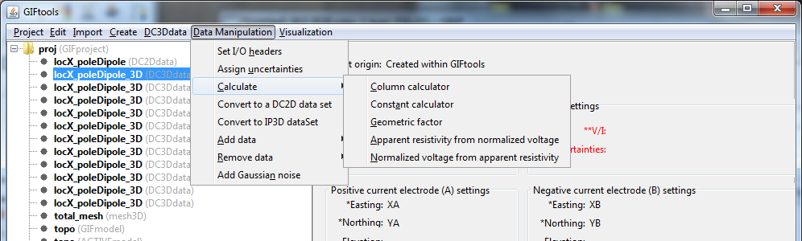
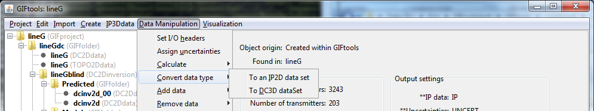
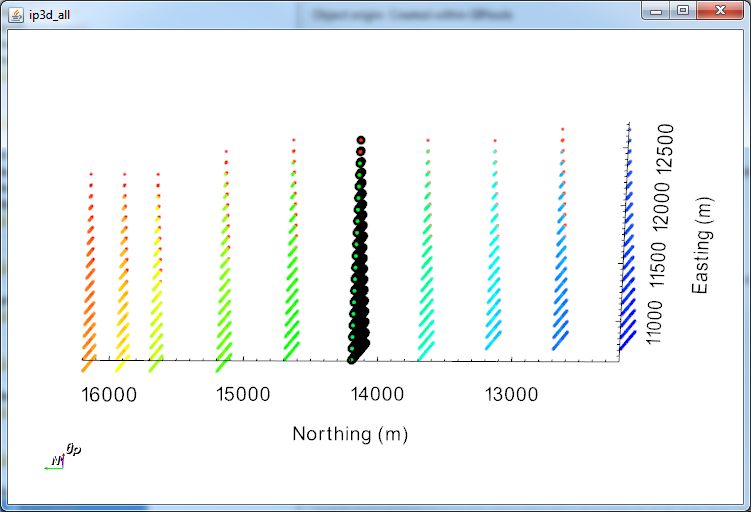
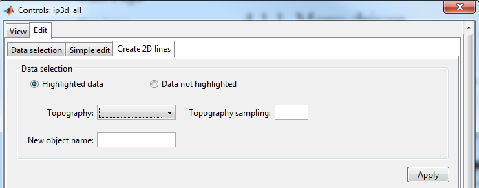
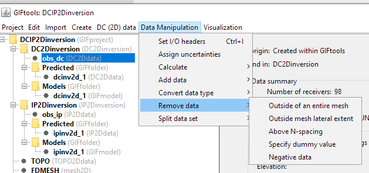

.. _objectDCIPDataManipulation:

.. include:: <isonum.txt>

Data Manipulation
=================

.. _objectDCIPDataCalculate:

Calculate: Transform between apparent resistivity and normalized voltage
------------------------------------------------------------------------

The DC/IP inversion algorithms require normalized voltage for their input. GIFtools offers a transform between apparent resitivity and normalized voltage (and vice versa). As a side product, the geometric factor will be calculated, although one could do that separately as a stand-alone task. Each transformation is found within the  **Data manipulation** |rarr| **Add data** submenu after clicking on the DC or IP item of interest. Each item in the menu list within GIFtools has the value to be calculated *first*. See below for each transformation.

Apparent resistivity to normalized voltage
^^^^^^^^^^^^^^^^^^^^^^^^^^^^^^^^^^^^^^^^^^

Click on the data item of interest and use the menu:

**Data manipulation** |rarr| **Add data** |rarr| **Normalized voltage from apparent resistivity**

Normalized voltage to Apparent resistivity
^^^^^^^^^^^^^^^^^^^^^^^^^^^^^^^^^^^^^^^^^^

Click on the data item of interest and use the menu:

**Data manipulation** |rarr| **Add data** |rarr| **Apparent resistivity from normalized voltage**

.. _objectDCIPDataCalculate_geofactor:

Geometry factor
^^^^^^^^^^^^^^^

Click on the data item of interest and use the menu:

**Data manipulation** |rarr| **Add data** |rarr| **Geometric factor**

.. _objectdcip3Dto2D:

Convert DC/IP 3D data to 2D
---------------------------

There are two different ways to create 2D data sets from a 3D DC/IP data set: (1) through a menu or (2) through the VTK viewer (Control + k when DC/IP3D data selected). Here we assume that there is a 3D DC or IP data set already in your project (see :ref:`loading 3D DC/IP data <importDCIP3Ddata>` into GIFtools). Converting topography in this process is important so that DCIP2D does not assume the data are down boreholes. Topography can be :ref:`imported into GIFtools <importTopo>` from quite a few file formats.

Both methods will project the data locations along the line and round to the nearest millimetre. The original 3D locations (i.e., UTM locations) will be stored in the new 2D data item.

Menu driven
^^^^^^^^^^^

For 3D DC data, use the menu:

**Data manipulation** |rarr| **Convert data type** |rarr| **To a 2D DC data set**

For 3D IP data, use the menu:

**Data manipulation** |rarr| **Convert data type** |rarr| **To a 2D IP data set**

.. _objectdcip3Dto2D_lineDEF:

    - OPTION 1: Line Definition
        This menu brings up the dialog box shown below. The user has the option to use two points along the line or the line direction. The positive, non-zero tolerance (m) is used to determine which data are sufficiently near the line to use for the projection (like a box). At this point, topography can also be projected on the line (recommended) sampled at the given interval.

        .. figure:: ../../../../images/2DlineCreator.png
            :align: center
            :width: 300

        **NOTE:** For ease, one may use the table view (control + T or **Visualization** |rarr| **Table view**) while the dialog box is open to fill out the points along the line.

.. _objectdcip3Dto2D_lineID:

    - OPTION 2: Line ID
        This menu brings up the dialog box shown below. DCIP data are seperated based on the ``lineID`` property. User can export ``TOPO2Ddata`` objects extracted from a ``TOPOdata`` object.

        .. figure:: ../../../../images/dcip3Dto2D_lineID.png
            :align: center
            :width: 300

.. _objectdc3Dtoip3D:

Convert DCdata to IPdata
------------------------

It is possible to convert directly a `DC3Ddata` to `IP3Ddata` and vice versa to preserve the survey configurations.

**Data manipulation** |rarr| **Convert data type** |rarr| **To DC[IP]3D data set**

VTK viewer
^^^^^^^^^^

Select the DC/IP 3D data item and bring up the viewer (control + k) or:

**Visualization** |rarr| **VTK view**

Within the viewer, select the **Edit** tab on the control dialog and then **Data selection**. Using the control button will allow the user to make multiple selections. Select the data to project (or not project if it is easier) onto the 2D line (example below).

Then (still under the **Edit** tab), select the **Create 2D lines** tab (see below). Choose either the data that was selected or the data not selected. If a topography item is located in the project, choose the topography (if applicable) and sampling rate. The sampling rate is only required if topography is selected. Fill out the new item's name and click apply. The 2D DC/IP data item is now ready to be input into a :ref:`DC/IP 2D inversion <createDCIPInv>` along with the 2D topography item, if applicable.

**NOTE:** For multiple lines, the VTK viewer is most likely the best (and quickest) option as it will compute the line. Multiple lines can be created by: clearing the selection, selecting the next line, changing the name of the 2D DC/IP item to create, and clicking **Apply**.

.. _objectDCIPApplyTopo:

Apply topography to DC/IP data
------------------------------

In some cases, the elevations of electrodes are not given or have not been set (i.e., the :ref:`surface format <surface3DFormat>`). DC/IP data can have elevation added to the data set through the interpolation of a topography data item. Click on the data item of interest and use the menu:

**Data manipulation** |rarr| **Add data** |rarr| **Apply topography**

.. figure:: ../../../../images/dcipAddMenu.png
    :align: center
    :width: 400

.. _objectDCIPRemoveNegativeData:

Remove Negative data value
--------------------------

In some cases, apparent resistivities can appear negative due to an issue in the measurements. This option allows the user to remove all data points with negative values in a specific column.

**Data manipulation** |rarr| **Remove data** |rarr| **Negative data**

