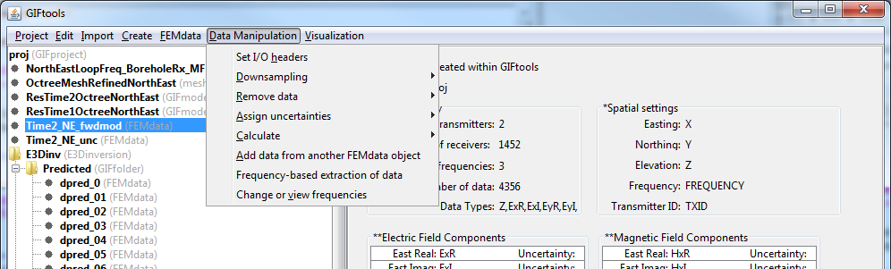

.. _objectEMDataManipulation:

.. include:: <isonum.txt>

EM Data Manipulation
====================

.. _objectTimeFreqExtract:

Extract data based on times or frequencies
------------------------------------------

To extract all the data associated with a certain time(s) or frequency(ies), click on the data item of interest and use the menu:

- TEM data: **Data manipulation** |rarr| **Time-based extraction of data**

- FEM data: **Data manipulation** |rarr| **Frequency-based extraction of data**

**NOTE:** This will create a new data item.

.. _objectTimeFreqEdit:

View and/or edit the times or frequencies of a data set
-------------------------------------------------------

To view (with the option to edit) the times or frequencies within a data set, click on the data item of interest and use the menu:

- TEM data: **Data manipulation** |rarr| **Change or view times**

- FEM data: **Data manipulation** |rarr| **Change or view frequencies**

**NOTE:** Editing will *NOT* create a new dataset and will over-write the previous times/frequencies.

.. _objectEMBiotSavart:

Compute Biot-Savart Primary Field (3D object only)
--------------------------------------------------

If the survey geometry has been defined, this functionality computes primary field assuming a current of 1 A using the Biot-Savart law in free-space.
The user may choose to compute either the H-field or B-field.
This functionality is accessed through:

**Data manipulation** |rarr| **Calculate** |rarr| **Compute Biot-Savart Primary Field**

For *FEMdata* and *TEMdata* objects, the user must have previously assigned the transmitters. This functionality will compute and create columns for the X, Y and Z components of the magnetic field as well as its magnitude.

For *FEM3Dsounding* and *TEM3Dsounding* objects, the user must have previously assigned both transmitters and receivers. In this case, the functionality will compute and create columns for the magnetic field along the receiver direction as well as the magnitude.

.. _objectEMsetDataNorm:

Set Data Normalization (FEM and TEMsounding Only)
-------------------------------------------------

Both the EM1DFM and EM1DTM inversion codes can interpret a variety of representations of EM data.
To ensure the data are interpreted correctly by the EM1DFM and EM1DTM codes, the data normalization must be properly set.
This functionality can be accessed through:

**Data manipulation** |rarr| **Set Data Normalization**

.. _objectEMsetDataNorm_FEM:

FEM data
^^^^^^^^

For FEM sounding data, the options for defining the type of data are as follows:

    - **ppm:** secondary field component as parts-per-million of the primary field
    - **%:** secondary field component as a fractional percent of the strength of the primary field
    - **A/m:** secondary field component in A/m
    - **Total field:** total field (primary + secondary) in A/m

.. _objectEMsetDataNorm_TEM:

TEM data
^^^^^^^^

For TEM sounding data, the options for defining **B-field data** are as follows:

    - **nano-Tesla**
    - **micro-Tesla**
    - **milli-Tesla**

and the options for defining **dB/dt data** are as follows:

    - **micro-Volts**
    - **milli-Volts**
    - **Volts**

.. note:: If the dipole moment of the receiver is 1 Am :math:`\! ^2`, then the magnitude of the EMF induced in the receiver coil in Volts equals the time-derivative of the magnetic flux density in T/s.

.. _objectEMsetTimeNorm:

Set Time Normalization (TEM1Dsounding Only)
-------------------------------------------

The EM1DTM inversion code can use a variety of units for the time channel column.
To ensure the data are interpreted correctly by the EM1DTM code, the time normalization must be properly set.
This functionality can be accessed through:

**Data manipulation** |rarr| **Set Time Normalization**

The options for defining the units of the time column are as follows:

    - **micro-seconds**
    - **milli-seconds**
    - **seconds**

.. _calculateTxRxSeperation:

Calculate Transmitter-Receiver seperation
-----------------------------------------

This function computes the in-line, cross-line and vertical seperation between the transmitter and receiver for each datum.

.. _parseEM3DsoundingbyTx:

Parse FEM/TEM 3D Sounding by Transmitter
----------------------------------------

This functionality is available for *FEM3Dsounding* and *TEM3Dsounding* data objects. When EM3Dsounding
objects contain data at the same location for multiple transmitters (e.g. surface UTEM), the data viewer
cannot be opened. This functionality parses the data object into a data object for each transmitter. 

This functionality can be accessed through:

**Data manipulation** |rarr| **Create new item** |rarr| **Parse EM3Dsounding by transmitter**

.. _mergeParsedEM3Dsounding:

Merge Parsed FEM/TEM 3D Soundings
---------------------------------

This functionality is available for *FEM3Dsounding* and *TEM3Dsounding* data objects.
This functionality is primarily used for merging multiple EM3Dsounding objects to
create a single data object that can be used to construct a mesh.
The number of data locations and times/frequencies do not need to be the same. However,
**the columns in each object must be identical;** i.e. number of columns, names, etc...

This functionality can be accessed through:

**Data manipulation** |rarr| **Create new item** |rarr| **Merge parsed EM3Dsounding data**

