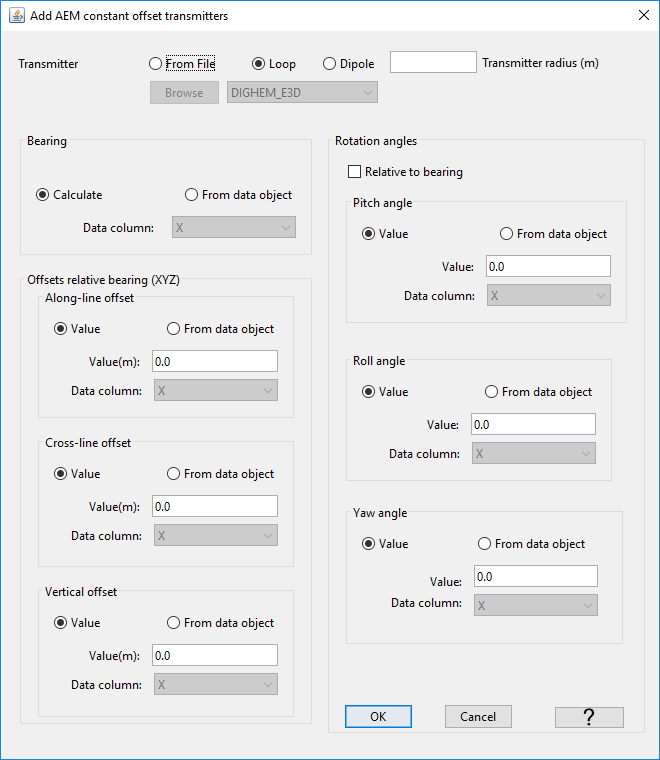

.. _objectEMdtype:

.. include:: <isonum.txt>

EM Data Type Functionality
==========================

.. _objectEMdtype_EM3Dsounding_tx:

Defining Transmitters
---------------------

For ``FEM3Ddata``, ``FEM3Dsounding``, ``TEM3Ddata`` and ``TEM3Dsounding`` data objects, we can define transmitters for the survey.
This functionality is accessed using the drop-down menu:

**"data type menu"** |rarr| **Add Transmitters**

.. _objectEMdtype_addTx:

Add Transmitters to 1D sounding
^^^^^^^^^^^^^^^^^^^^^^^^^^^^^^^

Here, the user may specify the transmitter locations
and properties based on the data locations.

Select the object: **"data type menu"** |rarr| **Add transmitters**

- Transmitter geometry
    - **From File:** Lets the user import a template geometry (XYZ coordinates) defining the transmitter coil.
    - **Loop:** Defines a simple loop transmitter with radius set by the user.
    - **Dipole:** Defines a dipole transmitter with moment set by the user (for EM1Dinversion)
- Bearing
    - **Calculate:**  Let GIFtools determine the bearing of survey lines. Assumes that the survey points are sorted in order of acquisition.
    - **From data object:** Bearing already supplied by the data object.
- Offsets relative to bearing (XYZ)
    - **Along-line offset:** Distance along the survey lines between the data location and transmitter
    - **Cross-line offset:** Distance perpendicular to the survey lines between the data location and transmitter
    - **Vertical offset:** Elevation difference between the data location and transmitter. For the :ref:`EM1Dsounding <objectEMDataIndex_EM1Dsounding>` class, the offset is relative to the ground.
- Rotation angles
    - **Relative to bearing:** Apply the rotation angles relative to the flight line orientation. Otherwise angles are relative to the Cartesian grid.
    - **Pitch angle:** Rotation angle about the wings of the bird. Positive angle moves the nose up, tail down.
    - **Roll angle:** Rotation angle about the length of the bird. Positive angle moves the left wing up, right wing down.
    - **Yaw angle:** Rotation angle about the XY plane. Positive angle rotates the bird clockwise.

.. important:: Make sure you have :ref:`set i/o headers<objectSetioHeaders>` for the xyz-data locations. This functionality computes the transmitter locations based on the i/o headers.

.. _objectEMdtype_EM3Dsounding_tx_airborne:

Create Surface/Airborne Sources
^^^^^^^^^^^^^^^^^^^^^^^^^^^^^^^

Create inductive sources (loops) for surface or airborne EM surveys. This functionality is accessed using the drop-down menu:

**"data type menu"** |rarr| **Add Transmitters** |rarr| **Create Surface/Airborne Sources**

.. _objectEMdtype_EM3Dsounding_tx_surface:

Create Single Inductive/Galvanic Source
^^^^^^^^^^^^^^^^^^^^^^^^^^^^^^^^^^^^^^^

Create a single inductive or galvanic source for all data in the object. This functionality is accessed using the drop-down menu:

**"data type menu"** |rarr| **Add Transmitters** |rarr| **Create Single Inductive/Galvanic Source**

.. _objectEMdtype_EM3Dsounding_rx:

Defining Receivers
------------------

For ``FEM3Dsounding`` and ``TEM3Dsounding`` data objects, we can define receivers for the survey.
This functionality is accessed using the drop-down menu:

**"data type menu"** |rarr| **Add Receivers**

.. _objectEMdtype_addRx:

Add Receivers to 1D sounding
^^^^^^^^^^^^^^^^^^^^^^^^^^^^^^^

.. _objectEMdtype_EM3Dsounding_rx_airborne:

Create Surface/Airborne Receivers
^^^^^^^^^^^^^^^^^^^^^^^^^^^^^^^^^

Create loop receivers for surface or airborne EM surveys. This functionality is accessed using the drop-down menu:

**"data type menu"** |rarr| **Add Transmitters** |rarr| **Create Surface/Airborne Receivers**

.. _objectEMdtype_removeTx:

Remove Transmitters
-------------------

This functionality allows the user to remove transmitter information from the data object.

Select the object and the menu **"data type menu"** |rarr| **Remove transmitters**

.. _objectEMdtype_removeRx:

Remove Receivers
----------------

This functionality allows the user to remove receiver information from the data object.

Select the object and the menu **"data type menu"** |rarr| **Remove receivers**

.. _objectEMdtype_waveform:

Waveform (TDEM objects only)
----------------------------

Here, we describe functionality related to defining, viewing and exporting waveforms for TEM data objects. This functionality is accessed through:

**data type menu** |rarr| **Waveform**

.. _objectEMdtype_waveform_exp:

Create Exponent On - Ramp Off
^^^^^^^^^^^^^^^^^^^^^^^^^^^^^

Here, the user defines an exponential ramp-on linear ramp-off waveform and sets it to the selected TEM data object. This functionality is accessed through:

**data type menu** |rarr| **Waveform** |rarr| **Create exponent on; ramp off**

The parameters defining this waveform are as follows:

    - **minimum time:** the starting time for the waveform (in seconds). This time **must** be before your first time channel
    - **maximum time:** the end time for the waveform (in seconds). This time **must** be after your latest time channel
    - **time = 0:** the shut-off time
    - **Number of segments:** Number of intervals after t0 which use a different time-step length
    - **Samples per segment:** Number of linearly sampled points which define the time-step length in each segment
    - **Exponent slope:** The constant :math:`\alpha` defining the exponential ramp on
    - **Exponent time:** The duration of the exponential ramp on
    - **Number of exp samples:** Number of data points, linearly sampled, defining the waveform during the exponential ramp on
    - **Ramp time:** The duration of the linear ramp off
    - **Number of ramp samples:** Number of data points, linearly sampled, defining the waveform during the linear ramp off

.. _objectEMdtype_waveform_stepoff:

Create Step Off
^^^^^^^^^^^^^^^

Here, the user defines a step-off waveform and sets it to the selected TEM data object. This functionality is accessed through:

**data type menu** |rarr| **Waveform** |rarr| **Create step off**

The parameters defining this waveform are as follows:

    - **minimum time:** the starting time for the waveform (in seconds). This time **must** be before your first time channel
    - **maximum time:** the end time for the waveform (in seconds). This time **must** be after your latest time channel
    - **time = 0:** the shut-off time
    - **Number of segments:** Number of intervals after t0 which use a different time-step length
    - **Samples per segment:** Number of linearly sampled points which define the time-step length in each segment

.. _objectEMdtype_waveform_import:

Import a Waveform
^^^^^^^^^^^^^^^^^

Here, the user imports a custom waveform from a text file and sets it to the selected TEM data object. This functionality is accessed through:

**data type menu** |rarr| **Waveform** |rarr| **Import (3D format)**

.. _objectEMdtype_waveform_view:

View
^^^^

Here, the user may look at the waveform assigned to the selected TEM data object. This functionality is accessed through:

**data type menu** |rarr| **Waveform** |rarr| **View**

.. _objectEMdtype_waveform_1D:

Export for 1D
^^^^^^^^^^^^^

Here, the user may export the waveform in the format used by the EM1DTM code. This functionality is accessed through:

**data type menu** |rarr| **Waveform** |rarr| **Export for 1D**

.. _objectEMdtype_waveform_3D:

Export for 3D
^^^^^^^^^^^^^

Here, the user may export the waveform in the format used by 3D codes. This functionality is accessed through:

**data type menu** |rarr| **Waveform** |rarr| **Export for 3D**
