.. _objectDataManipulation:

.. include:: <isonum.txt>

Data Manipulation Menu
======================

.. _objectSetioHeaders:

Set input/output data headers
-----------------------------

Input/output (i/o) data headers are important because it symbolized the data columns that will be exported to GIF inversion codes. If i/o headers are required, but not filled, they will appear in red in the information panel provided to the right of the data object when selected:

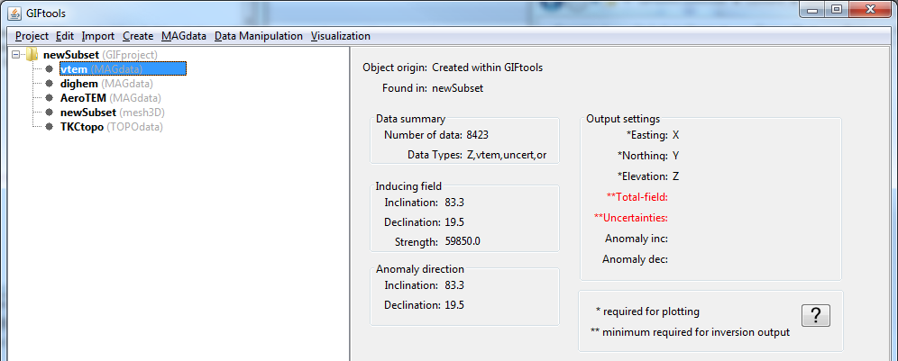

To set the i/o header, select the object and then the menu **Data manipulation** |rarr| **set I/O headers**

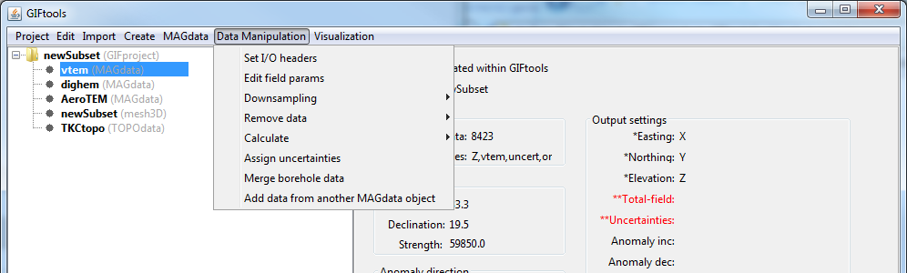

.. _objectDataDownsample:

Downsample Data
---------------

Data may be downsample in three ways: Simple down-sampling, mesh-based and by distance. With any method that deletes data locations, a *new* data object will be created after downsampling. See below for details.

Traditional downsampling
^^^^^^^^^^^^^^^^^^^^^^^^

Traditional downsampling requires a number, :math:`n`, which represents the fractional number of data kept (e.g, 3 is one-third, 4 is one-quarter). This downsampling can be done on any data object as the algorithm finds only the unique *horizontal* locations of data. To downsample the data this way, the menu structure is:

**Data manipulation** |rarr| **Downsampling** |rarr| **Simple**

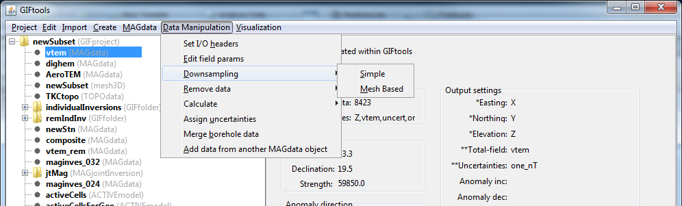

**NOTE:** This method of downsampling can be reached from the :ref:`data viewer <viewData>`. Data first need to be selected (to either be downsampled or left alone) via the **View** |rarr| **Edit** |rarr| **Data selection** tab of the viwer control dialog. Then select its neighbouring tab: **View** |rarr| **Edit** |rarr| **Simple edit** and select the radio button under "Downsample area." The value associated with this will be :math:`n` as given above. A new data object name will be required.

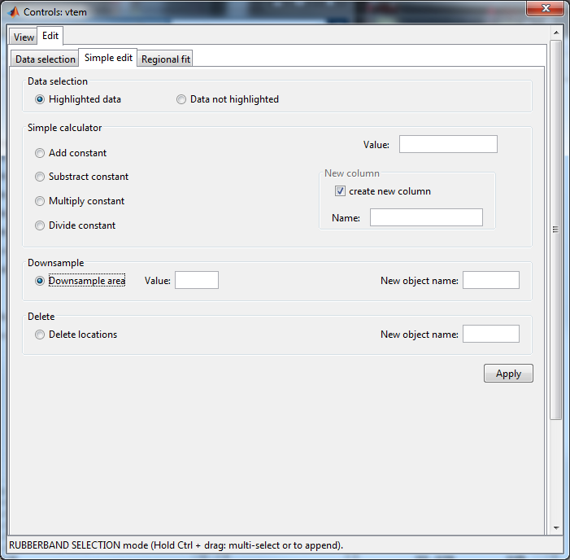

Downsample by mesh
^^^^^^^^^^^^^^^^^^
The second method of downsample requires a mesh (either :ref:`3D<importMesh3D>` or :ref:`ocTree<importMeshOctree>`) and will keep only one datum location per cell. EM data will have its times/frequencies preserved. The option also allows for either the closest location to the centre of each cell or a random location in each cell will be chosen. To access this function use:

**Data manipulation** |rarr| **Downsampling** |rarr| **Mesh Based**

Downsample by distance
^^^^^^^^^^^^^^^^^^^^^^

The third method downsamples the data based on the distance between points

**Data manipulation** |rarr| **Downsampling** |rarr| **Distance**

.. _objectMeshBasedDataRemoval:

Remove data outside mesh
------------------------

This function allows the user to remove data outside of a 3D mesh region that is of interest. With any method that deletes data locations, a *new* data object will be created after mesh-based removal. There are two options to choose: (1) removal outside the horizontal extent of the mesh or (2) removal outside the entire extent of the mesh. To perform either of these two tasks, click on the data object and then use the following menu (number corresponds from above):

#. **Data manipulation** |rarr| **Remove data** |rarr| **Outside mesh lateral extent** or

#. **Data manipulation** |rarr| **Remove data** |rarr| **Outside of an entire mesh**

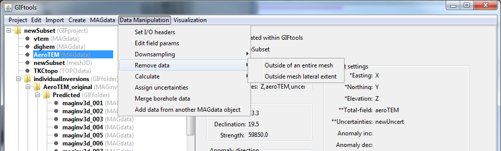

.. _objectPolyTrend:

Calculate a polynomial trend
----------------------------

Any data column may have a polynomial trend calculated. For access to this feature via *magnetics* or *gravity* data, click on the data item of interest and use the menu below. For all other data types, this feature can be accessed though the :ref:`data viewer <viewData>` (See Note 2).

**Data manipulation** |rarr| **Calculate** |rarr| **Polynomial trend**

The calculation of a polynomial trend can be accessed in the :ref:`data viewer <viewData>`. Data first need to be selected via the **View** |rarr| **Edit** |rarr| **Data selection** tab of the viwer control dialog. Then select its neighbouring tab: **View** |rarr| **Edit** |rarr| **Regional fit**. A new data column name is manditory as well as the degree of polynomial.

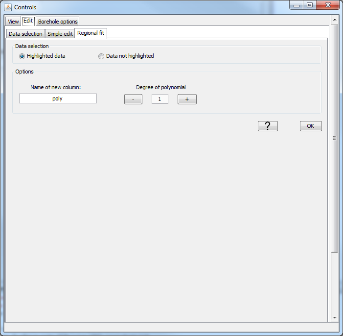

.. note:: For removal of the trend, see the :ref:`Calculator <objectCalculator>` for how to subtract one column from another within a data object.

.. _objectCalculator:

Apply a simple math operation to data
-------------------------------------

This functionality is used to apply basic math operations to a column of data.
To access this functionality, click on the data item of interest and use the
menu:

**Data manipulation** |rarr| **Calculate** |rarr| **Calculator**

Actions can be performed through the following pop-up window:

    .. figure:: ../../../../images/dataCalculate.png
        :align: center
        :scale: 100%

**Step 1:** For :math:`x` (Property), :math:`c` (Value or Property) and :math:`y` (new Property), choose from the following set of mathematical operations.
    - *Addition:* adds ``Value`` to the selected ``Property``; e.g. :math:`y = x + c`
    - *Subtraction:* subtracts ``Value`` from the selected ``Property``; e.g. :math:`y = x - c`
    - *Multiplication:* multiplies the selected ``Property`` by ``Value``; e.g. :math:`y = x \times c`
    - *Division:* divides the selected ``Property`` by ``Value``; e.g. :math:`y = x / c`
    - *Power:* computes the power (elementwize) of ``Property`` by the ``Value``; e.g. :math:`y = x ^ c`
    - *Exponential:* computes the power (elementwize) of `Value` by the ``Property``; e.g. :math:`y = c^x`
    - *Logarithm:* computes the logarithm of ``Property`` with base `Value` [:math:`2 | 10 | e`] ; e.g. :math:`y = log_c(x)`
    - *Replace Min:* returns the smaller of the two values when comparing ``Value`` to each entry in the selected ``Property``; e.g. :math:`y = \textrm{min}(x,c)`
    - *Replace Max:* returns the larger of the two values when comparing ``Value`` to each entry in the selected ``Property``; e.g. :math:`y = \textrm{max}(x,c)`
    - *Absolute:* returns the absolute value of ``Property``; e.g. :math:`y = |x|`
    - *Deg -> Rad:* returns ``Property`` in radian; e.g. :math:`y = x * \pi / 180`
    - *Rad -> Deg:* returns ``Property`` in degree; e.g. :math:`y = x * 180 / \pi`
**Step 2: Set :math:`x`** Choose a property ``Property`` from the drop-down menu
    - OPTIONAL: For EM data objects, operations can be applied on a single frequency or time channel.
**Step 3: Set :math:`c`**
    - OPTION 1: Chose a ``Property`` from the object
    - OPTION 2: Enter a number into the field for ``Value``
**Step 4:** Determine if new ``Property`` is created
	- *Create is not selected:* The new ``Property`` of data will replace the selected ``Property`` of data
	- *Create is selected:* A new ``Property`` is created for the calculated data and a name must be provided
**Step 5 [OPTIONAL]:**  Apply and continue
    - Allows the user to keep the ``Calculator`` window opened and proceed with more operations. Any new ``Property`` columns are added to the drop-down menues.

.. note:: Spatial (X,Y) :ref:`i/o Headers <objectSetioHeaders>` are not shown within the calculator. To apply the constant calculator to the x- or y-coordinates, remove them from the i/o header.

.. .. _objectColumnCalculator:

.. Apply a ``Property``-to-column math operation to data
.. -----------------------------------------------

.. This functionality allows the user to perform basic math operations using two data columns. To access this functionality, click on the data item of interest and use the menu:

.. **Data manipulation** |rarr| **Calculate** |rarr| **Column calculator**

.. Actions can be performed through the following pop-up window:

.. .. figure:: ../../../../images/columnCalculate.png
..     :align: center
..     :width: 500

.. **Step 1:** From the drop down menus, choose data columns for 'Column 1' and 'Column 2'

.. **Step 2:** For :math:`x_1` (Column 1), :math:`x_2` (Column 2) and :math:`y` (new column), choose from the following set of mathematical operations.

.. 	- *Addition:* adds column 2 to column 1; e.g. :math:`y = x_1 + x_2`
.. 	- *Subtraction:* subtracts column 2 from column 1; e.g. :math:`y = x_1 - x_2`
.. 	- *Multiplication:* multiplies column 1 and column 2; e.g. :math:`y = x_1 \times x_2`
.. 	- *Division:* divides column 1 by column 2; e.g. :math:`y = x_1 / x_2`
.. 	- *Exponent:* computes column 1 to the power of column 2; e.g. :math:`y = x_1^{x_2}`
.. 	- *Min:* returns the smaller of the two values when comparing column 1 to column 2; e.g. :math:`y = \textrm{min}(x_1,x_2)`
.. 	- *Max:* returns the larger of the two values when comparing column 1 to column 2; e.g. :math:`y = \textrm{max}(x_1,x_2)`

.. **Step 3:** Determine if new column is created

.. 	- *New column is not selected:* The new column of data will replace 'Column 1'
.. 	- *New column is selected:* A new column is created for the calculated data and a name must be provided

.. **Step 4:** Apply operation to only certain times/frequencies. This is good if you want to replace values in a column but only for certain times/frequencies.

.. .. note:: Spatial (X,Y) :ref:`i/o Headers <objectSetioHeaders>` are not shown within the calculator. To apply the constant calculator to the x- or y-coordinates, remove them from the i/o header.

.. _objectAddNoise:

Add Gaussian noise to data
^^^^^^^^^^^^^^^^^^^^^^^^^^

On occasion, one may want to add noise to a forward modelled dataset in order to test an inversion. To add Gaussian noise to a data column or columns, click on the data item of interest and use the menu:

**Data manipulation** |rarr| **Calculate** |rarr| **Add Gaussian noise**

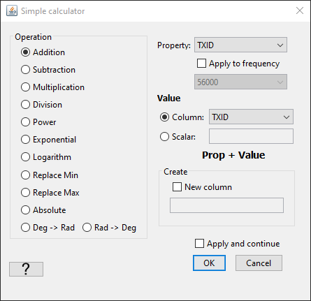

**NOTE 1:** Spatial (X,Y) :ref:`i/o Headers <objectSetioHeaders>` are not shown within the calculator.

.. _objectAddConstantCol:

Add Constant Column
^^^^^^^^^^^^^^^^^^^

One may want to append a constant value to the data object.

.. _objectCalcLineBearing:

Calculate line and bearing
^^^^^^^^^^^^^^^^^^^^^^^^^^

Geophysical survey are often collected along survey lines. While the data may
have Easting and Northing information, it is often useful to also know the
direction (bearing) of survey. This function groups the survey observation stations with line IDs, and provide the local bearing of each observation with respect to its nearest neighbours.

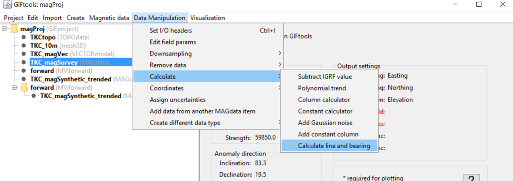

**NOTE:** The assumption is made that survey points are provided in the same order as they were collected.

.. _objectElevFromSurface:

Calculate elevation from surface
^^^^^^^^^^^^^^^^^^^^^^^^^^^^^^^^

This functionality allows the user to create an elevation (height of the data)
column from a surface or topography object using a linear interpolation
method. Elevations can be set at, above or below the surface by a specified
amount. In addition, data columns (such as a flight altitude column) within
the data object can be used to create the elevation values. This functionality
is accessed through:

**Data Manipulation** |rarr| **Calculate** |rarr| **Calculate elevation from surface**

Coordinates
-----------

This functionality is accessed through:

**Data Manipulation** |rarr| **Coordinates**

and can be used to:

    - rotate or shift raw data into a local coordinate system
    - use altitude data and surface topography to determine the data elevation

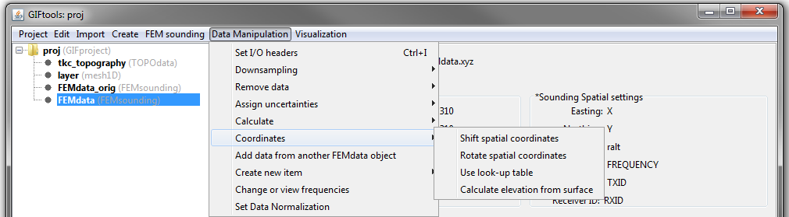

.. _objectShiftCoord:

Shift spatial coordinates
^^^^^^^^^^^^^^^^^^^^^^^^^

This functionality allows the user to shift the Easting and Northing locations of the data within a data object. The action creates new data columns and does not delete the preexisting Easting and Northing locations. This functionality is accessed through:

**Data Manipulation** |rarr| **Coordinates** |rarr| **Shift spatial coordinates**

.. _objectRotateCoord:

Rotate spatial coordinates and data
^^^^^^^^^^^^^^^^^^^^^^^^^^^^^^^^^^^

This functionality allows the user to change the Easting and Northing locations of the data within a data object by rotating about a fixed point. The use may also apply the rotation to specified data columns; this is useful when the dataset contains horizontal field measurements. This functionality is accessed through:

**Data Manipulation** |rarr| **Coordinates** |rarr| **Rotate spatial coordinates**

.. _objectLookUpTable:

Use look-up table
^^^^^^^^^^^^^^^^^

This functionality allows the user to convert locations of the data from
`local` coordinates to Easting and Northing by using a `Survey` file. This
operation is routinely performed after importing raw :ref:`DCIP2Ddata <importDCIP2Ddata>` objects.

**Data Manipulation** |rarr| **Coordinates** |rarr| **Look-up table**

.. _objectAssignUncert:

Assign uncertainties
--------------------

Assigning uncertainties is vital to inversion and therefore is also required as an :ref:`i/o header<objectSetioHeaders>`. An explanation of the uncertainties and their role in the inversion process can be found in :ref:`inversion fundamentals<Fundamentals_Uncertainties>`. To assign uncertainties to a data object, click on the object and select the menu:

**Data manipulation** |rarr| **Assign uncertainties**

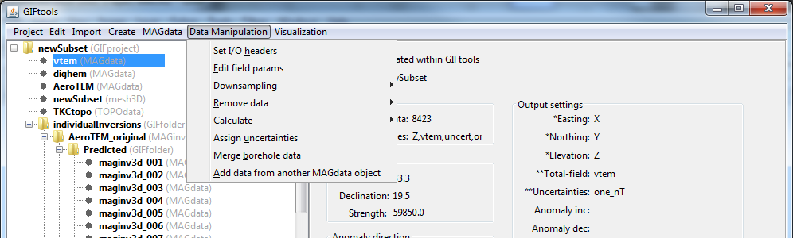

Frequency and Time-Dependent Uncertainties
^^^^^^^^^^^^^^^^^^^^^^^^^^^^^^^^^^^^^^^^^^

.. _objectAssignUncertGUI:

GUI
~~~

The user may want to specify or visualize a particular floor and percent for
the uncertainties at every distinct frequency/time. In this case, the user may
select:

    - **Data manipulation** |rarr| **Assign uncertainties** |rarr| **GUI**

If the data and uncertainties :ref:`I/O header has been
set<objectSetioHeaders>`, error bars will be auto-populated. Uncertainties
are assigned or modified by carrying out the following steps:

- FOR ALL data columns you want to compute and assign uncertainties for:

    - Select the data column from the *data type* drop-down menu
    - Fill in the *Column name* to specify the name of the column containing the uncertainties
    - FOR ALL times/frequencies you want to compute and assign uncertainties for:

        - Select the time/frequency from the *time/frequency* drop-down menu
        - Under *Select data*, specify the percent uncertainty (:math:`0 < \varepsilon_\% < 100`) and floor uncertainty for those data
        - Click *Assign selected* to apply the uncertainties to that particular *data type* and *time/frequency*. Click *Assign to all* to apply the same factional percent and floor to the data at all times/frequencies. If either of these buttons is not clicked, GIFtools will not temporarily remember these uncertainties while calculating uncertainties for another data type and/or frequency.

When uncertainties for all data columns have been assigned, select *OK* to finish

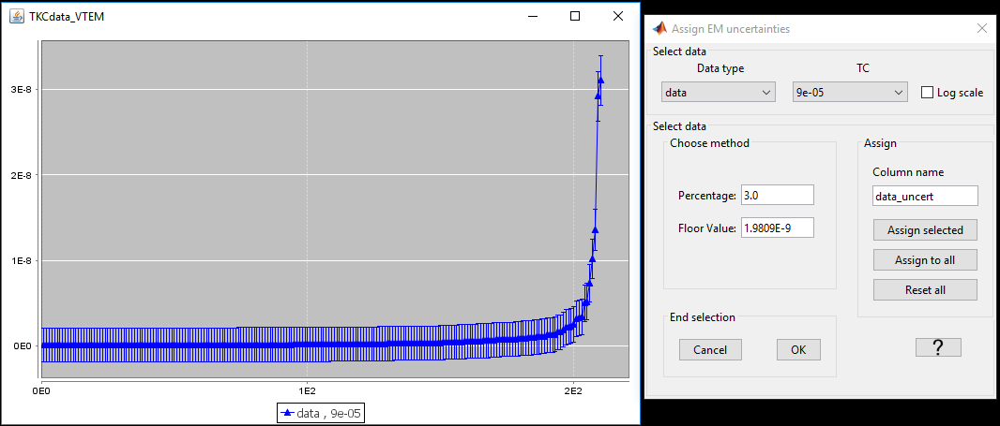

.. _objectAssignUncertFile:

Column File [% | floor]
~~~~~~~~~~~~~~~~~~~~~~~

Users can load percentages and floors uncertainties at every distinct
frequency/times from a column file.  The user will be prompt with a list of
properties to use. Multiple channels (i.e. Real and Imaginary data) can be set
with the same file.

.. important:: The number of rows in the selected file must equal the number
                of frequencies/times present in the :ref:`data object <objectGeneralDataIndex>`.

Assign Simple Uncertainties
^^^^^^^^^^^^^^^^^^^^^^^^^^^

To apply a constant floor value and identical percent when computing uncertainties for all data, select:

**Data manipulation** |rarr| **Assign uncertainties** |rarr| **Simple**

.. _objectAddColumnsFromObj:

Add columns from another data object of same type
-------------------------------------------------

Import specified data columns from one data object into a selected data object. **Requires both objects to have the same number of data (i.e. rows).** This functionality is useful when importing data columns into data objects corresponding to predicted data; output either from forward modeling or inversion.
To call this functionality:

**Data manipulation** |rarr| **Add data columns from another [data type] object**

.. _objectCombineData:

Add data from another data object of same type
----------------------------------------------

Any data object can be combined with another data object from its same class (e.g., MAGdata with MAGdata). Click on the data item of interest and, With the exception of DC/IP data (see NOTE below), use the menu:

**Data manipulation** |rarr| **Merge [data class] objects**

**NOTE: DC/IP data:** For DC or IP data, this function is found using the menu structure:

**Data manipulation** |rarr| **Add data** |rarr| **Merge [data class] objects**

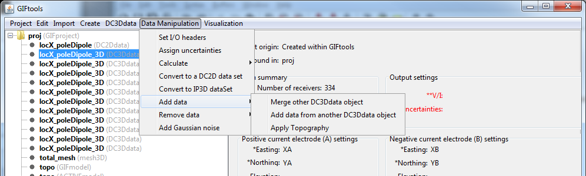

.. _objectCreateDiffData:

Create different data type
--------------------------

.. raw:: html
    :file: ../../../../underconstruction.html

