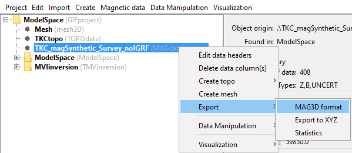
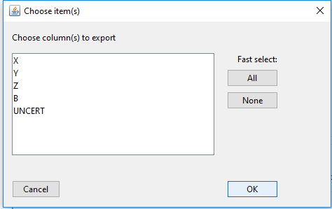
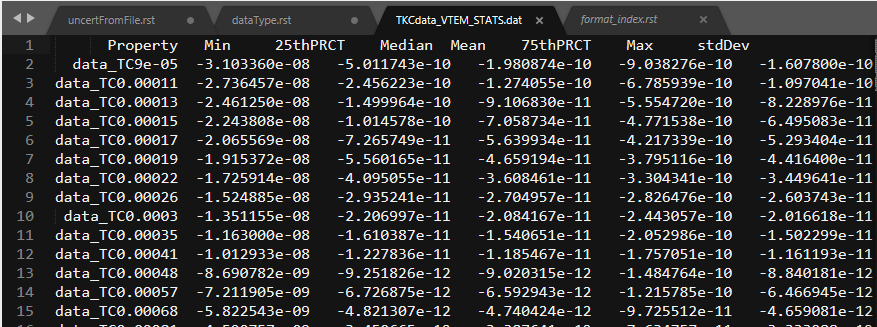

.. _objectDataType:

.. include:: <isonum.txt>

"Data Type" Data Menu
=====================

.. _objectDataHeaders:

Edit data headers
-----------------

Click on desired data object, the menu with its class name (e.g., **MAGdata** for magnetic data) |rarr| **Edit data headers**

.. _objectDataDeleteDataColumns:

Delete data columns
-------------------

Click on desired data object, the menu with its class name (e.g., **MAGdata** for magnetic data) |rarr| **Delete data column(s)**

**NOTE:** Data columns that are used in the :ref:`i/o Headers <objectSetioHeaders>` will not show up on the list of columns eligible for deletion.

.. _objectDataCreateTopo:

Create topography from data
---------------------------

In rare occasions when topography is not given (or in the event of forward modelling gridded data), the user can create a "draped" topography data object at the data locations by clicking on desired data object, the menu with its class name (e.g., **MAGdata** for magnetic data) |rarr| **Create topo**

.. _objectDataCreateMesh:

Create a 3D mesh from data
--------------------------

To create a 3D (tensor) mesh from a given data set, click on desired data object, the menu with its class name (e.g., **FEMdata** for Frequency-domain EM data) |rarr| **Create mesh**

**NOTE:** For EM data, GIFtools will prompt the use for a background resitivity in order to perform "back-of-the-envelope" calculations for skin depth to determine a suggested core region.

.. _objectDataExportData:

Export GIF data file
--------------------

GIFtools will allow the user to export any data object to its corresponding
:ref:`GIF format <format_index>`. The :ref:`i/o headers <objectSetioHeaders>`
will need to be set prior to exportation.

Select data object then menu with the class of the object

**Object** |rarr| **Export** |rarr| **Data (``Code`` Format)**

where ``Code`` is the name of the inversion style (will be GIF formatted)

Below is an example using MAGdata and exporting for MAG3D:

Special types
~~~~~~~~~~~~~

Most data type can be export by the above method. However, certain data types require one or more additional steps. Links to exporting these data types are found below:

    - :ref:`Export E3DMT version 1 observations/locations <objectDataTypeMT_export1>`
    - :ref:`Export E3DMT version 2 observations/locations <objectDataTypeMT_export2>`

.. _objectDataExportXYZ:

Export XYZ file
---------------

Data objects with their attributes can be exported to a column seperated data
format:

**Object** |rarr| **Export** |rarr| **XYZ Format**

A second menu will be prompt for the selection of properties to be exported.

.. _objectDataExportSTATS:

Export Property Statistics
--------------------------

It is often useful to get an overview of the data properties based on simple
statistics. This information can be useful for data QC or to define :ref:`uncertainties
<recipe_data_createUncertFile>`.

**Object** |rarr| **Export** |rarr| **Statistics**

A second menu will be prompt for the selection of properties to be exported as
above. The output file holds 8 columns:

``Property`` | ``Minimum`` | ``25thPRCT`` | ``Median`` | ``Mean`` | ``75thPRCT`` | ``Maximum`` | ``stdDev``

In the case of ``EMdata`` object, statistics are calculated independently for each time or frequency.

