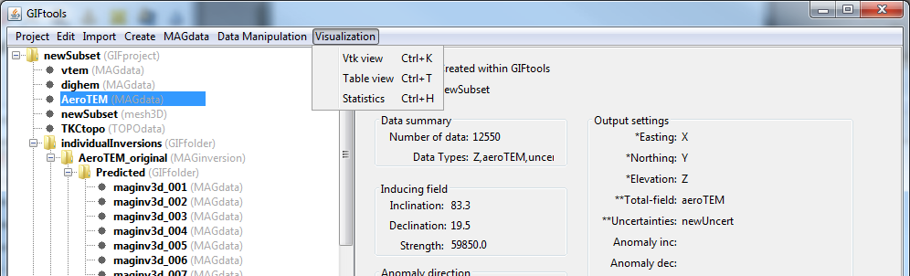

.. _viewData:

.. include:: <isonum.txt>

Visualization Menu
==================

GIFtools allows the user three different ways to view data. The methods are grouped under **Visualization** menu when clicking on a data item.

VTK data viewer
^^^^^^^^^^^^^^^

3D visualization is performed through the VTK (Visualization ToolKit) data viewer. To get to this viewer, the spatial :ref:`i/o headers <objectSetioHeaders>` must be set. Then click on the data item and use the menu:

**Visualization** |rarr| **VTK view**

The shortcut for this viewer is ``control + k`` for any item selected in the tree.

.. _viewData_table:

Table viewer
^^^^^^^^^^^^

To access the table viewer (and editor), click on the data item and the use the menu:

**Visualization** |rarr| **Table view**

The shortcut for this viewer is ``control + t`` for any item selected in the tree.

.. _viewData_statistics:

Statistics viewer
^^^^^^^^^^^^^^^^^

GIFtools offers a histogram view with minor statistics of each column of data. To access the histogram viewer, click on the data item and the use the menu:

**Visualization** |rarr| **Statistics**

The shortcut for this viewer is ``control + h`` for any item selected in the tree.

 

