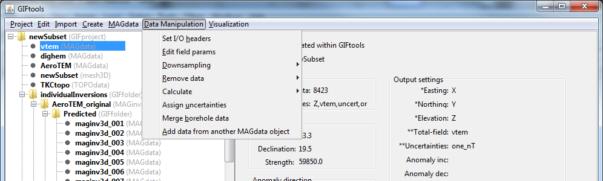
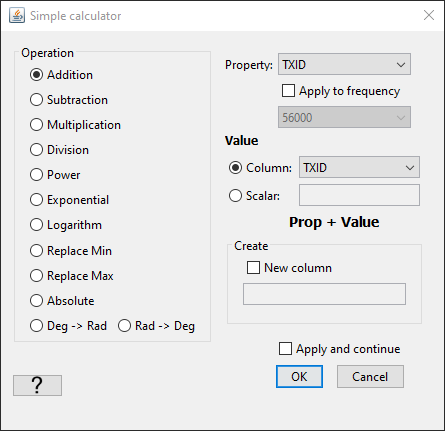

.. _objectMagDataManipulation:

.. include:: <isonum.txt>

Data Manipulation for Magnetic Data
===================================

.. _objectEditFieldParam:

Edit inducing magnetic field parameters
---------------------------------------

The inducing field (inclination, declination, and field strength) is vital to properly creating a sensitivity matrix in inversion and forward modelling. This is only performed on a magnetic data object (MAGdata).

Select the object and the menu **Data manipulation** |rarr| **Edit field params**

.. _objectRemoveIGRF:

Remove the IGRF from magnetic data
----------------------------------

To remove the IGRF value from a magnetic data set, the i/o header for the data must be set. Click on the data item of interest and use the menu:

**Data manipulation** |rarr| **Calculate** |rarr| **Subtract IGRF value**

**NOTE 1:** A separate way of removing the IGRF would be through the :ref:`Calculator <objectCalculator>`.

.. _objectMagDataElevation:

Calculate elevation from topography and flight height
-----------------------------------------------------

This functionality allows the user to compute the elevation of their data from using a topography object. It is accessed through:

**Data Manipulation** |rarr| **Coordinates** |rarr| **Calculate elevation from surface**

**Required**

	- A topography object

.. _objectMagDataChangeType:

Change data type
----------------

To change whether GIFtools treads a Mag data object as amplitude data, TMI data or other data, use the change data type feature. This can be accessed through:

	- **Data Manipulation** |rarr| **Create different data type** |rarr| **Total-field magnetic data**
	- **Data Manipulation** |rarr| **Create different data type** |rarr| **Magnetic amplitude data**
	- **Data Manipulation** |rarr| **Create different data type** |rarr| **Other data type**

