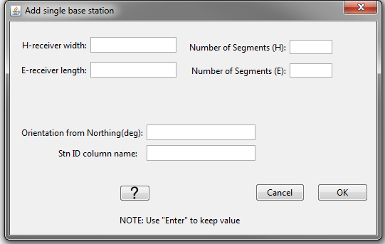
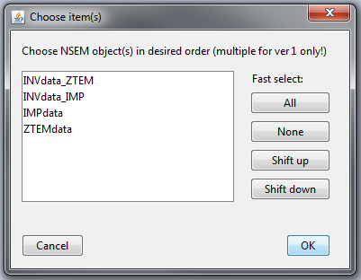

.. _objectDataTypeMT:

.. include:: <isonum.txt>

MT "Data Type" Data Menu
========================

.. _objectDataTypeMT_snid:

Set/Reset Receivers from Data Locations
---------------------------------------

To forward model or invert impedance data using the E3DMT version 2 code, all wire receivers that measure the electric field and all inductive loop receivers that measure the magnetic field must be defined. If data were loaded into GIFtools using EDI, MTZ3D or E3DMT version 1 formats, this functionality can be used to define the dimensions of the wire and loop receivers from the data locations. If data were loaded from an E3DMT version 2 data file, then the receivers are automatically defined according to the `receiver file <https://e3dmt.readthedocs.io/en/e3dmt_v2/content/files/receiverFile.html>`__ . This functionality is accessed via: 

**[data type]** |rarr| **Set/reset receivers from data locations**

In the pop-up window shown below, the user specifies the following:

    - **H-receiver width:** Sets the dimensions of loop receivers measuring the H-field
    - **E-receiver length:** Sets the length of the wire receivers measuring the E-field
    - **Number of Segments (H):** Number of segments used to define H-receiver loops. If 4 is entered, the loop is square and *H-receiver width* is the side length of the loop. If a number larger than 4 is entered, the loop is circular and *H-receiver width* is the diameter.
    - **Number of Segments (E):** Number of segments used to define the E-receiver wires. A number larger than 1 means you would like to be more accurate as you integrate the electric field over the path of the wire
    - **Orientation from Northing:** This value is the angle, in degrees, from geographic North. It is positive in the clockwise direction. If in standard orientation (:math:`Z_{xy} = E_x/H_y` with X = Northing, Y = Easting and Z = down), then use a value of 0. If the receivers are rotated relative to geographic North, you can model this with E3DMT v2.
    - **Stn ID column name:** the name of the data header given to the SNID column

Some things to note about this functionality:

    - The centers of wire and loop receivers are at the location of the associated datum.
    - By using this functionality, you will replace the receivers and receiver index column associated with this data object.

.. _objectDataTypeMT_export:

Export Observation/Locations
----------------------------

.. _objectDataTypeMT_export1:

E3DMT version 1 format (Impedance only)
^^^^^^^^^^^^^^^^^^^^^^^^^^^^^^^^^^^^^^^

The E3DMT version 1 code can forward model and jointly invert data from multiple impedance tensor and/or ZTEM data objects. When selecting an impedance data object and choosing **Impedance data** |rarr| **Export**, a pop-up window appears (see below). The user then:

    1) Select the impedance and/or ZTEM data objects they would like to export into a single observations/locations file
    2) Select *OK*

Some things to note about this functionality:

    - The order in which you select the data objects is the order in which the observations/locations show up in the exported file.
    - You cannot export apparent resistivity and phase data.
    - When loading predicted data, it is important to remember the order or data objects you used to create the locations file. If forward modeling or inversion is done through the GUI, the forward modeling/inversion object will remember the correct order.
    - If all data headers are set for all objects, an observations file is exported. If no data headers are set for any object, a locations file is exported.

.. _objectDataTypeMT_export2:

E3DMT version 2 format (Impedance only)
^^^^^^^^^^^^^^^^^^^^^^^^^^^^^^^^^^^^^^^

The E3DMT version 2 code requires an `observations <https://e3dmt.readthedocs.io/en/latest/content/files/obsFile.html#version-2-2017>`__ or `survey index <https://e3dmt.readthedocs.io/en/latest/content/files/indexFile.html>`__ file, a `receivers file <https://e3dmt.readthedocs.io/en/latest/content/files/receiverFile.html>`__ and a `frequencies file <https://e3dmt.readthedocs.io/en/latest/content/files/freqFile.html>`__ form the third pup-up window. The user selects the `observations <https://e3dmt.readthedocs.io/en/latest/content/files/obsFile.html#version-2-2017>`__ or `survey index file <https://e3dmt.readthedocs.io/en/latest/content/files/indexFile.html>`__ from the first pop-up window, the `receivers file <https://e3dmt.readthedocs.io/en/latest/content/files/receiverFile.html>`__ from the second pop-up window, and the `frequencies file <https://e3dmt.readthedocs.io/en/latest/content/files/freqFile.html>`__ form the third pup-up window.

