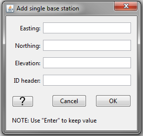
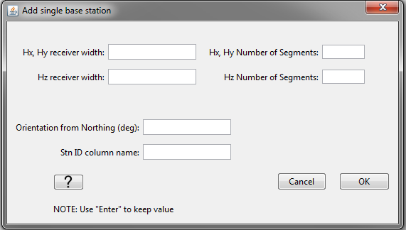

.. _objectDataTypeZTEM:

.. include:: <isonum.txt>

ZTEM "Data Type" Data Menu
==========================

.. _objectDataTypeZTEM_basestn:

Set/Reset Base Station
----------------------

To forward model or invert ZTEM data using the MTZ3D or E3DMT version 1 codes, the base station must first be defined. If data were loaded into GIFtools using EDI or E3DMT version 2 formats, this functionality can be used to define the base station. If data were loaded from and E3DMT version 1 or MTZ3D data file, then the base station(s) may automatically be defined. This functionality is accessed via:

**ZTEM data** |rarr| **Set/reset base station**

In the pop-up window shown below, the user specifies the following:

    - **Hx, Hy receiver width:** Sets the dimensions of loop receivers measuring the horizontal H-field
    - **Hz receiver length:** Sets the dimensions of loop receivers measuring the vertical H-field
    - **Hx, Hy Number of Segments:** Number of segments used to define receiver loops measuring Hx and Hy. If 4 is entered, the loops are square and *Hx, Hy receiver width* is the side length of each loop. If a number larger than 4 is entered, the loops are circular and *Hx, Hy receiver width* is the diameter.
    - **Hz Number of Segments:** Number of segments used to define receiver loops measuring Hz. If 4 is entered, the loop is square and *Hz receiver width* is the side length of the loop. If a number larger than 4 is entered, the loop is circular and *Hz receiver width* is the diameter.
    - **Orientation from Northing:** This value is the angle, in degrees, from geographic North. It is positive in the clockwise direction. If in standard orientation (:math:`Z_{xy} = E_x/H_y` with X = Northing, Y = Easting and Z = down), then use a value of 0. If the receivers are rotated relative to geographic North, you can model this with E3DMT v2.
    - **Stn ID column name:** the name of the data header given to the SNID column

Some things to note about this functionality:

    - By using this functionality, you will replace any pre-existing base stations and replace the base station index (BASEID) column.
    - This functionality works for ZTEM simulations with and without base stations.
    - A base station can be set and used within the framework of the E3DMT version 2 code.

.. _objectDataTypeZTEM_datatype:

Set ZTEM Data Type
------------------

For the E3DMT version 1 code, there are several inversion options for inverting ZTEM data:

    - MTT: A fix base station is used to measure Hx and Hy, while Hz is measured at each data locations
    - MTE: Same as above, however the values for Hx and Hy are computed from the starting model
    - MTH: No base station. Hx, Hy and Hz are all measured at every data location

This functionality can be accessed via:

**ZTEM data** |rarr| **Set ZTEM data type**

Some things to note about this functionality

    - If the user chooses type *MTT* or *MTE*, they will need to :ref:`set/reset base station <objectDataTypeZTEM_basestn>` and set the io Header for the BASEID column to use the E3DMT version 1 code.
    - As of right now, the E3DMT version 2 code only supports *MTH*. In the future, this may change.

.. _objectDataTypeZTEM_snid:

Set/Reset Receivers from Data Locations
---------------------------------------

To forward model or invert ZTEM data using the E3DMT version 2 code, all inductive loop receivers that measure the magnetic field must be defined. If data were loaded into GIFtools using EDI, MTZ3D or E3DMT version 1 formats, this functionality can be used to define the dimensions of the loop receivers from the data locations. If data were loaded from an E3DMT version 2 data file, then the receivers are automatically defined according to the `receiver file <https://e3dmt.readthedocs.io/en/latest/content/files/receiverFile.html>`__ . This functionality is accessed via: 

**ZTEM data** |rarr| **Set/reset receivers from data locations**

In the pop-up window shown below, the user specifies the following:

    - **Easting width:** the width along the Easting direction for loops that measure Hy and Hz
    - **Northing width:** the width along the Northing direction for loops that measure Hx and Hz
    - **Vertical width:** the width along the vertical direction for loops that measure Hx and Hy
    - **Stn ID column name:** the name of the data header given to the SNID column

Some things to note about this functionality:

    - The centers of loop receivers are at the location of the associated datum.
    - By using this functionality, you will replace the receivers and receiver index column (SNID) associated with this data object.
    - If :ref:`ZTEM data type <objectDataTypeZTEM_datatype>` is *MTH*, then Hx and Hy will be measured at the observation locations. If :ref:`ZTEM data type <objectDataTypeZTEM_datatype>` is *MTT* or *MTE* and you have :ref:`set a base station <objectDataTypeZTEM_basestn>`, then the locations of the loops measuring Hx and Hy will be at the location of the base station. This functionality will not work however if there are multiple base stations. 

.. _objectDataTypeZTEM_rmbase:

Remove Base Station
-------------------

This functionality removes all base stations associate with the ZTEM data object. This functionality is accessed via:

**ZTEM data** |rarr| **Remove base station**

.. _objectDataTypeZTEM_export:

Export Observation/Locations
----------------------------

.. _objectDataTypeZTEM_export1:

E3DMT version 1 format
^^^^^^^^^^^^^^^^^^^^^^

This functionality is described within the :ref:`MT section <objectDataTypeMT_export1>`.

.. _objectDataTypeZTEM_export2:

E3DMT version 2 format
^^^^^^^^^^^^^^^^^^^^^^

This functionality is described within the :ref:`MT section <objectDataTypeMT_export2>`.

