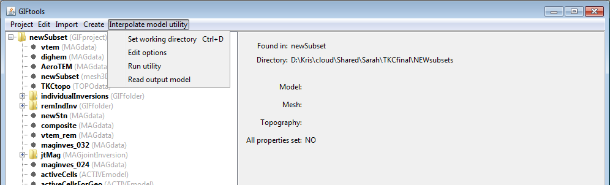

.. _utilEditOptions:

.. include:: <isonum.txt>

Edit the utility's options
==========================

To change the options of the utility, click on the utility item, select the menu showing its class (e.g., ``Interpolate Model utility``):

**[utility class]** |rarr| **Edit options**

