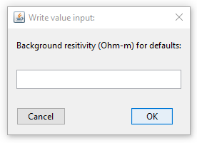
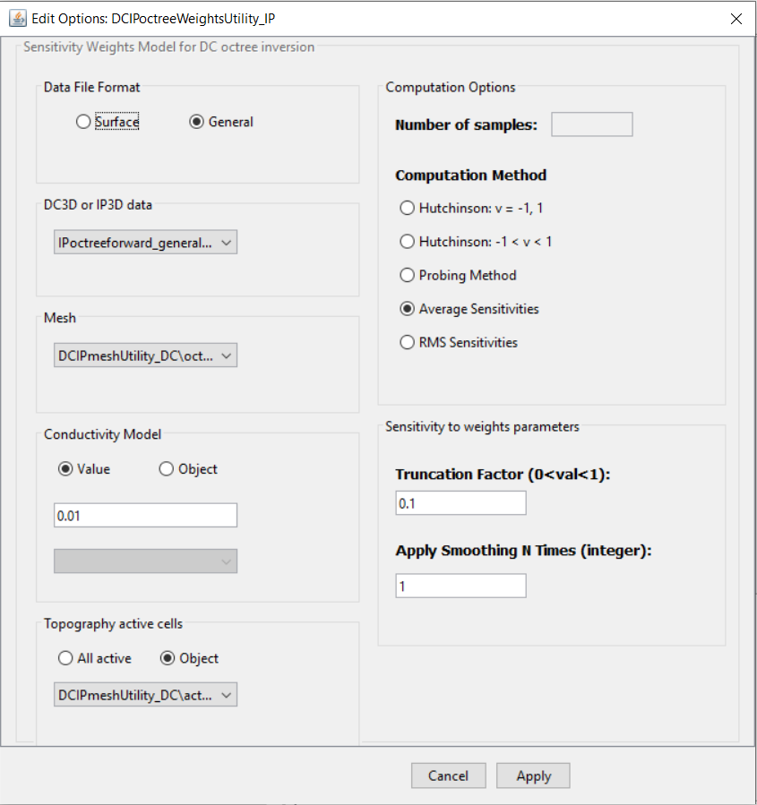

.. _utilEditOptions:

.. include:: <isonum.txt>

Edit the utility's options
==========================

To change the options of the utility, click on the utility item, select the menu showing its class (e.g., ``Interpolate Model utility``):

**[utility class]** |rarr| **Edit options**

.. figure:: ../../../images/utilityMenu.png
    :align: center
    :width: 400

.. _utilEditOptions_DCIP:

DCIP OcTree Mesh Utility
------------------------

- Input Options (`related documentation for DCIP OcTree <https://dcipoctree.readthedocs.io/en/latest/content/inputfiles/createOcTree.html>`_)

    .. figure:: ../../../images/utilityDCIPMeshEditOption.png
        :align: center
        :width: 600

.. important:: If **surface** is selected, all electrodes will be projected to the discrete surface topography. If **general** is selected, all electrodes above the discrete surface topography are projected and all electrodes below the discrete surface are left in their original locations. The latter option is mean for datasets containing borehole data.

.. _utilEditOptions_E3DMT:

E3DMT Mesh Utility
------------------

- Enter an estimate background resistivity value. This value is used to estimate the necessary padding distances.

- Input Options (`related documentation for E3DMT <https://e3dmt.readthedocs.io/en/e3dmt/content/inputfiles/createOcTree.html>`_)

    .. figure:: ../../../images/utilityE3DMTMeshEditOption_panel1.png
        :align: center
        :width: 600

.. important:: Regarding the *shift_data* button. If MT data are used to design the survey, *shift_data* will create a receivers file that places all receivers on the discretized surface. If ZTEM data are used to design the survey, *shift_data* will create a receivers file such that true flight height is preserved over the discretized surface.

.. _utilEditOptions_E3DMTv2:

E3DMT v2 Mesh Utility
---------------------

- Enter an estimate background resistivity value. This value is used to estimate the necessary padding distances.

- Input Options (`related documentation for E3DMT v2 <https://e3dmt.readthedocs.io/en/e3dmt_v2/content/inputfiles/createOcTree.html>`_)

    .. figure:: ../../../images/utilityE3DMTv2MeshEditOption_panel1.png
        :align: center
        :width: 600

.. _utilEditOptions_E3Dver2Tiled:

E3D_ver2_Tiled Mesh Utility
---------------------------

- Enter an estimate background resistivity value. This value is used to estimate the necessary padding distances.

- Input Options (`related documentation for E3D v2 tiled <https://e3d.readthedocs.io/en/latest/content/inputfiles/createOcTree.html#create-octree-mesh-input-file>`_)

    .. figure:: ../../../images/utilityE3DMeshEditOption_panel2.png
        :align: center
        :width: 600

    - Core cell dimension
        - East, North and Thickness dimension of the smallest octree level

    - Octree Refinement Level
        - Power of expension (Min. fact.): Integer value of power 2
        - Minimum cell size (min_cell_size_fwd): Sets the minimum cell size for the forward mesh, factor of base core cell.
        - Maximum topography-based cell size (max_topo_cell): Largest cell before rapid octree expansion.

    - Padding cell expansion
        - Distance to expand outside the core region along the Cartesian directions.

    - Topography
        - Value: Assume flat topography at given elevation (m)
        - Object: Topography defined by a ``TOPOdata`` object

    - Core Region refinement (Inversion)
        - Sets the discretization depth for the first three octree levels (global inversion mesh)

    - Core region refinement (Forward)
        - Sets the discretization depth for the first three octree levels (local forward meshes)

    - Number of cells around Rx
        - Number of cells around each receiver for the first three octree levels

    - Make polygon
        - Value: Distance (m) outside the data convex haul
        - Object: Points defining the outer core region

.. _utilEditOptions_SurfaceElectrodes:

Project Electrodes to Discrete Topography
-----------------------------------------

.. figure:: ../../../images/utilitySurfaceElectrodes.PNG
    :align: center
    :width: 400

.. _utilEditOptions_DCsensitivity:

DC/IP Octree Sensitivity Utility
--------------------------------

Set parameters to compute approximate senstivity weights model for DC or IP octree inversion. The utility will look at the data type to determine whether DC or IP weights are being computed.

**Input Options** (`thorough description of all parameters provided in DCIP octree documentation <https://dcipoctree.readthedocs.io/en/latest/content/inputfiles/sensFile.html>`_)

    - If **surface** is selected, all electrodes will be projected to the discrete surface topography. If **general** is selected, all electrodes above the discrete surface topography are projected and all electrodes below the discrete surface are left in their original locations. The latter option is mean for datasets containing borehole data.

    - *Number of samples:* This is the number of iterations for approximating the diagonals of :math:`J^T J` with Hutchinson's or probing approach. A value of 10 is reasonable.

    - *Computation method:* Choose one of the approximate or analytic methods for computing the sensitivities. We suggest using *average sensitivities* or *RMS sensitivities* because these approaches are analytic and do not take much longer than any of the approximate sensitivity methods.

    - *Truncation Factor:* We must apply a truncation factor due to the large dynamic range of the sensitivities. A value between 0.01 and 0.2 is good.

    - *Apply Smoothing:* Artifacts related to approximating the sensitivities can negatively impact the final inversion result. To mitigate this, we 'smooth out' these artifact. This paramter specifies the number of times smoothing is applied. A value of 1-5 works well.
