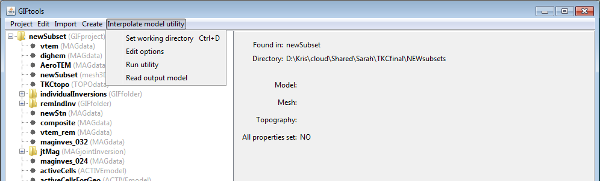

.. _utilLoadResults:

.. include:: <isonum.txt>

Load utility program results
============================

Once the utility has run, the user can load the created files (model(s), mesh(es), etc). via the **Read output files** command under the utility's menu. The items will load underneath the utility make it a folder.

